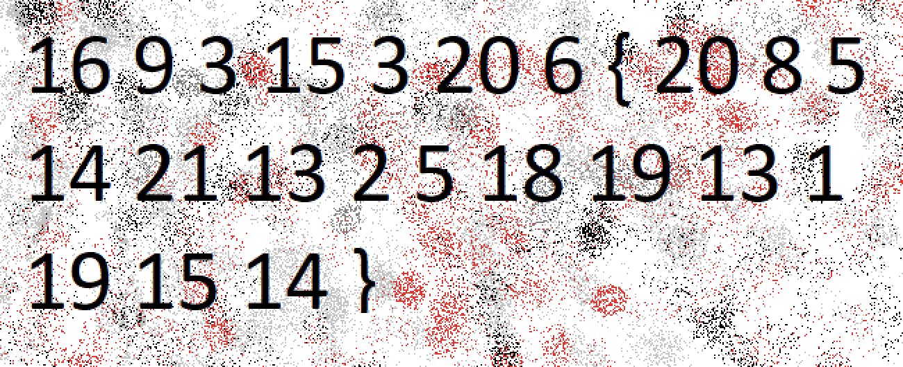

### Mod 26

The challenge provides this encoded string:

`cvpbPGS{arkg_gvzr_V'yy_gel_2_ebhaqf_bs_ebg13_nSkgmDJE}`. 

It's `ROT13` encoded so we can decode it this way.

```python
#!/usr/bin/python3.8
import codecs

print(codecs.encode("cvpbPGS{arkg_gvzr_V'yy_gel_2_ebhaqf_bs_ebg13_nSkgmDJE}", 'rot_13'))
```

```bash
➜  Crypotgraphy git:(main) ✗ python solver.py
picoCTF{XXX}
```

### 13

This is the exact same challenge that's why I added them together.

```python
#!/usr/bin/python3.8
import codecs

print(codecs.encode("cvpbPGS{abg_gbb_onq_bs_n_ceboyrz}", 'rot_13'))
```

```bash
➜  Crypotgraphy git:(main) ✗ python solver.py
picoCTF{XXX}
```

### caesar

Download the file and get this ciphertext:

`picoCTF{gvswwmrkxlivyfmgsrhnrisegl}`.

The challenge already says it is `caesars cipher` so we will brute force it because we don't know the shift. 

```python
#!/usr/bin/python3.8

ciphertext = 'gvswwmrkxlivyfmgsrhnrisegl'

def decode(ciphertext, shift):
    plaintext = 'picoCTF{'
    for char in ciphertext:
        if char.isalpha():
            # shift the character back by the given shift
            plaintext += chr((ord(char) - shift - 65) % 26 + 65).lower()
        else:
            plaintext += char.lower()
    plaintext += '}'
    return plaintext

for i in range(26):
  print(decode(ciphertext, i))
```

From the output, only one line is readable.

```bash
picoCTF{mbyccsxqdrobelsmyxntxoykmr}
picoCTF{laxbbrwpcqnadkrlxwmswnxjlq}
picoCTF{kzwaaqvobpmzcjqkwvlrvmwikp}
picoCTF{jyvzzpunaolybipjvukqulvhjo}
picoCTF{ixuyyotmznkxahoiutjptkugin}
picoCTF{hwtxxnslymjwzgnhtsiosjtfhm}
picoCTF{gvswwmrkxlivyfmgsrhnrisegl}
picoCTF{furvvlqjwkhuxelfrqgmqhrdfk}
picoCTF{etquukpivjgtwdkeqpflpgqcej}
picoCTF{dspttjohuifsvcjdpoekofpbdi}
picoCTF{crossingtherubicondjneoach} <--- here
picoCTF{bqnrrhmfsgdqtahbnmcimdnzbg}
picoCTF{apmqqglerfcpszgamlbhlcmyaf}
picoCTF{zolppfkdqeboryfzlkagkblxze}
picoCTF{ynkooejcpdanqxeykjzfjakwyd}
picoCTF{xmjnndiboczmpwdxjiyeizjvxc}
picoCTF{wlimmchanbylovcwihxdhyiuwb}
picoCTF{vkhllbgzmaxknubvhgwcgxhtva}
picoCTF{ujgkkafylzwjmtaugfvbfwgsuz}
picoCTF{tifjjzexkyvilsztfeuaevfrty}
picoCTF{sheiiydwjxuhkrysedtzdueqsx}
picoCTF{rgdhhxcviwtgjqxrdcsyctdprw}
picoCTF{qfcggwbuhvsfipwqcbrxbscoqv}
picoCTF{pebffvatgurehovpbaqwarbnpu}
picoCTF{odaeeuzsftqdgnuoazpvzqamot}
picoCTF{nczddtyrespcfmtnzyouypzlns}
```

### The Number

Download the file and open it.



These are the indexes of characters inside the alphabet.

```python
a = '_ABCDEFGHIJKLMNOPQRSTUVWXYZ'

print(a[16] + a[9] + a[3] + a[15] + a[3] + a[20] + a[6] +
      '{' + a[20] + a[8] + a[5] + a[14] + a[21] + a[13] + a[2] +
      a[5] + a[18] + a[19] + a[13] + a[1] + a[19] + a[15] + a[14] + '}')
```

````bash
➜  Crypotgraphy git:(main) ✗ python solver.py
PICOCTF{XXX}
````

### Mind your Ps and Qs

Download the file and `cat` its content.

```bash
cat values 
Decrypt my super sick RSA:
c: 843044897663847841476319711639772861390329326681532977209935413827620909782846667
n: 1422450808944701344261903748621562998784243662042303391362692043823716783771691667
e: 65537
```

First of all we need to factorize `n`. I will use this [site](http://factordb.com/). After we find the `p` and `q`, we need to calculate the `modulo`. Lastly, we calculate the private exponent and we convert the decrypted string to ASCII.

```python
from Crypto.Util.number import inverse

c = 843044897663847841476319711639772861390329326681532977209935413827620909782846667
e = 65537

# Number to factorize here: http://factordb.com/
n = 1422450808944701344261903748621562998784243662042303391362692043823716783771691667

# Results
p = 2159947535959146091116171018558446546179
q = 658558036833541874645521278345168572231473

# Calculate modulo
phi = (p-1)*(q-1)

# Calculate private exponent
d = inverse(e, phi)

flag = pow(c, d, n)

print(f"Decrypted message: {flag.to_bytes((flag.bit_length() + 7) // 8, byteorder='big').decode()}")
```

### Easy1

Download the file and `cat` its content.

```bash
cat table.txt 
    A B C D E F G H I J K L M N O P Q R S T U V W X Y Z 
   +----------------------------------------------------
A | A B C D E F G H I J K L M N O P Q R S T U V W X Y Z
B | B C D E F G H I J K L M N O P Q R S T U V W X Y Z A
C | C D E F G H I J K L M N O P Q R S T U V W X Y Z A B
D | D E F G H I J K L M N O P Q R S T U V W X Y Z A B C
E | E F G H I J K L M N O P Q R S T U V W X Y Z A B C D
F | F G H I J K L M N O P Q R S T U V W X Y Z A B C D E
G | G H I J K L M N O P Q R S T U V W X Y Z A B C D E F
H | H I J K L M N O P Q R S T U V W X Y Z A B C D E F G
I | I J K L M N O P Q R S T U V W X Y Z A B C D E F G H
J | J K L M N O P Q R S T U V W X Y Z A B C D E F G H I
K | K L M N O P Q R S T U V W X Y Z A B C D E F G H I J
L | L M N O P Q R S T U V W X Y Z A B C D E F G H I J K
M | M N O P Q R S T U V W X Y Z A B C D E F G H I J K L
N | N O P Q R S T U V W X Y Z A B C D E F G H I J K L M
O | O P Q R S T U V W X Y Z A B C D E F G H I J K L M N
P | P Q R S T U V W X Y Z A B C D E F G H I J K L M N O
Q | Q R S T U V W X Y Z A B C D E F G H I J K L M N O P
R | R S T U V W X Y Z A B C D E F G H I J K L M N O P Q
S | S T U V W X Y Z A B C D E F G H I J K L M N O P Q R
T | T U V W X Y Z A B C D E F G H I J K L M N O P Q R S
U | U V W X Y Z A B C D E F G H I J K L M N O P Q R S T
V | V W X Y Z A B C D E F G H I J K L M N O P Q R S T U
W | W X Y Z A B C D E F G H I J K L M N O P Q R S T U V
X | X Y Z A B C D E F G H I J K L M N O P Q R S T U V W
Y | Y Z A B C D E F G H I J K L M N O P Q R S T U V W X
Z | Z A B C D E F G H I J K L M N O P Q R S T U V W X Y
```

This table looks like a [substitution cipher](https://en.wikipedia.org/wiki/Substitution_cipher), and more likely [Vigenere](https://en.wikipedia.org/wiki/Vigen%C3%A8re_cipher). 

We have the `key` and the `ciphertext`, so we write a python script to decrypt the message.

```python
import string

def vigenere_decrypt(ciphertext, keyword):
    alphabet = string.ascii_uppercase
    keyword_repeated = (keyword * (len(ciphertext) // len(keyword))) + keyword[:len(ciphertext) % len(keyword)]
    decrypted_text = ""

    for i in range(len(ciphertext)):
        if ciphertext[i].isalpha():
            shift = (alphabet.index(ciphertext[i].upper()) - alphabet.index(keyword_repeated[i].upper())) % 26
            decrypted_char = alphabet[shift]
            if ciphertext[i].islower():
                decrypted_char = decrypted_char.lower()
            decrypted_text += decrypted_char
        else:
            decrypted_text += ciphertext[i]

    return decrypted_text

# Example usage
ciphertext = "UFJKXQZQUNB"
keyword = "SOLVECRYPTO"
decrypted_text = vigenere_decrypt(ciphertext, keyword)
print("Decrypted Text:", decrypted_text)
```

### HideToSee

We download the image and open it with `eog atbash.jpg`.

Nothing of interest there. We try `binwalk` to extract anything from the image but we get nothing. Well, another useful tool to extract content from images is `steghige`.

```bash
sudo apt install steghide -y
```

Then we run `steghide extract -sf atbash.jpg` with no `passphrase` and get a `txt` file.

```bash
krxlXGU{zgyzhs_xizxp_92533667}
```

Looks like `ceasar's` but as the image name suggests, it's `atbash`. We use this [site](https://www.dcode.fr/atbash-cipher) to decode it.

### rail-fence

Download the file and `cat` its content. We see a message that has been encoded with what the challenge says: `rail-fence` cipher. We use this [site](https://www.dcode.fr/rail-fence-cipher) to decode it by changing the `heieght` to 4 and tick `keep punctuations and spaces`.


### credstuff

Download the compressed file and extract it with `tar -xvf leak.tar`.

The challenge says to find the username `cultiris` in `usernames.txt` and its corresponding password in `passwords.txt`. We will use `grep -n` to find the line of the username and then pipe its output to find the password. When we do this, we see its a `ROT13` string. We decode it and get the flag.

```bash
grep -n "cultiris" usernames.txt | cut -d':' -f1 | while read line; do sed -n "${line}p" passwords.txt; done | tr 'a-zA-Z' 'n-za-mN-ZA-M'
```

### basic-mod1

Download the file and `cat` its content.

```bash
cat message.txt 
128 322 353 235 336 73 198 332 202 285 57 87 262 221 218 405 335 101 256 227 112 140
```

The challenge says that we need to `mod 37` these values and then address the output to the corresponding letter in the alphabet. Out of range characters are the numeric ones and the underscore. We make a simple python script to get the flag.

```python
#!/usr/bin/python3

enc = [128, 322, 353, 235, 336, 73, 198,
       332, 202, 285, 57, 87, 262, 221,
       218, 405, 335, 101, 256, 227, 112, 140]

alpha = 'abcdefghijklmnopqrstuvwxyz0123456789_'

flag = ''.join(alpha[i % 37] for i in enc)
print(f'picoCTF{{{flag}}}')
```

### basic-mod2

Same as `basic-mod1` with the slight difference that now it wants the `inverse modulo`. I used `sympy` `mod_inverse` function to do it:

```python
#!/usr/bin/python3
from sympy import mod_inverse

enc = [ 432, 331, 192, 108, 180, 50, 231, 
		188, 105, 51, 364, 168, 344, 195,
		297, 342, 292, 198, 448, 62, 236, 342, 63]

alpha = 'abcdefghijklmnopqrstuvwxyz0123456789_'

flag = ''
flag += ''.join(alpha[mod_inverse(num % 41, 41) - 1] for num in enc)

print(f'picoCTF{{{flag}}}')
```

