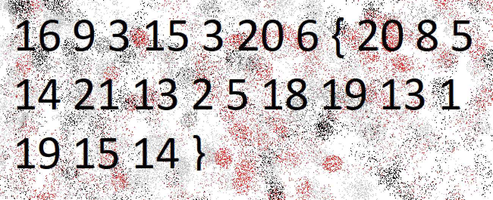
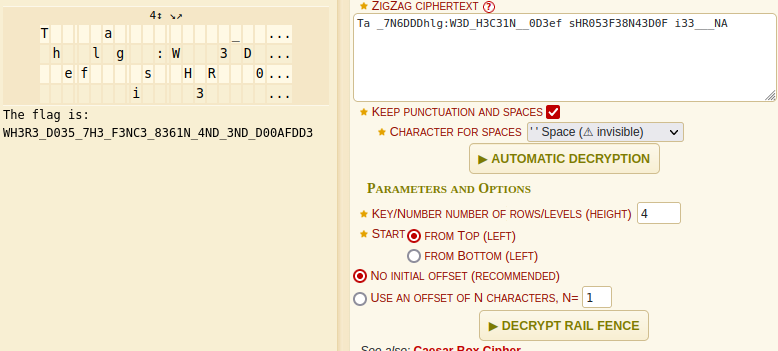
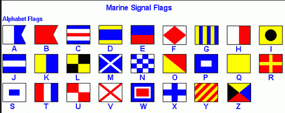
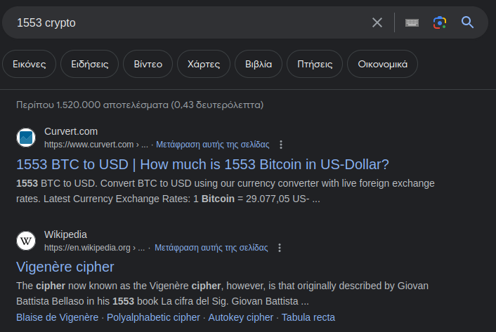
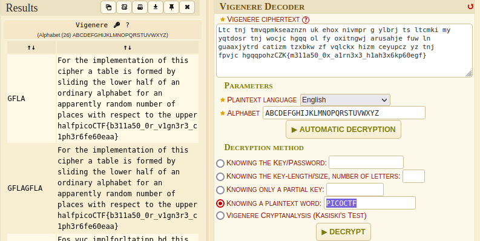
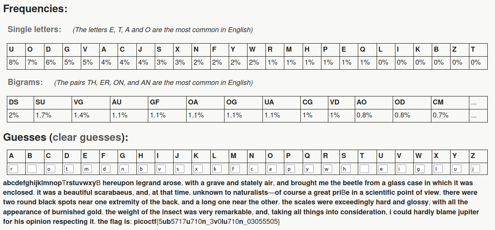
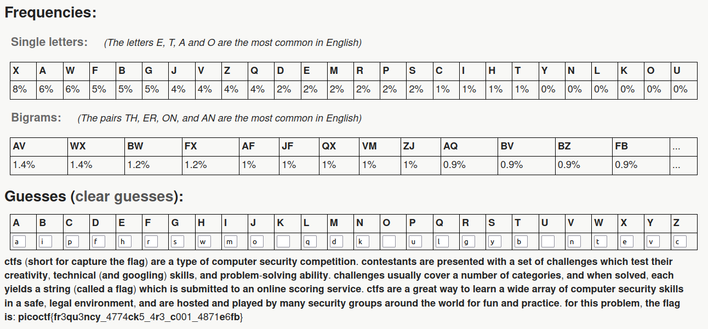
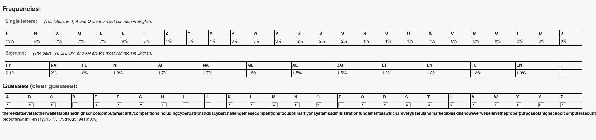

### Mod 26

The challenge provides this encoded string:

`cvpbPGS{arkg_gvzr_V'yy_gel_2_ebhaqf_bs_ebg13_nSkgmDJE}`. 

It's `ROT13` encoded so we can decode it this way.

```python
#!/usr/bin/python3.8
import codecs

print(codecs.encode("cvpbPGS{arkg_gvzr_V'yy_gel_2_ebhaqf_bs_ebg13_nSkgmDJE}", 'rot_13'))
```

```bash
➜  Crypotgraphy git:(main) ✗ python solver.py
picoCTF{XXX}
```

### 13

This is the exact same challenge that's why I added them together.

```python
#!/usr/bin/python3.8
import codecs

print(codecs.encode("cvpbPGS{abg_gbb_onq_bs_n_ceboyrz}", 'rot_13'))
```

```bash
➜  Crypotgraphy git:(main) ✗ python solver.py
picoCTF{XXX}
```

### caesar

Download the file and get this ciphertext:

`picoCTF{gvswwmrkxlivyfmgsrhnrisegl}`.

The challenge already says it is `caesars cipher` so we will brute force it because we don't know the shift. 

```python
#!/usr/bin/python3.8

ciphertext = 'gvswwmrkxlivyfmgsrhnrisegl'

def decode(ciphertext, shift):
    plaintext = 'picoCTF{'
    for char in ciphertext:
        if char.isalpha():
            # shift the character back by the given shift
            plaintext += chr((ord(char) - shift - 65) % 26 + 65).lower()
        else:
            plaintext += char.lower()
    plaintext += '}'
    return plaintext

for i in range(26):
  print(decode(ciphertext, i))
```

From the output, only one line is readable.

```bash
picoCTF{mbyccsxqdrobelsmyxntxoykmr}
picoCTF{laxbbrwpcqnadkrlxwmswnxjlq}
picoCTF{kzwaaqvobpmzcjqkwvlrvmwikp}
picoCTF{jyvzzpunaolybipjvukqulvhjo}
picoCTF{ixuyyotmznkxahoiutjptkugin}
picoCTF{hwtxxnslymjwzgnhtsiosjtfhm}
picoCTF{gvswwmrkxlivyfmgsrhnrisegl}
picoCTF{furvvlqjwkhuxelfrqgmqhrdfk}
picoCTF{etquukpivjgtwdkeqpflpgqcej}
picoCTF{dspttjohuifsvcjdpoekofpbdi}
picoCTF{crossingtherubicondjneoach} <--- here
picoCTF{bqnrrhmfsgdqtahbnmcimdnzbg}
picoCTF{apmqqglerfcpszgamlbhlcmyaf}
picoCTF{zolppfkdqeboryfzlkagkblxze}
picoCTF{ynkooejcpdanqxeykjzfjakwyd}
picoCTF{xmjnndiboczmpwdxjiyeizjvxc}
picoCTF{wlimmchanbylovcwihxdhyiuwb}
picoCTF{vkhllbgzmaxknubvhgwcgxhtva}
picoCTF{ujgkkafylzwjmtaugfvbfwgsuz}
picoCTF{tifjjzexkyvilsztfeuaevfrty}
picoCTF{sheiiydwjxuhkrysedtzdueqsx}
picoCTF{rgdhhxcviwtgjqxrdcsyctdprw}
picoCTF{qfcggwbuhvsfipwqcbrxbscoqv}
picoCTF{pebffvatgurehovpbaqwarbnpu}
picoCTF{odaeeuzsftqdgnuoazpvzqamot}
picoCTF{nczddtyrespcfmtnzyouypzlns}
```

### The Number

Download the file and open it.



These are the indexes of characters inside the alphabet.

```python
a = '_ABCDEFGHIJKLMNOPQRSTUVWXYZ'

print(a[16] + a[9] + a[3] + a[15] + a[3] + a[20] + a[6] +
      '{' + a[20] + a[8] + a[5] + a[14] + a[21] + a[13] + a[2] +
      a[5] + a[18] + a[19] + a[13] + a[1] + a[19] + a[15] + a[14] + '}')
```

````bash
➜  Crypotgraphy git:(main) ✗ python solver.py
PICOCTF{XXX}
````

### Mind your Ps and Qs

Download the file and `cat` its content.

```bash
cat values 
Decrypt my super sick RSA:
c: 843044897663847841476319711639772861390329326681532977209935413827620909782846667
n: 1422450808944701344261903748621562998784243662042303391362692043823716783771691667
e: 65537
```

First of all we need to factorize `n`. I will use this [site](http://factordb.com/). After we find the `p` and `q`, we need to calculate the `modulo`. Lastly, we calculate the private exponent and we convert the decrypted string to ASCII.

```python
from Crypto.Util.number import inverse

c = 843044897663847841476319711639772861390329326681532977209935413827620909782846667
e = 65537

# Number to factorize here: http://factordb.com/
n = 1422450808944701344261903748621562998784243662042303391362692043823716783771691667

# Results
p = 2159947535959146091116171018558446546179
q = 658558036833541874645521278345168572231473

# Calculate modulo
phi = (p-1)*(q-1)

# Calculate private exponent
d = inverse(e, phi)

flag = pow(c, d, n)

print(f"Decrypted message: {flag.to_bytes((flag.bit_length() + 7) // 8, byteorder='big').decode()}")
```

### Easy1

Download the file and `cat` its content.

```bash
cat table.txt 
    A B C D E F G H I J K L M N O P Q R S T U V W X Y Z 
   +----------------------------------------------------
A | A B C D E F G H I J K L M N O P Q R S T U V W X Y Z
B | B C D E F G H I J K L M N O P Q R S T U V W X Y Z A
C | C D E F G H I J K L M N O P Q R S T U V W X Y Z A B
D | D E F G H I J K L M N O P Q R S T U V W X Y Z A B C
E | E F G H I J K L M N O P Q R S T U V W X Y Z A B C D
F | F G H I J K L M N O P Q R S T U V W X Y Z A B C D E
G | G H I J K L M N O P Q R S T U V W X Y Z A B C D E F
H | H I J K L M N O P Q R S T U V W X Y Z A B C D E F G
I | I J K L M N O P Q R S T U V W X Y Z A B C D E F G H
J | J K L M N O P Q R S T U V W X Y Z A B C D E F G H I
K | K L M N O P Q R S T U V W X Y Z A B C D E F G H I J
L | L M N O P Q R S T U V W X Y Z A B C D E F G H I J K
M | M N O P Q R S T U V W X Y Z A B C D E F G H I J K L
N | N O P Q R S T U V W X Y Z A B C D E F G H I J K L M
O | O P Q R S T U V W X Y Z A B C D E F G H I J K L M N
P | P Q R S T U V W X Y Z A B C D E F G H I J K L M N O
Q | Q R S T U V W X Y Z A B C D E F G H I J K L M N O P
R | R S T U V W X Y Z A B C D E F G H I J K L M N O P Q
S | S T U V W X Y Z A B C D E F G H I J K L M N O P Q R
T | T U V W X Y Z A B C D E F G H I J K L M N O P Q R S
U | U V W X Y Z A B C D E F G H I J K L M N O P Q R S T
V | V W X Y Z A B C D E F G H I J K L M N O P Q R S T U
W | W X Y Z A B C D E F G H I J K L M N O P Q R S T U V
X | X Y Z A B C D E F G H I J K L M N O P Q R S T U V W
Y | Y Z A B C D E F G H I J K L M N O P Q R S T U V W X
Z | Z A B C D E F G H I J K L M N O P Q R S T U V W X Y
```

This table looks like a [substitution cipher](https://en.wikipedia.org/wiki/Substitution_cipher), and more likely [Vigenere](https://en.wikipedia.org/wiki/Vigen%C3%A8re_cipher). 

We have the `key` and the `ciphertext`, so we write a python script to decrypt the message.

```python
import string

def vigenere_decrypt(ciphertext, keyword):
    alphabet = string.ascii_uppercase
    keyword_repeated = (keyword * (len(ciphertext) // len(keyword))) + keyword[:len(ciphertext) % len(keyword)]
    decrypted_text = ""

    for i in range(len(ciphertext)):
        if ciphertext[i].isalpha():
            shift = (alphabet.index(ciphertext[i].upper()) - alphabet.index(keyword_repeated[i].upper())) % 26
            decrypted_char = alphabet[shift]
            if ciphertext[i].islower():
                decrypted_char = decrypted_char.lower()
            decrypted_text += decrypted_char
        else:
            decrypted_text += ciphertext[i]

    return decrypted_text

# Example usage
ciphertext = "UFJKXQZQUNB"
keyword = "SOLVECRYPTO"
decrypted_text = vigenere_decrypt(ciphertext, keyword)
print("Decrypted Text:", decrypted_text)
```

### HideToSee

We download the image and open it with `eog atbash.jpg`.

Nothing of interest there. We try `binwalk` to extract anything from the image but we get nothing. Well, another useful tool to extract content from images is `steghige`.

```bash
sudo apt install steghide -y
```

Then we run `steghide extract -sf atbash.jpg` with no `passphrase` and get a `txt` file.

```bash
krxlXGU{zgyzhs_xizxp_92533667}
```

Looks like `ceasar's` but as the image name suggests, it's `atbash`. We use this [site](https://www.dcode.fr/atbash-cipher) to decode it.

### rail-fence

Download the file and `cat` its content. We see a message that has been encoded with what the challenge says: `rail-fence` cipher. We use this [site](https://www.dcode.fr/rail-fence-cipher) to decode it by changing the `heieght` to 4 and tick `keep punctuations and spaces`.



### credstuff

Download the compressed file and extract it with `tar -xvf leak.tar`.

The challenge says to find the username `cultiris` in `usernames.txt` and its corresponding password in `passwords.txt`. We will use `grep -n` to find the line of the username and then pipe its output to find the password. When we do this, we see its a `ROT13` string. We decode it and get the flag.

```bash
grep -n "cultiris" usernames.txt | cut -d':' -f1 | while read line; do sed -n "${line}p" passwords.txt; done | tr 'a-zA-Z' 'n-za-mN-ZA-M'
```

### basic-mod1

Download the file and take each number mod 37 and map it to the following character set: 0-25 is the alphabet (uppercase), 26-35 are the decimal digits, and 36 is an underscore.

```python
#!/usr/bin/python3
from sympy import mod_inverse

enc = [ 128, 322, 353, 235, 336, 73, 198, 332, 
        202, 285, 57, 87, 262, 221, 218, 405, 
        335, 101, 256, 227, 112, 140]

alpha = 'abcdefghijklmnopqrstuvwxyz0123456789_'

flag = ''
flag += ''.join(alpha[(num % 37)] for num in enc)

print(f'picoCTF{{{flag}}}')
```

### Mr-Worldwide

Download the file and `cat` its content.

```bash
cat message.txt 
<<<<<<< HEAD
picoCTF{(35.028309, 135.753082)(46.469391, 30.740883)(39.758949, -84.191605)(41.015137, 28.979530)(24.466667, 54.366669)(3.140853, 101.693207)_(9.005401, 38.763611)(-3.989038, -79.203560)(52.377956, 4.897070)(41.085651, -73.858467)(57.790001, -152.407227)(31.205753, 29.924526)}
```

These paired values seem like geolocations. Searching the first one, we see it's `Kamigo Yard` or `Kyoto`. Taking the first letter of each location we get the flag.

| Location                     | Coordinates            |
| ---------------------------- | ---------------------- |
| **K**amigo Yard or **K**yoto | 35.028309, 135.753082  |
| **O**desa                    | 46.469391, 30.740883   |
| **D**ayton                   | 39.758949, -84.191605  |
| **I**stanbul                 | 41.015137, 28.979530   |
| **A**bu Dhabi                | 24.466667, 54.366669   |
| **K**uala Lumpur             | 3.140853, 101.693207   |
| **A**ddis Ababa              | 9.005401, 38.763611    |
| **L**oja                     | -3.989038, -79.203560  |
| **A**msterdam                | 52.377956, 4.897070    |
| **S**leepy Hollow            | 41.085651, -73.858467  |
| **K**odiak                   | 57.790001, -152.407227 |
| **Al**exandria               | 31.205753, 29.924526   |

### Flags

Download the image and open it. We see some weird flag. Not knowing about this, I searched about `flag ciphers` and found this image:



The flags seem similar to our file, so we just decode them and get the flag. We can use this [site](https://www.dcode.fr/maritime-signals-code).

### la cifra de

We connect to the remote instance with `nc` and get this:

```bash
nc jupiter.challenges.picoctf.org 5726
Encrypted message:
Ne iy nytkwpsznyg nth it mtsztcy vjzprj zfzjy rkhpibj nrkitt ltc tnnygy ysee itd tte cxjltk

Ifrosr tnj noawde uk siyyzre, yse Bnretèwp Cousex mls hjpn xjtnbjytki xatd eisjd

Iz bls lfwskqj azycihzeej yz Brftsk ip Volpnèxj ls oy hay tcimnyarqj dkxnrogpd os 1553 my Mnzvgs Mazytszf Merqlsu ny hox moup Wa inqrg ipl. Ynr. Gotgat Gltzndtg Gplrfdo 

Ltc tnj tmvqpmkseaznzn uk ehox nivmpr g ylbrj ts ltcmki my yqtdosr tnj wocjc hgqq ol fy oxitngwj arusahje fuw ln guaaxjytrd catizm tzxbkw zf vqlckx hizm ceyupcz yz tnj fpvjc hgqqpohzCZK{m311a50_0x_a1rn3x3_h1ah3x6kp60egf}

Ehk ktryy herq-ooizxetypd jjdcxnatoty ol f aordllvmlbkytc inahkw socjgex, bls sfoe gwzuti 1467 my Rjzn Hfetoxea Gqmexyt.

Tnj Gimjyèrk Htpnjc iy ysexjqoxj dosjeisjd cgqwej yse Gqmexyt Doxn ox Fwbkwei Inahkw.

Tn 1508, Ptsatsps Zwttnjxiax tnbjytki ehk xz-cgqwej ylbaql rkhea (g rltxni ol xsilypd gqahggpty) ysaz bzuri wazjc bk f nroytcgq nosuznkse ol yse Bnretèwp Cousex.

Gplrfdo’y xpcuso butvlky lpvjlrki tn 1555 gx l cuseitzltoty ol yse lncsz. Yse rthex mllbjd ol yse gqahggpty fce tth snnqtki cemzwaxqj, bay ehk fwpnfmezx lnj yse osoed qptzjcs gwp mocpd hd xegsd ol f xnkrznoh vee usrgxp, wnnnh ify bk itfljcety hizm paim noxwpsvtydkse.
```

At first, I thought I should proceed with some frequency analysis but I did not get much. Then I took a look at the years (1553 and 1508) trying to find anything close to that, and landed on this:



So, we have a possible `Vigenere` cipher with unknown key. This time, I will use an online [decoder](https://www.dcode.fr/vigenere-cipher).



### Tapping

Connect to the remote server with `nc` and see that it's a `morse code`. 

```bash
nc jupiter.challenges.picoctf.org 48247
.--. .. -.-. --- -.-. - ..-. { -- ----- .-. ... ...-- -.-. ----- -.. ...-- .---- ... ..-. ..- -. .---- ..--- -.... .---- ....- ...-- ---.. .---- ---.. .---- }
```

We can use an online converter or write our own script to decrypt it.

```python
from pwn import *

morse_code_dict = {
    '.-': 'A', '-...': 'B', '-.-.': 'C', '-..': 'D', '.': 'E',
    '..-.': 'F', '--.': 'G', '....': 'H', '..': 'I', '.---': 'J',
    '-.-': 'K', '.-..': 'L', '--': 'M', '-.': 'N', '---': 'O',
    '.--.': 'P', '--.-': 'Q', '.-.': 'R', '...': 'S', '-': 'T',
    '..-': 'U', '...-': 'V', '.--': 'W', '-..-': 'X', '-.--': 'Y',
    '--..': 'Z',
    '-----': '0', '.----': '1', '..---': '2', '...--': '3', '....-': '4',
    '.....': '5', '-....': '6', '--...': '7', '---..': '8', '----.': '9',
    '.-.-.-': '.', '--..--': ',', '..--..': '?', '-....-': '-', '-.--.': '(',
    '-.--.-': ')', '.----.': "'", '-...-': '=', '.-..-.': '"', '.--.-.': '/',
    '-..-.': '/'
}

def morse_to_ascii(morse_code):
    words = morse_code.split('   ')  # Morse code words are separated by 3 spaces
    ascii_text = ''
    for word in words: characters = word.split()  # Characters in Morse code words are separated by 1 space
        for char in characters:
            if char in morse_code_dict: ascii_text += morse_code_dict[char]
            else: ascii_text += '?'  # Use '?' for unknown Morse code characters
        ascii_text += ' '  # Separate words by space
    return ascii_text.strip()  # Remove leading/trailing spaces

r = remote('jupiter.challenges.picoctf.org', 48247)

morse_code = r.recvline().strip().decode()
ascii_text = morse_to_ascii(morse_code)
print("Morse Code:", morse_code)
print("ASCII Text:", ascii_text)
```

### substitution0

Download the file and `cat` its content.

```bash
OHNFUMWSVZLXEGCPTAJDYIRKQB 

Suauypcg Xuwaogf oacju, rvds o waoiu ogf jdoduxq ova, ogf hacywsd eu dsu huudxu
mace o wxojj noju vg rsvns vd roj ugnxcjuf. Vd roj o huoydvmyx jnoaohouyj, ogf, od
dsod dveu, yglgcrg dc godyaoxvjdj—cm ncyaju o wauod pavbu vg o jnvugdvmvn pcvgd
cm ivur. Dsuau ruau drc acygf hxonl jpcdj guoa cgu ukdauevdq cm dsu honl, ogf o
xcgw cgu guoa dsu cdsua. Dsu jnoxuj ruau uknuufvgwxq soaf ogf wxcjjq, rvds oxx dsu
oppuoaognu cm hyagvjsuf wcxf. Dsu ruvwsd cm dsu vgjund roj iuaq aueoalohxu, ogf,
dolvgw oxx dsvgwj vgdc ncgjvfuaodvcg, V ncyxf soafxq hxoeu Zypvdua mca svj cpvgvcg
aujpundvgw vd.

Dsu mxow vj: pvncNDM{5YH5717Y710G_3I0XY710G_03055505}
```

The hint says to try `frequency analysis`. We use this [site](https://wilsoa.github.io/gallery/frequency_analysis.html).

It's pretty obvious that the `pvncNDM` is the `picoCTF`. Starting from that, we can find the rest of the letters.



### substitution1

This is the same as `substitution0`.



### substitution2

Same as `substitution0` and `substitution1`. 



### rotation

Download the file and `cat` its content.

```bash
xqkwKBN{z0bib1wv_l3kzgxb3l_4k71n5j0}
```

It looks like a simple `ceasar's cipher`. We try `rot18` and get the flag.

```bash
echo 'xqkwKBN{z0bib1wv_l3kzgxb3l_4k71n5j0}' | tr 'A-Za-z' 'S-ZA-Rs-za-r'
128 322 353 235 336 73 198 332 202 285 57 87 262 221 218 405 335 101 256 227 112 140
```

The challenge says that we need to `mod 37` these values and then address the output to the corresponding letter in the alphabet. Out of range characters are the numeric ones and the underscore. We make a simple python script to get the flag.

```python
#!/usr/bin/python3

enc = [128, 322, 353, 235, 336, 73, 198,
       332, 202, 285, 57, 87, 262, 221,
       218, 405, 335, 101, 256, 227, 112, 140]

alpha = 'abcdefghijklmnopqrstuvwxyz0123456789_'

flag = ''.join(alpha[i % 37] for i in enc)
print(f'picoCTF{{{flag}}}')
```

### basic-mod2

Same as `basic-mod1` with the slight difference that now it wants the `inverse modulo`. I used `sympy` `mod_inverse` function to do it:

```python
#!/usr/bin/python3
from sympy import mod_inverse

enc = [ 432, 331, 192, 108, 180, 50, 231, 
		188, 105, 51, 364, 168, 344, 195,
		297, 342, 292, 198, 448, 62, 236, 342, 63]

alpha = 'abcdefghijklmnopqrstuvwxyz0123456789_'

flag = ''
flag += ''.join(alpha[mod_inverse(num % 41, 41) - 1] for num in enc)

print(f'picoCTF{{{flag}}}')
```

### ReadMyCert

Download the file. We see its a `.csr` file so we use this [site](https://www.ssldragon.com/decode-csr/) to decode it.

### waves over lambda

We connect with `nc` and get some random text each time. 

```console
-------------------------------------------------------------------------------
ftzncpai xwcw ki rtyc mvpn - mcwsywzfr_ki_f_tjwc_vpleup_pnmvfnaryw
-------------------------------------------------------------------------------
ewabwwz yi axwcw bpi, pi k xpjw pvcwpur ipku itlwbxwcw, axw etzu tm axw iwp. ewikuwi xtvukzn tyc xwpcai atnwaxwc axctynx vtzn gwcktui tm iwgpcpaktz, ka xpu axw wmmwfa tm lpqkzn yi atvwcpza tm wpfx taxwc'i rpczipzu wjwz ftzjkfaktzi. axw vpbrwcaxw ewia tm tvu mwvvtbixpu, ewfpyiw tm xki lpzr rwpci pzu lpzr jkcaywi, axw tzvr fyixktz tz uwfq, pzu bpi vrkzn tz axw tzvr cyn. axw pfftyzapza xpu ectynxa tya pvcwpur p etd tm utlkztwi, pzu bpi atrkzn pcfxkawfaycpvvr bkax axw etzwi. lpcvtb ipa fctii-vwnnwu cknxa pma, vwpzkzn pnpkzia axw lkoowz-lpia. xw xpu iyzqwz fxwwqi, p rwvvtb ftlgvwdktz, p iacpknxa epfq, pz pifwakf pigwfa, pzu, bkax xki pcli uctggwu, axw gpvli tm xpzui tyabpcui, cwiwlevwu pz kutv. axw ukcwfatc, ipakimkwu axw pzfxtc xpu nttu xtvu, lpuw xki bpr pma pzu ipa utbz pltznia yi. bw wdfxpznwu p mwb btcui vpokvr. pmawcbpcui axwcw bpi ikvwzfw tz etpcu axw rpfxa. mtc itlw cwpitz tc taxwc bw uku zta ewnkz axpa nplw tm utlkztwi. bw mwva lwukapakjw, pzu mka mtc ztaxkzn eya gvpfku iapckzn. axw upr bpi wzukzn kz p iwcwzkar tm iakvv pzu wdsykikaw eckvvkpzfw. axw bpawc ixtzw gpfkmkfpvvr; axw iqr, bkaxtya p igwfq, bpi p ewzknz kllwzikar tm yziapkzwu vknxa; axw jwcr lkia tz axw wiiwd lpcix bpi vkqw p npyor pzu cpukpza mpeckf, xyzn mctl axw bttuwu ckiwi kzvpzu, pzu ucpgkzn axw vtb ixtcwi kz ukpgxpztyi mtvui. tzvr axw nvttl at axw bwia, ecttukzn tjwc axw yggwc cwpfxwi, ewfplw ltcw itlecw wjwcr lkzyaw, pi km pznwcwu er axw pggctpfx tm axw iyz.
```

The challenge suggests it uses a lot of substitutions to encrypt the message. Suppose it's monoalphabetic, we use this [site](https://www.dcode.fr/monoalphabetic-substitution) to decrypt it.

### interencdec

Download the file, double `base64` decode it and then perform `ROT-19` to the string to get the flag.
