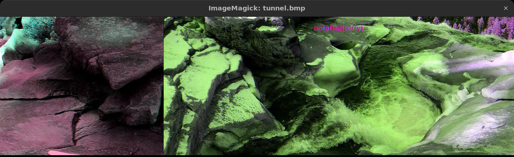
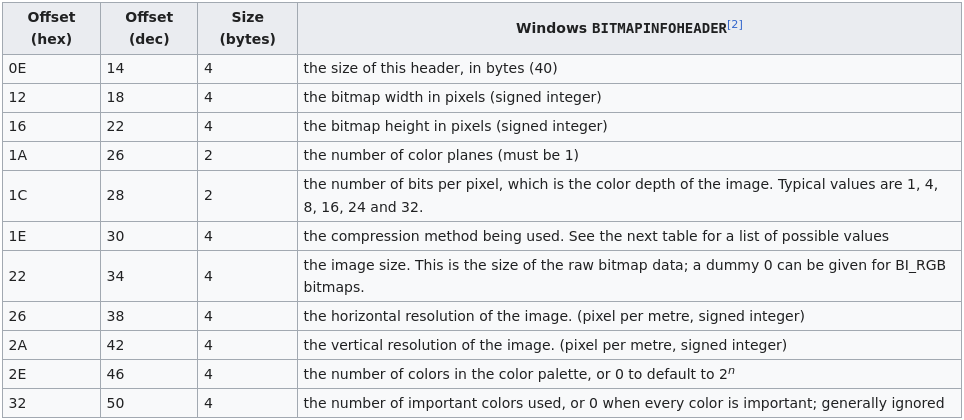
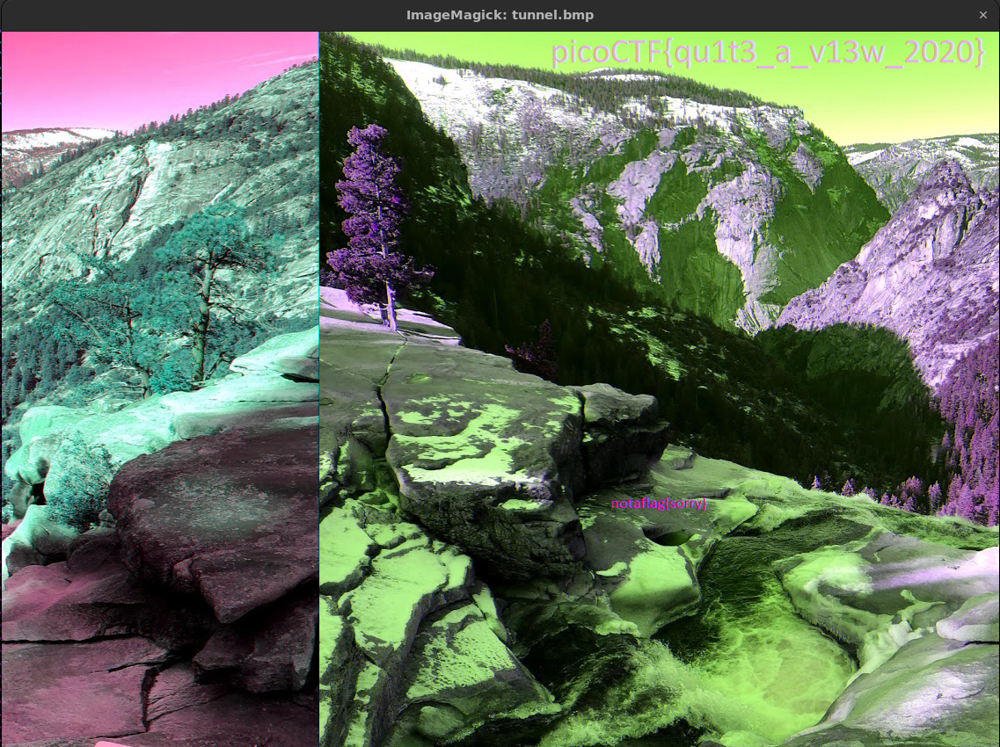
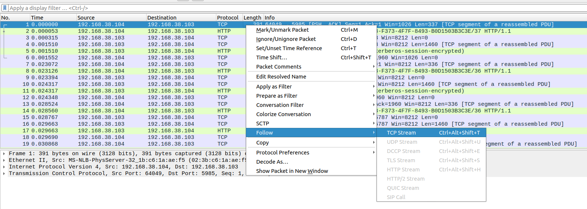
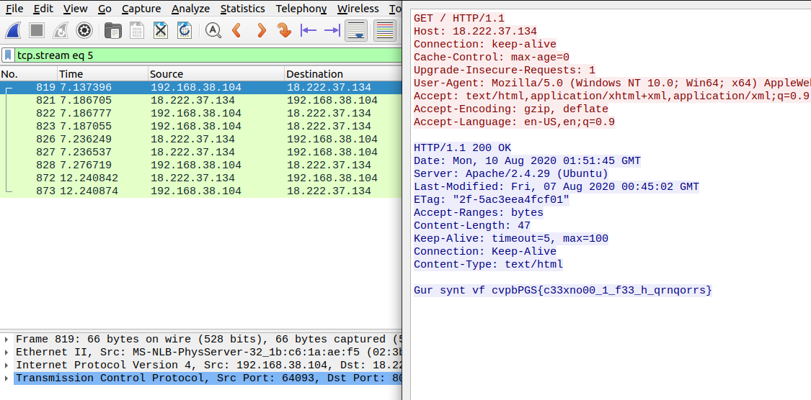
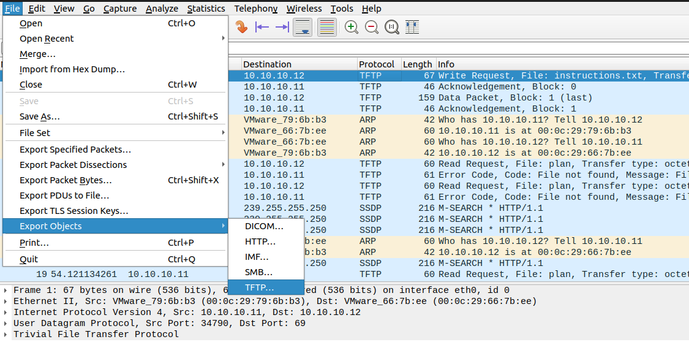
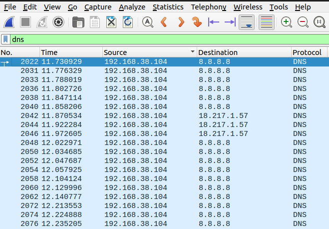
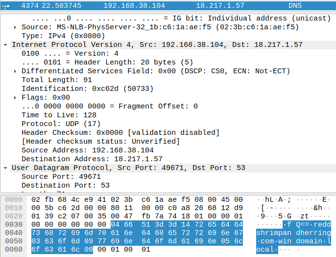
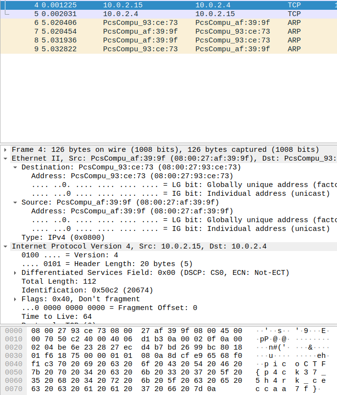

### information

Download the file and check its info with `exiftool`.

```console
exiftool cat.jpg                                                                                       ✭
ExifTool Version Number         : 12.40
File Name                       : cat.jpg
Directory                       : .
File Size                       : 858 KiB
File Modification Date/Time     : 2023:10:18 01:48:48+03:00
File Access Date/Time           : 2023:10:18 01:49:21+03:00
File Inode Change Date/Time     : 2023:10:18 01:49:09+03:00
File Permissions                : -rw-rw-r--
File Type                       : JPEG
File Type Extension             : jpg
MIME Type                       : image/jpeg
JFIF Version                    : 1.02
Resolution Unit                 : None
X Resolution                    : 1
Y Resolution                    : 1
Current IPTC Digest             : 7a78f3d9cfb1ce42ab5a3aa30573d617
Copyright Notice                : PicoCTF
Application Record Version      : 4
XMP Toolkit                     : Image::ExifTool 10.80
License                         : cGljb0NURnt0aGVfbTN0YWRhdGFfMXNfbW9kaWZpZWR9
Rights                          : PicoCTF
Image Width                     : 2560
Image Height                    : 1598
Encoding Process                : Baseline DCT, Huffman coding
Bits Per Sample                 : 8
Color Components                : 3
Y Cb Cr Sub Sampling            : YCbCr4:2:0 (2 2)
Image Size                      : 2560x1598
Megapixels                      : 4.1
```

We see a strange string at `License`. Try to `base64` decode it and get the flag.

```bash
exiftool cat.jpg | grep License | awk '{print $3}' | base64 -d
```

### tunn3l v1s10n

Download the file and run `xxd` on it.

```bash
xxd tunnel | head -n 20                                                                          ✹ ✭
00000000: 424d 8e26 2c00 0000 0000 bad0 0000 bad0  BM.&,...........
00000010: 0000 6e04 0000 3201 0000 0100 1800 0000  ..n...2.........
00000020: 0000 5826 2c00 2516 0000 2516 0000 0000  ..X&,.%...%.....
00000030: 0000 0000 0000 231a 1727 1e1b 2920 1d2a  ......#..'..) .*
00000040: 211e 261d 1a31 2825 352c 2933 2a27 382f  !.&..1(%5,)3*'8/
00000050: 2c2f 2623 332a 262d 2420 3b32 2e32 2925  ,/&#3*&-$ ;2.2)%
00000060: 3027 2333 2a26 382c 2836 2b27 392d 2b2f  0'#3*&8,(6+'9-+/
00000070: 2623 1d12 0e23 1711 2916 0e55 3d31 9776  &#...#..)..U=1.v
00000080: 668b 6652 996d 569e 7058 9e6f 549c 6f54  f.fR.mV.pX.oT.oT
00000090: ab7e 63ba 8c6d bd8a 69c8 9771 c193 71c1  .~c..m..i..q..q.
000000a0: 9774 c194 73c0 9372 c08f 6fbd 8e6e ba8d  .t..s..r..o..n..
000000b0: 6bb7 8d6a b085 64a0 7455 a377 5a98 6f56  k..j..d.tU.wZ.oV
000000c0: 7652 3a71 523d 6c4f 406d 5244 6e53 4977  vR:qR=lO@mRDnSIw
000000d0: 5e54 5339 3370 5852 7661 5973 5f54 7e6b  ^TS93pXRvaYs_T~k
000000e0: 5e86 7463 7e6a 5976 6250 765e 4c7a 6250  ^.tc~jYvbPv^LzbP
000000f0: 876d 5d83 6959 8d73 639b 8171 9e84 7498  .m].iY.sc..q..t.
00000100: 7e6e 9b81 718d 7363 735a 4a70 5747 5a41  ~n..q.scsZJpWGZA
00000110: 314f 3626 4e37 274f 3828 4f38 2851 3a2a  1O6&N7'O8(O8(Q:*
00000120: 5039 294f 3829 4b35 2950 3a2f 4b35 2a3f  P9)O8)K5)P:/K5*?
00000130: 291e 422e 234b 372c 4531 263f 2b20 432f  ).B.#K7,E1&?+ C/
```

As we can see from the [Magic Bytes](https://en.wikipedia.org/wiki/List_of_file_signatures) of the file, it was supposed to be a `.bmp` file. 

When we `display` the file, we see this:



Now, to fix the whole image, we need to change its extension but also change some things on the header.



As we can see, at offset `0x16`, we have the `height` of the `.bmp`. 

With `hexedit`, we tamper with the `height` of the image. Trying to change it from `0x1` to `0x3` worked perfectly.

Before:

```console
xxd tunnel.bmp | head -n 20                                                                          ✹ ✭
00000000: 424d 8e26 2c00 0000 0000 bad0 0000 bad0  BM.&,...........
00000010: 0000 6e04 0000 3201 0000 0100 1800 0000  ..n...2.........
```

After:

```
xxd tunnel.bmp | head -n 20                                                                          ✹ ✭
00000000: 424d 8e26 2c00 0000 0000 bad0 0000 bad0  BM.&,...........
00000010: 0000 6e04 0000 3203 0000 0100 1800 0000  ..n...2.........
```



### Matryoshka doll

We download the file and see that it's an image.

```bash
file dolls.jpg                                                                              
dolls.jpg: PNG image data, 594 x 1104, 8-bit/color RGBA, non-interlaced
```

As the challenge name suggests, we will extract any given files with `binwalk` using the `-M` option. From the `help` page of `binwalk`:

> Binwalk v2.3.3
> Craig Heffner, ReFirmLabs
> https://github.com/ReFirmLabs/binwalk
>
> Usage: binwalk [OPTIONS] [FILE1] [FILE2] [FILE3] ...
>
> Disassembly Scan Options:
>     -Y, --disasm                 Identify the CPU architecture of a file using the capstone disassembler
>     -T, --minsn=<int>            Minimum number of consecutive instructions to be considered valid (default: 500)
>     -k, --continue               Don't stop at the first match
>
> Signature Scan Options:
>     -B, --signature              Scan target file(s) for common file signatures
>     -R, --raw=<str>              Scan target file(s) for the specified sequence of bytes
>     -A, --opcodes                Scan target file(s) for common executable opcode signatures
>     -m, --magic=<file>           Specify a custom magic file to use
>     -b, --dumb                   Disable smart signature keywords
>     -I, --invalid                Show results marked as invalid
>     -x, --exclude=<str>          Exclude results that match <str>
>     -y, --include=<str>          Only show results that match <str>
>
> Extraction Options:
>     -e, --extract                Automatically extract known file types
>     -D, --dd=<type[:ext[:cmd]]>  Extract <type> signatures (regular expression), give the files an extension of <ext>, and execute <cmd>
>     -M, --matryoshka             Recursively scan extracted files

We run this command and successfully read `flag.txt` and remove all the unnecessary directories.

```bash
binwalk -e -M dolls.jpg && clear; find ./ -type f -name "flag.txt" -exec cat {} \; && rm -rf _dolls*
```

### Glory of the Garden

Download the file and run `strings` to get the flag.

```bash
strings garden.jpg | grep pico                                                                       ✹ ✭
Here is a flag "picoCTF{XXX}"
```

### Wireshark doo dooo do doo...

Download the file and open it in `wireshark`.

To install `wireshark` on a `Debian` based system, just run:

```bash 
sudo apt install -y wireshark
```

When we open the file in `wireshark`, we want to right click on a `TCP` packet and `follow TCP stream`.



At the fifth stream, we can see this string:



This seems like `ROT13`.

Run this command and get the flag.

```bash
python -c "import codecs; print(codecs.decode('cvpbPGS{c33xno00_1_f33_h_qrnqorrs}', 'rot_13'))"
```

### MacroHard WeakEdge

Download the file and try to extract something with `binwalk`.

```bash
binwalk -e Forensics\ is\ fun.pptm
```

We see a `0.zip` file inside. We unzip it and overrides the current directories.

```bash
unzip 0.zip 
```

I am not familiar with these files so I searched around and found a file name `hidden`. 

```bash
ls ppt/slideMasters 

hidden  _rels  slideMaster1.xml
```

We cat its content and see something that looks like a `base64` strings.

```bash
cat ppt/slideMasters/hidden 

Z m x h Z z o g c G l j b 0 N U R n t E M W R f d V 9 r b j B 3 X 3 B w d H N f c l 9 6 M X A 1 f Q
```

We `base64` decode the string and get the flag.

```bash
echo 'ZmxhZzogcGljb0NURntEMWRfdV9rbjB3X3BwdHNfcl96MXA1fQ' | base64 -d
flag: picoCTF{D1d_u_kn0w_ppts_r_z1p5}
```

### Trivial Flag Transfer Protocol

Download the file and open it in `wireshark`. As the challenge name suggests, we will try to export files from the `TFTP` protocol.



We see it has extracted some files:

```bash
instructions.txt  picture2.bmp  plan         README.md
picture1.bmp      picture3.bmp  program.deb  tftp.pcapng
```

`README.md` is my file but the rest not. Starting with `instructions.txt`.

```bash
cat instructions.txt 
GSGCQBRFAGRAPELCGBHEGENSSVPFBJRZHFGQVFTHVFRBHESYNTGENAFSRE.SVTHERBHGNJNLGBUVQRGURSYNTNAQVJVYYPURPXONPXSBEGURCYNA
```

This looks like a `Ceasar's cipher`. We try `ROT13`.

```bash
python -c "import codecs; print(codecs.decode('GSGCQBRFAGRAPELCGBHEGENSSVPFBJRZHFGQVFTHVFRBHESYNTGENAFSRE.SVTHERBHGNJNLGBUVQRGURSYNTNAQVJVYYPURPXONPXSBEGURCYNA', 'rot_13'))"
```

The output is readable: `TFTPDOESNTENCRYPTOURTRAFFICSOWEMUSTDISGUISEOURFLAGTRANSFER.FIGUREOUTAWAYTOHIDETHEFLAGANDIWILLCHECKBACKFORTHEPLAN`

It suggests we `check back for the plan`. So, out next target is the `plan` file.

```bash
cat plan 
VHFRQGURCEBTENZNAQUVQVGJVGU-QHRQVYVTRAPR.PURPXBHGGURCUBGBF
```

Another `ROT13` maybe?

```bash
python -c "import codecs; print(codecs.decode('VHFRQGURCEBTENZNAQUVQVGJVGU-QHRQVYVTRAPR.PURPXBHGGURCUBGBF', 'rot_13'))"
```

The output is readable:

`IUSEDTHEPROGRAMANDHIDITWITH-DUEDILIGENCE.CHECKOUTTHEPHOTOS`.

It suggests we `check out the photos` that he has `hidded` something in there `with` the possible password `DUEDILIGENCE`.

We try to `extract` the files with given password. I personally went with `stegide`. The third picture contains `flag.txt`.

```bash
steghide extract -sf picture3.bmp -p DUEDILIGENCE

wrote extracted data to "flag.txt".
```

```bash
steghide extract -sf picture3.bmp -p DUEDILIGENCE && clear && cat flag.txt
```

### Wireshark twoo twooo two twoo...

We download the file and open it in `wireshark`.

If we follow the `TCP` stream, we find ourselves in a big rabbit hole, getting flags like these: `picoCTF{cb8fe3ec65f890e2f0570c98c4edd3fe4115bc059ac2afb39300c7b66f2302c4}`. 

Tried a few and then left the rabbit hole. Then I decided to check the `DNS` stream for anything suspicious. 

 

We see that most of the `Destinations` are `8.8.8.8` but there are others with the `IP` `18.217.1.57`.

We apply this filter to read only the packets from this destination.

```console
dns and ip.dst==18.217.1.57
```

We take a look at the last byte and we can see this:


A weird `Q==`. This might be the ending of a `base64` string. We iterate through all the packets and we extract this string:

`cGljb0NURntkbnNfM3hmMWxfZnR3X2RlYWRiZWVmfQ==`. We `base64` decode it and get the flag.

```bash
echo 'cGljb0NURntkbnNfM3hmMWxfZnR3X2RlYWRiZWVmfQ==' | base64 -d
```

### Enhance!

Download the file and run `strings`.

```bash
strings drawing.flag.svg 
<?xml version="1.0" encoding="UTF-8" standalone="no"?>
<!-- Created with Inkscape (http://www.inkscape.org/) -->
<svg
   xmlns:dc="http://purl.org/dc/elements/1.1/"
   xmlns:cc="http://creativecommons.org/ns#"
   xmlns:rdf="http://www.w3.org/1999/02/22-rdf-syntax-ns#"
   xmlns:svg="http://www.w3.org/2000/svg"
   xmlns="http://www.w3.org/2000/svg"
   xmlns:sodipodi="http://sodipodi.sourceforge.net/DTD/sodipodi-0.dtd"
   xmlns:inkscape="http://www.inkscape.org/namespaces/inkscape"
   width="210mm"
   height="297mm"
   viewBox="0 0 210 297"
   version="1.1"
   id="svg8"
   inkscape:version="0.92.5 (2060ec1f9f, 2020-04-08)"
   sodipodi:docname="drawing.svg">
  <defs
     id="defs2" />
  <sodipodi:namedview
     id="base"
     pagecolor="#ffffff"
     bordercolor="#666666"
     borderopacity="1.0"
     inkscape:pageopacity="0.0"
     inkscape:pageshadow="2"
     inkscape:zoom="0.69833333"
     inkscape:cx="400"
     inkscape:cy="538.41159"
     inkscape:document-units="mm"
     inkscape:current-layer="layer1"
     showgrid="false"
     inkscape:window-width="1872"
     inkscape:window-height="1016"
     inkscape:window-x="48"
     inkscape:window-y="27"
     inkscape:window-maximized="1" />
  <metadata
     id="metadata5">
    <rdf:RDF>
      <cc:Work
         rdf:about="">
        <dc:format>image/svg+xml</dc:format>
        <dc:type
           rdf:resource="http://purl.org/dc/dcmitype/StillImage" />
        <dc:title></dc:title>
      </cc:Work>
    </rdf:RDF>
  </metadata>
  <g
     inkscape:label="Layer 1"
     inkscape:groupmode="layer"
     id="layer1">
    <ellipse
       id="path3713"
       cx="106.2122"
       cy="134.47203"
       rx="102.05357"
       ry="99.029755"
       style="stroke-width:0.26458332" />
    <circle
       style="fill:#ffffff;stroke-width:0.26458332"
       id="path3717"
       cx="107.59055"
       cy="132.30211"
       r="3.3341289" />
    <ellipse
       style="fill:#000000;stroke-width:0.26458332"
       id="path3719"
       cx="107.45217"
       cy="132.10078"
       rx="0.027842503"
       ry="0.031820003" />
    <text
       xml:space="preserve"
       style="font-style:normal;font-weight:normal;font-size:0.00352781px;line-height:1.25;font-family:sans-serif;letter-spacing:0px;word-spacing:0px;fill:#ffffff;fill-opacity:1;stroke:none;stroke-width:0.26458332;"
       x="107.43014"
       y="132.08501"
       id="text3723"><tspan
         sodipodi:role="line"
         x="107.43014"
         y="132.08501"
         style="font-size:0.00352781px;line-height:1.25;fill:#ffffff;stroke-width:0.26458332;"
         id="tspan3748">p </tspan><tspan
         sodipodi:role="line"
         x="107.43014"
         y="132.08942"
         style="font-size:0.00352781px;line-height:1.25;fill:#ffffff;stroke-width:0.26458332;"
         id="tspan3754">i </tspan><tspan
         sodipodi:role="line"
         x="107.43014"
         y="132.09383"
         style="font-size:0.00352781px;line-height:1.25;fill:#ffffff;stroke-width:0.26458332;"
         id="tspan3756">c </tspan><tspan
         sodipodi:role="line"
         x="107.43014"
         y="132.09824"
         style="font-size:0.00352781px;line-height:1.25;fill:#ffffff;stroke-width:0.26458332;"
         id="tspan3758">o </tspan><tspan
         sodipodi:role="line"
         x="107.43014"
         y="132.10265"
         style="font-size:0.00352781px;line-height:1.25;fill:#ffffff;stroke-width:0.26458332;"
         id="tspan3760">C </tspan><tspan
         sodipodi:role="line"
         x="107.43014"
         y="132.10706"
         style="font-size:0.00352781px;line-height:1.25;fill:#ffffff;stroke-width:0.26458332;"
         id="tspan3762">T </tspan><tspan
         sodipodi:role="line"
         x="107.43014"
         y="132.11147"
         style="font-size:0.00352781px;line-height:1.25;fill:#ffffff;stroke-width:0.26458332;"
         id="tspan3764">F { 3 n h 4 n </tspan><tspan
         sodipodi:role="line"
         x="107.43014"
         y="132.11588"
         style="font-size:0.00352781px;line-height:1.25;fill:#ffffff;stroke-width:0.26458332;"
         id="tspan3752">c 3 d _ d 0 a 7 5 7 b f }</tspan></text>
  </g>
</svg>
```

At the last lines we see the flag, but we need to concatenate the strings. 

### File types

We download the file with `wget`.

```bash
wget https://artifacts.picoctf.net/c/82/Flag.pdf
```

Run `file`.

```bash
file Flag.pdf 
Flag.pdf: shell archive text
```

We see that it's a `shell archive text`  file and contains this `data`:

```bash
#!/bin/sh
# This is a shell archive (produced by GNU sharutils 4.15.2).
# To extract the files from this archive, save it to some FILE, remove
# everything before the '#!/bin/sh' line above, then type 'sh FILE'.
lock_dir=_sh00046
# Made on 2023-03-16 01:40 UTC by <root@e076735df429>.
# Source directory was '/app'.
# Existing files will *not* be overwritten, unless '-c' is specified.
# This shar contains:
# length mode       name
# ------ ---------- ------------------------------------------
#   1092 -rw-r--r-- flag
MD5SUM=${MD5SUM-md5sum}
f=`${MD5SUM} --version | egrep '^md5sum .*(core|text)utils'`
test -n "${f}" && md5check=true || md5check=false
${md5check} || \
  echo 'Note: not verifying md5sums.  Consider installing GNU coreutils.'
if test "X$1" = "X-c"
then keep_file=''
else keep_file=true
echo=echo
save_IFS="${IFS}"
IFS="${IFS}:"
gettext_dir=
locale_dir=
set_echo=false
for dir in $PATH
  if test -f $dir/gettext \
     && ($dir/gettext --version >/dev/null 2>&1)
  then
    case `$dir/gettext --version 2>&1 | sed 1q` in
      *GNU*) gettext_dir=$dir
      set_echo=true
      break ;;
    esac
  fi
done
if ${set_echo}
then
  set_echo=false
  for dir in $PATH
  do
    if test -f $dir/shar \
       && ($dir/shar --print-text-domain-dir >/dev/null 2>&1)
    then
      locale_dir=`$dir/shar --print-text-domain-dir`
      set_echo=true
      break
    fi
  done
  if ${set_echo}
  then
    TEXTDOMAINDIR=$locale_dir
    export TEXTDOMAINDIR
    TEXTDOMAIN=sharutils
    export TEXTDOMAIN
    echo="$gettext_dir/gettext -s"
  fi
IFS="$save_IFS"
if (echo "testing\c"; echo 1,2,3) | grep c >/dev/null
then if (echo -n test; echo 1,2,3) | grep n >/dev/null
     then shar_n= shar_c='
     else shar_n=-n shar_c= ; fi
else shar_n= shar_c='\c' ; fi
f=shar-touch.$$
st1=200112312359.59
st2=123123592001.59
st2tr=123123592001.5 # old SysV 14-char limit
st3=1231235901
if   touch -am -t ${st1} ${f} >/dev/null 2>&1 && \
     test ! -f ${st1} && test -f ${f}; then
  shar_touch='touch -am -t $1$2$3$4$5$6.$7 "$8"'
elif touch -am ${st2} ${f} >/dev/null 2>&1 && \
     test ! -f ${st2} && test ! -f ${st2tr} && test -f ${f}; then
  shar_touch='touch -am $3$4$5$6$1$2.$7 "$8"'
elif touch -am ${st3} ${f} >/dev/null 2>&1 && \
     test ! -f ${st3} && test -f ${f}; then
  shar_touch='touch -am $3$4$5$6$2 "$8"'
else
  shar_touch=:
  echo
  ${echo} 'WARNING: not restoring timestamps.  Consider getting and
installing GNU '\''touch'\'', distributed in GNU coreutils...'
  echo
rm -f ${st1} ${st2} ${st2tr} ${st3} ${f}
if test ! -d ${lock_dir} ; then :
else ${echo} "lock directory ${lock_dir} exists"
     exit 1
if mkdir ${lock_dir}
then ${echo} "x - created lock directory ${lock_dir}."
else ${echo} "x - failed to create lock directory ${lock_dir}."
     exit 1
# ============= flag ==============
if test -n "${keep_file}" && test -f 'flag'
then
${echo} "x - SKIPPING flag (file already exists)"
else
${echo} "x - extracting flag (text)"
  sed 's/^X//' << 'SHAR_EOF' | uudecode &&
begin 600 flag
M(3QA<F-H/@IF;&%G+R`@("`@("`@("`@,"`@("`@("`@("`@,"`@("`@,"`@
M("`@-C0T("`@("`Q,#(T("`@("`@8`K'<>H`.Y*D@0`````!````$F2#<P4`
M``#^`69L86<``$)::#DQ05DF4UF(WJSO```@____Y)U_U<SW/^OTZ?'U_=L^
M[6U=O_O(8_WQ_?;^]R_>L[`!&U8(`T&F0VH`T&@:```#0!IH``&@'J:#1HT`
M]"`!H-``!M0;4VH>IM3,:FH@T:&(#3)B:`T,F@:-!IDTT-&AHP3(&@T-,0T&
M(&0Q#1IH/2`,(-H1H`R9`%4T3)H>D:`TR9&AHT`R!H&09#",0``8C0#$,@,@
MR8F@`TT:!H:!D8C0`0`@`"01`H!^_$QU,`V*$A`!6'F(]N[-;FC]^&3PR1#9
MPR,KRW><F<49%$Q!!N[Y?=40;N##KW4D[`_\>RXRA?-VG(E/=DW&Q`:DU8G>
MMFW,-D>1C@-1P&"MR*[TX&O7KM9]S5=DU0VC=9?.T'0?DVD+/#[?',M)']85
M*8@&IZ7%1U*=`[3V(?.C;*QER!+T,)6UYG?BLMV7!\L\;3$+^W%89SR(9RO(
M>+3K'>QL]21+'O&!V`_:4<<C7R!.D'BG?GI\GT1*W#AC625`V>W`87AZF@[I
M:]!!QL1^'NUJ#8O\=0A54@29A#E-6B(?TR(09S3_#,Z0H'SQBO?]^LMC2G$!
MA!19*?93"DWLZ`^I!$.L*!%ILMU#!AJ3SP_!>:^5PJIFC)-,*5ERC!7="@"$
M,$;I*<PV8-8[\ORRQ:K_%W)%.%"0B-ZL[\=Q``````````````$`````````
M"P``````5%)!24Q%4B$A(0``````````````````````````````````````
M````````````````````````````````````````````````````````````
M````````````````````````````````````````````````````````````
M````````````````````````````````````````````````````````````
M````````````````````````````````````````````````````````````
M````````````````````````````````````````````````````````````
M````````````````````````````````````````````````````````````
M````````````````````````````````````````````````````````````
M````````````````````````````````````````````````````````````
M````````````````````````````````````````````````````````````
,````````````````
SHAR_EOF
  (set 20 23 03 16 01 40 19 'flag'
   eval "${shar_touch}") && \
  chmod 0644 'flag'
if test $? -ne 0
then ${echo} "restore of flag failed"
  if ${md5check}
  then (
       ${MD5SUM} -c >/dev/null 2>&1 || ${echo} 'flag': 'MD5 check failed'
       ) << \SHAR_EOF
0838b0ca0f0415b3cb6f24da377204de  flag
SHAR_EOF
else
test `LC_ALL=C wc -c < 'flag'` -ne 1092 && \
  ${echo} "restoration warning:  size of 'flag' is not 1092"
  fi
if rm -fr ${lock_dir}
then ${echo} "x - removed lock directory ${lock_dir}."
else ${echo} "x - failed to remove lock directory ${lock_dir}."
     exit 1
exit 0
```

We make it executable and run it. When we do, we get the following errors:

```bash
./Flag.pdf   
x - created lock directory _sh00046.
x - extracting flag (text)
./Flag.pdf: 119: uudecode: not found
restore of flag failed
flag: MD5 check failed
x - removed lock directory _sh00046.
```

To fix these errors, we need to install a package.

```bash
sudo apt-get update && sudo apt-get install sharutils
```

After that, we execute the file and get the `flag` file.

```console
./Flag.pdf                                           
x - created lock directory _sh00046.
x - extracting flag (text)
x - removed lock directory _sh00046.
```

We check the file and see that it's a `current ar archive`.

```console
file flag
flag: current ar archive
```

We extract it with `ar xv flag`. Now we got another `flag` file.

```bash
file flag
flag: cpio archive
```

This time is a `cpio archive`.

```bash
cpio -idu < flag
```

Now it's a `bzip2` file.

```bash
file flag
flag: bzip2 compressed data, block size = 900k
```

```bash
bzip2 -d flag 
bzip2: Can't guess original name for flag -- using flag.out
```

Now it's a `gzip`.

```bash
file flag.out 
flag.out: gzip compressed data, was "flag", last modified: Thu Mar 16 01:40:19 2023, from Unix, original size modulo 2^32 328
```

We convert the file to the correct format and decompress it.

```bash
mv flag flag.gz && gzip -d flag
```

Now it's an `lzip`.

```bash
file flag
flag: lzip compressed data, version: 1
```

```bash
sudo apt-get install lzip && mv flag flag.lz && lzip -d flag.lz
```

Now it's an `LZ4`.

```bash
file flag
flag: LZ4 compressed data (v1.4+)
```

Install `LZ4` and extract it.

```bash
sudo apt-get install lz4 && mv flag flag.lz4 && lz4 -d flag.lz4
```

Now it's `LZMA`.

```bash
file flag
flag: LZMA compressed data, non-streamed, size 253
```

Install the necessary packages.

```bash
sudo apt-get install xz-utils && mv flag flag.tar.xz && xz -d flag.tar.xz
```

I'm starting to get tired. 

```bash
file flag.tar 
flag.tar: lzop compressed data - version 1.040, LZO1X-1, os: Unix
```

```bash
sudo apt-get install lzop && mv flag.tar flag.lzo && lzop -d flag.lzo
```

Now `lzip`.

```bash
file flag
flag: lzip compressed data, version: 1
```

```bash
mv flag flag.lz && lzip -d flag.lz
```

I don't want to do this anymore, 1 last extraction and we get the flag.

```bash
mv flag flag.xz && xz --check=crc64 -d flag.xz
```

Now it's ASCII, so we just convert the hex to ASCII and get the flag.

```bash
python -c "print(bytes.fromhex(''.join(open('flag', 'rb').read().strip().decode('utf-8').split())).decode('utf-8'))"
```

```bash
#!/bin/bash
sudo apt-get update  && sudo apt-get install -y sharutils lz4 xz-utils cpio && 
chmod +x Flag.pdf    && ./Flag.pdf
cpio -idu < flag     && 
bzip2 -d flag        &&
mv flag.out flag.gz  && gzip -d flag                 &&
mv flag flag.lz      && lzip -d flag.lz              && 
mv flag flag.lz4     && lz4  -d flag.lz4             &&
mv flag flag.tar.xz  && xz   -d flag.tar.xz          &&
mv flag.tar flag.lzo && lzop -d flag.lzo             &&
mv flag flag.lz      && lzip -d flag.lz              && 
mv flag flag.xz      && xz --check=crc64 -d flag.xz  &&
clear
python3 -c "print(bytes.fromhex(''.join(open('flag', 'rb').read().strip().decode('utf-8').split())).decode('utf-8'))"
rm -rf flag*
```

### Lookey here

Download the file and run `cat` and `grep` to get the flag.

```bash
cat anthem.flag.txt | grep pico
      we think that the men of picoCTF{gr3p_15_@w3s0m3_4c479940}
```

### Packets Primer

Download the file and open it in `wireshark`. It's a small `pcap` and we can see at the 4th packet the flag.



### Redaction gone wrong

Download the file with `wget`.

```bash
wget https://artifacts.picoctf.net/c/84/Financial_Report_for_ABC_Labs.pdf
```

We see some redacted text inside the `pdf`. One good way to extract the content of a `pdf` is `pdftotext`.

```bash
pdftotext Financial_Report_for_ABC_Labs.pdf && cat Financial_Report_for_ABC_Labs.txt | grep pico
```

### Sleuthkit Intro

The first unintended way to solve this challenge is via `bruteforce`.

```python
#!/usr/bin/python3
from pwn import *
import warnings
import os
warnings.filterwarnings('ignore')
context.log_level = 'critical'

os.system('clear')

counter = 200000

while True:
	try:
		print(f'\rTries: {counter}', end='', flush=True)
		r = remote('saturn.picoctf.net', 64605)
		r.sendlineafter('sectors: ', str(counter))
		counter += 1
		print(f'\n\nSize: {counter}\n\nFlag --> {r.recvline_contains("pico", timeout=0.2).strip().decode()}')
		r.close()
		break
	except:
		r.close()
		pass
```

Otherwise, download the file and install `Sleuthkit` if needed.

```bash
sudo apt install sleuthkit -y
```

Then we `decompress` the file. 

```bash
gzip -d disk.img.gz
```

We are going to use `mmls` to view the partitions.

```bash
mmls disk.img 
DOS Partition Table
Offset Sector: 0
Units are in 512-byte sectors

      Slot      Start        End          Length       Description
000:  Meta      0000000000   0000000000   0000000001   Primary Table (#0)
001:  -------   0000000000   0000002047   0000002048   Unallocated
002:  000:000   0000002048   0000204799   0000202752   Linux (0x83)
```

We see that the size is `202752`.

### Milkslap

We press the glass of milk and get redirected here: `http://mercury.picoctf.net:29522/`.

Then we open the `gif` in another tab and get the image: `http://mercury.picoctf.net:29522/concat_v.png`.

```bash
wget http://mercury.picoctf.net:29522/concat_v.png
```

Running `zsteg` on the file will give the flag.

```bash
zsteg concat_v.png
```

### extensions

Download the file and run `file`.

```bash
file flag.txt
flag.txt: PNG image data, 1697 x 608, 8-bit/color RGB, non-interlaced
```

Even though the extension is `txt`, the magic bytes indicate the the file is in reality a `.png`.

Change the extension to `.png` and open the file.

```bash
sudo apt install -y feh && mv flag.txt flag.png && feh flag.png
```

### So Meta

Download the file and run `strings` and `grep`.

```bash
strings pico_img.png | grep pico
```

### shark on wire 1

Download the file and open it in `wireshark`.

Follow the `UDP` stream (`udp.stream eq 6`) and you will find the flag there. 

### What Lies Within

Download the file and run `zsteg`.

```bash
sudo zsteg buildings.png | grep pico
b1,rgb,lsb,xy       .. text: "picoCTF{h1d1ng_1n_th3_b1t5}"
```

### like1000

Download the file and `decompress`  it 1000 times to get the flag.

```bash
#!/bin/bash

for i in {1000..1}; 
do
  tar -xvf "${i}.tar" && rm -f "${i}.tar" filler.txt
done

feh flag.png
```
