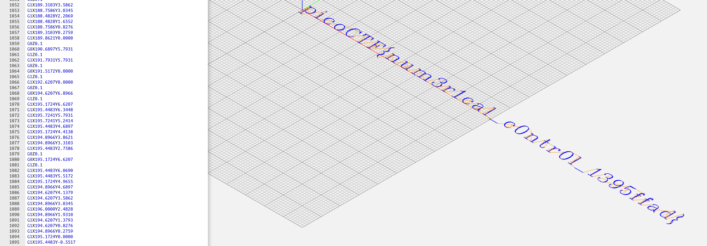
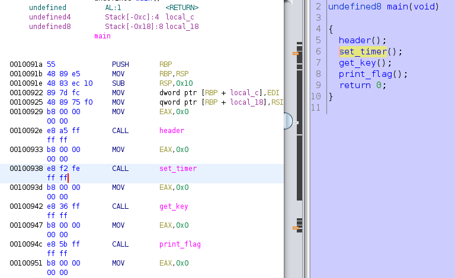
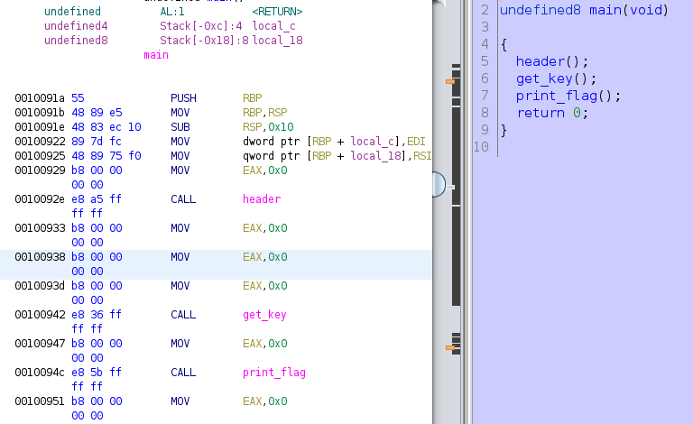

### Transformation

The challenge provides an encoded string and the way it was produced.

`灩捯䍔䙻ㄶ形楴獟楮獴㌴摟潦弸彥ㄴㅡて㝽`

```python
''.join([chr((ord(flag[i]) << 8) + ord(flag[i + 1])) for i in range(0, len(flag), 2)])
```

If we reverse this, we can get the flag.

```python
enc = '灩捯䍔䙻ㄶ形楴獟楮獴㌴摟潦弸彥ㄴㅡて㝽'
flag = ""
for i in range(0, len(enc)):
    val = ord(enc[i])
    flag += chr(val >> 8) + chr(val & 0xFF)

print(flag)
```

```bash
➜  Reverse-Engineering git:(main) ✗ python solver.py
picoCTF{XXX}
```

### crackme-py

Download the file and check its content.

```python
# Hiding this really important number in an obscure piece of code is brilliant!
# AND it's encrypted!
# We want our biggest client to know his information is safe with us.
bezos_cc_secret = "A:4@r%uL`M-^M0c0AbcM-MFE067d3eh2bN"

# Reference alphabet
alphabet = "!\"#$%&'()*+,-./0123456789:;<=>?@ABCDEFGHIJKLMNOPQRSTUVWXYZ"+ \
            "[\\]^_`abcdefghijklmnopqrstuvwxyz{|}~"


def decode_secret(secret):
    """ROT47 decode

    NOTE: encode and decode are the same operation in the ROT cipher family.
    """

    # Encryption key
    rotate_const = 47

    # Storage for decoded secret
    decoded = ""

    # decode loop
    for c in secret:
        index = alphabet.find(c)
        original_index = (index + rotate_const) % len(alphabet)
        decoded = decoded + alphabet[original_index]

    print(decoded)


def choose_greatest():
    """Echo the largest of the two numbers given by the user to the program

    Warning: this function was written quickly and needs proper error handling
    """

    user_value_1 = input("What's your first number? ")
    user_value_2 = input("What's your second number? ")
    greatest_value = user_value_1 # need a value to return if 1 & 2 are equal

    if user_value_1 > user_value_2:
        greatest_value = user_value_1
    elif user_value_1 < user_value_2:
        greatest_value = user_value_2

    print( "The number with largest positive magnitude is "
        + str(greatest_value) )


choose_greatest()
```

We see there is a `decode_secret()` function and the `secret` above. We simply remove the unnecessary part and directly call this function with the `secret` as argument.

```python
# Hiding this really important number in an obscure piece of code is brilliant!
# AND it's encrypted!
# We want our biggest client to know his information is safe with us.
bezos_cc_secret = "A:4@r%uL`M-^M0c0AbcM-MFE067d3eh2bN"

# Reference alphabet
alphabet = "!\"#$%&'()*+,-./0123456789:;<=>?@ABCDEFGHIJKLMNOPQRSTUVWXYZ"+ \
            "[\\]^_`abcdefghijklmnopqrstuvwxyz{|}~"


def decode_secret(secret):
    """ROT47 decode

    NOTE: encode and decode are the same operation in the ROT cipher family.
    """

    # Encryption key
    rotate_const = 47

    # Storage for decoded secret
    decoded = ""

    # decode loop
    for c in secret:
        index = alphabet.find(c)
        original_index = (index + rotate_const) % len(alphabet)
        decoded = decoded + alphabet[original_index]

    print(decoded)

decode_secret(bezos_cc_secret)
```

```bash
➜  Reverse-Engineering git:(main) ✗ python crackme.py 
picoCTF{XXX}
```

### vault-door-training

Download the file and `cat` its content.

```java
import java.util.*;

class VaultDoorTraining {
    public static void main(String args[]) {
        VaultDoorTraining vaultDoor = new VaultDoorTraining();
        Scanner scanner = new Scanner(System.in); 
        System.out.print("Enter vault password: ");
        String userInput = scanner.next();
	String input = userInput.substring("picoCTF{".length(),userInput.length()-1);
	if (vaultDoor.checkPassword(input)) {
	    System.out.println("Access granted.");
	} else {
	    System.out.println("Access denied!");
	}
   }

    // The password is below. Is it safe to put the password in the source code?
    // What if somebody stole our source code? Then they would know what our
    // password is. Hmm... I will think of some ways to improve the security
    // on the other doors.
    //
    // -Minion #9567
    public boolean checkPassword(String password) {
        return password.equals("w4rm1ng_Up_w1tH_jAv4_3808d338b46");
    }
}
```

We see the the flag is `picoCTF{w4rm1ng_Up_w1tH_jAv4_3808d338b46}`.

### speeds and feeds

When we connect to the the remote server with `nc mercury.picoctf.net 16524`, we get a big amount of code.

```bash
G17 G21 G40 G90 G64 P0.003 F50
G0Z0.1
G0Z0.1
G0X0.8276Y3.8621
G1Z0.1
G1X0.8276Y-1.9310
G0Z0.1
G0X1.1034Y3.8621
G1Z0.1
G1X1.1034Y-1.9310
```

From the challenge description, it says it's `cnc`. So, we write the whole output to a file like this:

```bash
nc mercury.picoctf.net 16524 > cnc.gcode
```

Then, we use this [converter](https://ncviewer.com/) to decrypt the message. 



### Shop

I was lucky enough because I did not need to reverse engineer this binary. With some fuzzing I found that if I choose option `0` and insert a negative number, it increases the coins. This is common mistake when the calculation is done like:

```c
size_t coins = 10;
int user_input = 0;
size_t price = 20;
fprintf(stdout, "Insert coins: ");
scanf("%d", &user_input);

// This should be added
if (user_input < 0 || user_input > price)
    // trigger an error and continue or exit

coins -= user_input;
```

Now if we give a negative number, let's say -10, it will do `10 - (-10) = 20`, thus increasing the coins instead of decreasing them. 

```bash
➜  Reverse-Engineering git:(main) ✗ nc mercury.picoctf.net 11371
Welcome to the market!
=====================
You have 40 coins
	Item		Price	Count
(0) Quiet Quiches	10	12
(1) Average Apple	15	8
(2) Fruitful Flag	100	1
(3) Sell an Item
(4) Exit
Choose an option: 
0
How many do you want to buy?
-100
You have 1040 coins
	Item		Price	Count
(0) Quiet Quiches	10	112
(1) Average Apple	15	8
(2) Fruitful Flag	100	1
(3) Sell an Item
(4) Exit
Choose an option: 
2
How many do you want to buy?
1
Flag is:  [112 105 99 111 67 84 70 123 98 52 100 95 98 114 111 103 114 97 109 109 101 114 95 98 56 100 55 50 55 49 102 125]
```

Automate everything.

```python
#!/usr/bin/python3.8
from pwn import *
import warnings
warnings.filterwarnings('ignore')
context.log_level = 'critical'

r = remote('mercury.picoctf.net', 11371)

# Trigger wrong calculation to increase coins
r.sendline('0')
r.sendline('-100')

# Read flag
r.sendline('2')
r.sendline('1')

# Decrypt flag
r.recvuntil('[')
enc = r.recvuntil(']', drop=True).split()

for i in enc:
  print(chr(int(i.decode())), end='')
```

```bash
➜  Reverse-Engineering git:(main) ✗ python solver.py
picoCTF{XXX}
```

### vault-door-1

Download the file and `cat` its content with `cat VaultDoor1.java`.

```java
	password.charAt(0)  == 'd' &&
    password.charAt(29) == 'a' &&
    password.charAt(4)  == 'r' &&
    password.charAt(2)  == '5' &&
    password.charAt(23) == 'r' &&
    password.charAt(3)  == 'c' &&
    password.charAt(17) == '4' &&
    password.charAt(1)  == '3' &&
    password.charAt(7)  == 'b' &&
    password.charAt(10) == '_' &&
    password.charAt(5)  == '4' &&
    password.charAt(9)  == '3' &&
    password.charAt(11) == 't' &&
    password.charAt(15) == 'c' &&
    password.charAt(8)  == 'l' &&
    password.charAt(12) == 'H' &&
    password.charAt(20) == 'c' &&
    password.charAt(14) == '_' &&
    password.charAt(6)  == 'm' &&
    password.charAt(24) == '5' &&
    password.charAt(18) == 'r' &&
    password.charAt(13) == '3' &&
    password.charAt(19) == '4' &&
    password.charAt(21) == 'T' &&
    password.charAt(16) == 'H' &&
    password.charAt(27) == '6' &&
    password.charAt(30) == 'f' &&
    password.charAt(25) == '_' &&
    password.charAt(22) == '3' &&
    password.charAt(28) == 'd' &&
    password.charAt(26) == 'f' &&
    password.charAt(31) == '4';
```

This is the flag. Now we need to rearrange it and keep only the characters inside the quotes.

```bash
password.charAt(0)  == 'd' &&
password.charAt(1)  == '3' &&
password.charAt(2)  == '5' &&
password.charAt(3)  == 'c' &&
password.charAt(4)  == 'r' &&
password.charAt(5)  == '4' &&
password.charAt(6)  == 'm' &&
password.charAt(7)  == 'b' &&
password.charAt(8)  == 'l' &&
password.charAt(9)  == '3' &&
password.charAt(10) == '_' &&
password.charAt(11) == 't' &&
password.charAt(12) == 'H' &&
password.charAt(13) == '3' &&
password.charAt(14) == '_' &&
password.charAt(15) == 'c' &&
password.charAt(16) == 'H' &&
password.charAt(17) == '4' &&
password.charAt(18) == 'r' &&
password.charAt(19) == '4' &&
password.charAt(20) == 'c' &&
password.charAt(21) == 'T' &&
password.charAt(22) == '3' &&
password.charAt(23) == 'r' &&
password.charAt(24) == '5' &&
password.charAt(25) == '_' &&
password.charAt(26) == 'f' &&
password.charAt(27) == '6' &&
password.charAt(28) == 'd' &&
password.charAt(29) == 'a' &&
password.charAt(30) == 'f' &&
password.charAt(31) == '4';
```

Write them in a file named `pass.txt` and run this bash script to get the flag.

```bash
#!/bin/bash

flag1="picoCTF{"
flag2=$(sed -n "s/.*'\(.\)'.*/\1/gp" "pass.txt")
flag3="}"

echo "Flag --> $flag1$flag2$flag3" | tr -d "\n"
```

```bash
➜  Reverse-Engineering git:(main) ✗ ./sol.sh
Flag --> picoCTF{XXX}
```

### file-run1

Download the file and run `strings` with `grep` to get the flag.

```bash
➜  Reverse-Engineering git:(main) ✗ strings run | grep pico
picoCTF{XXX}
```

### file-run2

Download the file and run `strings` with `grep` to get the flag.

```bash
➜  Reverse-Engineering git:(main) ✗ strings run | grep pico
picoCTF{XXX}
```

### GDB Test Drive

Download the file and `chmod +x` to mark it as executable. After that, we can open it in `gdb` with `gdb ./gdbme` and run the following commands:

```gdb
break *(main+99)
run
jump *(main+104)
```

Or we can make an automated solver to print the flag.

`sol.py`:

```python
import gdb

g = lambda x : gdb.execute(x)

g('set logging file tmp.txt')
g('b *main+99')
open('tmp.txt').read()
g('set logging on')
g('r')
g('b *main+147')
g('jump *main+104')
g('set logging enabled off')
g('exit')
```

`flag.py`:

```python
import os, re

os.system('gdb -x sol.py ./gdbme')

os.system('clear')
f = open('tmp.txt', 'r')
content = f.readlines()
for line in content:
	if 'picoCTF' in line:
		flag = line
		f.close()
		break

pattern = r'pico[^}]*}'
match = re.search(pattern, flag)
print(f'Flag --> {match.group(0)}')
```

Run `python flag.py` to get the flag.

```bash
Flag --> picoCTF{XXX}
```

### patchme.py

Download the 2 files and `cat` the `patchme.flag.py`.

```python
### THIS FUNCTION WILL NOT HELP YOU FIND THE FLAG --LT ########################
def str_xor(secret, key):
    #extend key to secret length
    new_key = key
    i = 0
    while len(new_key) < len(secret):
        new_key = new_key + key[i]
        i = (i + 1) % len(key)        
    return "".join([chr(ord(secret_c) ^ ord(new_key_c)) for (secret_c,new_key_c) in zip(secret,new_key)])
###############################################################################


flag_enc = open('flag.txt.enc', 'rb').read()


def level_1_pw_check():
    user_pw = input("Please enter correct password for flag: ")
    if( user_pw == "ak98" + \
                   "-=90" + \
                   "adfjhgj321" + \
                   "sleuth9000"):
        print("Welcome back... your flag, user:")
        decryption = str_xor(flag_enc.decode(), "utilitarian")
        print(decryption)
        return
    print("That password is incorrect")


level_1_pw_check()
```

We see the 2 lines that decrypt and print the flag. Instead of the checker we call these 2 lines and get the flag.

```python
def str_xor(secret, key):
    new_key = key
    i = 0
    while len(new_key) < len(secret):
        new_key = new_key + key[i]
        i = (i + 1) % len(key)        
    return "".join([chr(ord(secret_c) ^ ord(new_key_c)) for (secret_c,new_key_c) in zip(secret,new_key)])

flag_enc = open('flag.txt.enc', 'rb').read()

decryption = str_xor(flag_enc.decode(), "utilitarian")
print(decryption)
```

```bash
➜  Reverse-Engineering git:(main) ✗ python patchme.flag.py 
picoCTF{XXX}
```

### Safe Opener

Download the file and `cat` its content.

```java
import java.io.*;
import java.util.*;  
public class SafeOpener {
    public static void main(String args[]) throws IOException {
        BufferedReader keyboard = new BufferedReader(new InputStreamReader(System.in));
        Base64.Encoder encoder = Base64.getEncoder();
        String encodedkey = "";
        String key = "";
        int i = 0;
        boolean isOpen;
        

        while (i < 3) {
            System.out.print("Enter password for the safe: ");
            key = keyboard.readLine();

            encodedkey = encoder.encodeToString(key.getBytes());
            System.out.println(encodedkey);
              
            isOpen = openSafe(encodedkey);
            if (!isOpen) {
                System.out.println("You have  " + (2 - i) + " attempt(s) left");
                i++;
                continue;
            }
            break;
        }
    }
    
    public static boolean openSafe(String password) {
        String encodedkey = "cGwzYXMzX2wzdF9tM18xbnQwX3RoM19zYWYz";
        
        if (password.equals(encodedkey)) {
            System.out.println("Sesame open");
            return true;
        }
        else {
            System.out.println("Password is incorrect\n");
            return false;
        }
    }
}
```

We can see the `encodedkey` which is a `base64` string. Decode it and add it inside the flag format to get the flag.

```bash
echo -n 'picoCTF{'; echo cGwzYXMzX2wzdF9tM18xbnQwX3RoM19zYWYz | base64 -d; echo '}'
picoCTF{XXX}
```

### unpackme.py

Download the file and `cat` its content.

```python
import base64
from cryptography.fernet import Fernet


payload = b'gAAAAABkEnJ22xH-mciP_AukxIoebp8KDzy7RvBh_yPBcP9ZQGulW61mWzDNCXCQCI4RclwLPH5eeTTw7ThtEB14JnGBDZqsXEZWxLK6fxvyODJ-V-kyLnYkDVPB5sxwyHz-ouWyR2MJiR-dX0UQw1lyHun_R8c7EuvEmhehxyV-3NzVTDB0IJBCqAe_x4BjyNeh_yBdBiVTlAg5M_ekx0aeHLD-tB1oNxeHHFQYHHCcMpiv5L0cVQNrxwwpNrSgvRNf8b2bUwIFoyOlFIwUd4ev0ocgJkYh0g=='

key_str = 'correctstaplecorrectstaplecorrec'
key_base64 = base64.b64encode(key_str.encode())
f = Fernet(key_base64)
plain = f.decrypt(payload)
exec(plain.decode())
```

Without reversing it much, I simply printed the content of `plain` and got the flag.

```python
import base64
from cryptography.fernet import Fernet
import re

payload = 'gAAAAABkEnJ22xH-mciP_AukxIoebp8KDzy7RvBh_yPBcP9ZQGulW61mWzDNCXCQCI4RclwLPH5eeTTw7ThtEB14JnGBDZqsXEZWxLK6fxvyODJ-V-kyLnYkDVPB5sxwyHz-ouWyR2MJiR-dX0UQw1lyHun_R8c7EuvEmhehxyV-3NzVTDB0IJBCqAe_x4BjyNeh_yBdBiVTlAg5M_ekx0aeHLD-tB1oNxeHHFQYHHCcMpiv5L0cVQNrxwwpNrSgvRNf8b2bUwIFoyOlFIwUd4ev0ocgJkYh0g=='

key_str = 'correctstaplecorrectstaplecorrec'
key_base64 = base64.b64encode(key_str.encode())
f = Fernet(key_base64)
plain = f.decrypt(payload)

pattern = r'pico[^}]*}'
match = re.search(pattern, plain.decode())
print(f'Flag --> {match.group(0)}')
```

```bash
Flag --> picoCTF{XXX}
```

### gogo

Download the file and open it in a decompiler like [Ghidra](https://ghidra-sre.org/).

Running it we see it asks for a password.

```bash
➜  Reverse-Engineering git:(main) ✗ chmod +x enter_password && ./enter_password 
Enter Password: w3t
```

We do not know the password so we need to understand how the program works.

Taking a look at the `main.main` function.

```go
void main.main(void)

{
  uint *puVar1;
  int iVar2;
  int *in_GS_OFFSET;
  undefined4 *in_stack_ffffffac;
  undefined4 *puVar3;
  char cVar4;
  undefined *local_30;
  undefined **local_2c;
  undefined *local_28;
  undefined **local_24;
  undefined *local_20;
  undefined **local_1c;
  undefined *local_18 [2];
  undefined *local_10;
  undefined **local_c;
  undefined *local_8;
  undefined4 *local_4;
  undefined **ppuVar5;
  
  puVar1 = (uint *)(*(int *)(*in_GS_OFFSET + -4) + 8);
  if (&stack0x00000000 < (undefined *)*puVar1 || &stack0x00000000 == (undefined *)*puVar1) {
    local_4 = (undefined4 *)0x80d4a7b;
    runtime.morestack_noctxt();
    main.main();
    return;
  }
  runtime.newobject(&DAT_080e8860);
  fmt.Printf(&DAT_080fea50,0x10,0,0,0);
  local_18[0] = &DAT_080e1300;
  ppuVar5 = local_18;
  fmt.Scanf(&DAT_080fd1b6,3,ppuVar5,1,1);
  cVar4 = (char)ppuVar5;
  main.checkPassword(*in_stack_ffffffac,in_stack_ffffffac[1]);
  if (cVar4 == '\0') {
    local_10 = &DAT_080e8860;
    local_c = &main.statictmp_3;
    fmt.Println(&local_10,1,1);
  }
  else {
    local_20 = &DAT_080e8860;
    local_1c = &main.statictmp_0;
    fmt.Println(&local_20,1,1);
    local_28 = &DAT_080e8860;
    local_24 = &main.statictmp_1;
    fmt.Println(&local_28,1,1);
    local_30 = &DAT_080e8860;
    local_2c = &main.statictmp_2;
    puVar3 = (undefined4 *)0x1;
    fmt.Println(&local_30,1,1);
    runtime.newobject(&DAT_080e8860);
    local_8 = &DAT_080e1300;
    local_4 = puVar3;
    fmt.Scanf(&DAT_080fd1b6,3,&local_8,1,1);
    main.ambush(*puVar3,puVar3[1]);
    iVar2 = runtime.deferproc(0,&PTR_main.get_flag_081046a0);
    if (iVar2 != 0) {
      runtime.deferreturn();
      return;
    }
  }
  runtime.deferreturn();
  return;
}
```

We see that it calls a `&PTR_main.get_flag_081046a0`.  

Inspecting this address, we see it has the `main.get_flag`. 

```go
void main.get_flag(void)

{
  uint *puVar1;
  int *in_GS_OFFSET;
  undefined4 in_stack_ffffffc8;
  undefined4 in_stack_ffffffcc;
  undefined4 local_30;
  undefined4 local_2c;
  undefined4 local_28;
  undefined local_18 [8];
  undefined *local_10;
  undefined **local_c;
  undefined4 local_8;
  undefined4 local_4;
  
  puVar1 = (uint *)(*(int *)(*in_GS_OFFSET + -4) + 8);
  if ((undefined *)*puVar1 <= &stack0x00000000 && &stack0x00000000 != (undefined *)*puVar1) {
    io/ioutil.ReadFile(&DAT_080fd957,8);
    main.check(local_2c,local_28);
    runtime.slicebytetostring(0,in_stack_ffffffc8,in_stack_ffffffcc,local_30);
    local_8 = 0;
    local_4 = 0;
    local_10 = &DAT_080e8860;
    local_c = &main.statictmp_5;
    runtime.convT2Estring(&DAT_080e8860,local_18);
    fmt.Println(&local_10,2,2);
    os.Exit(0);
    return;
  }
```

This functions opens `flag.txt` and prints its content. We do not own the actual `flag.txt` on the remote server, so we cannot simply call this function locally and hope it works remotely.

There is another interesting function `main.checkPassword(*in_stack_ffffffac,in_stack_ffffffac[1]);`.

```go
void main.checkPassword(int param_1,uint param_2)

{
  uint *puVar1;
  uint uVar2;
  int iVar3;
  int *in_GS_OFFSET;
  undefined4 local_40;
  undefined4 local_3c;
  undefined4 local_38;
  undefined4 local_34;
  undefined4 local_30;
  undefined4 local_2c;
  undefined4 local_28;
  undefined4 local_24;
  byte local_20 [28];
  undefined4 uStack4;
  
  puVar1 = (uint *)(*(int *)(*in_GS_OFFSET + -4) + 8);
  if (&stack0x00000000 < (undefined *)*puVar1 || &stack0x00000000 == (undefined *)*puVar1) {
    uStack4 = 0x80d4b72;
    runtime.morestack_noctxt();
    main.checkPassword();
    return;
  }
  if ((int)param_2 < 0x20) {
    os.Exit(0);
  }
  FUN_08090b18();
void main.checkPassword(int param_1,uint param_2)

{
  uint *puVar1;
  uint uVar2;
  int iVar3;
  int *in_GS_OFFSET;
  undefined4 local_40;
  undefined4 local_3c;
  undefined4 local_38;
  undefined4 local_34;
  undefined4 local_30;
  undefined4 local_2c;
  undefined4 local_28;
  undefined4 local_24;
  byte local_20 [28];
  undefined4 uStack4;
  
  puVar1 = (uint *)(*(int *)(*in_GS_OFFSET + -4) + 8);
  if (&stack0x00000000 < (undefined *)*puVar1 || &stack0x00000000 == (undefined *)*puVar1) {
    uStack4 = 0x80d4b72;
    runtime.morestack_noctxt();
    main.checkPassword();
    return;
  }
  if ((int)param_2 < 0x20) {
    os.Exit(0);
  }
  FUN_08090b18();
void main.checkPassword(int param_1,uint param_2)

{
  uint *puVar1;
  uint uVar2;
  int iVar3;
  int *in_GS_OFFSET;
  undefined4 local_40;
  undefined4 local_3c;
  undefined4 local_38;
  undefined4 local_34;
  undefined4 local_30;
  undefined4 local_2c;
  undefined4 local_28;
  undefined4 local_24;
  byte local_20 [28];
  undefined4 uStack4;
  
  puVar1 = (uint *)(*(int *)(*in_GS_OFFSET + -4) + 8);
  if (&stack0x00000000 < (undefined *)*puVar1 || &stack0x00000000 == (undefined *)*puVar1) {
    uStack4 = 0x80d4b72;
    runtime.morestack_noctxt();
    main.checkPassword();
    return;
  }
  if ((int)param_2 < 0x20) {
    os.Exit(0);
  }
  FUN_08090b18();
  local_40 = 0x38313638;
  local_3c = 0x31663633;
  local_38 = 0x64336533;
  local_34 = 0x64373236;
  local_30 = 0x37336166;
  local_2c = 0x62646235;
  local_28 = 0x39383338;
  local_24 = 0x65343132;
  FUN_08090fe0();
  uVar2 = 0;
  iVar3 = 0;
  while( true ) {
    if (0x1f < (int)uVar2) {
      if (iVar3 == 0x20) {
        return;
      }
      return;
    }
    if ((param_2 <= uVar2) || (0x1f < uVar2)) break;
    if ((*(byte *)(param_1 + uVar2) ^ *(byte *)((int)&local_40 + uVar2)) == local_20[uVar2]) {
      iVar3 = iVar3 + 1;
    }
    uVar2 = uVar2 + 1;
  }
  runtime.panicindex();
  do {
    invalidInstructionException();
  } while( true );
}
  FUN_08090fe0();
  uVar2 = 0;
  iVar3 = 0;
  while( true ) {
    if (0x1f < (int)uVar2) {
      if (iVar3 == 0x20) {
        return;
      }
      return;
    }
    if ((param_2 <= uVar2) || (0x1f < uVar2)) break;
    if ((*(byte *)(param_1 + uVar2) ^ *(byte *)((int)&local_40 + uVar2)) == local_20[uVar2]) {
      iVar3 = iVar3 + 1;
    }
    uVar2 = uVar2 + 1;
  }
  runtime.panicindex();
  do {
    invalidInstructionException();
  } while( true );
}
  FUN_08090fe0();
  uVar2 = 0;
  iVar3 = 0;
  while( true ) {
    if (0x1f < (int)uVar2) {
      if (iVar3 == 0x20) {
        return;
      }
      return;
    }
    if ((param_2 <= uVar2) || (0x1f < uVar2)) break;
    if ((*(byte *)(param_1 + uVar2) ^ *(byte *)((int)&local_40 + uVar2)) == local_20[uVar2]) {
      iVar3 = iVar3 + 1;
    }
    uVar2 = uVar2 + 1;
  }
  runtime.panicindex();
  do {
    invalidInstructionException();
  } while( true );
}
```

Decrypting the string we get:

```python
addr = ['38313638', '31663633', '64336533', '64373236',
        '37336166', '62646235', '39383338', '65343132']

dec = ''

for i in addr:
  tmp = ''
  for j in range(0, 8, 2):
    tmp += chr(int(i[j + 0: j + 2], 16))
  dec += tmp[::-1]

print(f'Decrypted string: {dec}')
```

```bash
➜  Reverse-Engineering git:(main) ✗ python dec.py
Decrypted string: 861836f13e3d627dfa375bdb8389214e
```

Well, this is not what we are looking for.

```bash
➜  Reverse-Engineering git:(main) ✗ ./enter_password 
Enter Password: 861836f13e3d627dfa375bdb8389214e
Try again!
```

Taking a better look at the function:

```go
if ((*(byte *)(param_1 + uVar2) ^ *(byte *)((int)&local_40 + uVar2)) == local_20[uVar2]) {
  iVar3 = iVar3 + 1;
}
uVar2 = uVar2 + 1;
```

It seems like the "password" we found is `XORed` with some values.

To better understand this, we open the program in `gdb` and disassemble `main.checkPassword`. 

```gdb
gef➤  disass main.checkPassword 
Dump of assembler code for function main.checkPassword:
=> 0x080d4a80 <+0>:	mov    ecx,DWORD PTR gs:0x0
   0x080d4a87 <+7>:	mov    ecx,DWORD PTR [ecx-0x4]
   0x080d4a8d <+13>:	cmp    esp,DWORD PTR [ecx+0x8]
   0x080d4a90 <+16>:	jbe    0x80d4b6d <main.checkPassword+237>
   0x080d4a96 <+22>:	sub    esp,0x44
   0x080d4a99 <+25>:	mov    ecx,DWORD PTR [esp+0x4c]
   0x080d4a9d <+29>:	cmp    ecx,0x20
   0x080d4aa0 <+32>:	jl     0x80d4b51 <main.checkPassword+209>
   0x080d4aa6 <+38>:	lea    edi,[esp+0x4]
   0x080d4aaa <+42>:	xor    eax,eax
   0x080d4aac <+44>:	call   0x8090b18 <runtime.duffzero+120>
   0x080d4ab1 <+49>:	mov    DWORD PTR [esp+0x4],0x38313638
   0x080d4ab9 <+57>:	mov    DWORD PTR [esp+0x8],0x31663633
   0x080d4ac1 <+65>:	mov    DWORD PTR [esp+0xc],0x64336533
   0x080d4ac9 <+73>:	mov    DWORD PTR [esp+0x10],0x64373236
   0x080d4ad1 <+81>:	mov    DWORD PTR [esp+0x14],0x37336166
   0x080d4ad9 <+89>:	mov    DWORD PTR [esp+0x18],0x62646235
   0x080d4ae1 <+97>:	mov    DWORD PTR [esp+0x1c],0x39383338
   0x080d4ae9 <+105>:	mov    DWORD PTR [esp+0x20],0x65343132
   0x080d4af1 <+113>:	lea    edi,[esp+0x24]
   0x080d4af5 <+117>:	lea    esi,ds:0x810fe00
   0x080d4afb <+123>:	call   0x8090fe0 <runtime.duffcopy+1200>
   0x080d4b00 <+128>:	mov    ecx,DWORD PTR [esp+0x48]
   0x080d4b04 <+132>:	mov    edx,DWORD PTR [esp+0x4c]
   0x080d4b08 <+136>:	xor    eax,eax
   0x080d4b0a <+138>:	xor    ebx,ebx
   0x080d4b0c <+140>:	jmp    0x80d4b0f <main.checkPassword+143>
   0x080d4b0e <+142>:	inc    eax
   0x080d4b0f <+143>:	cmp    eax,0x20
   0x080d4b12 <+146>:	jge    0x80d4b3a <main.checkPassword+186>
   0x080d4b14 <+148>:	cmp    eax,edx
   0x080d4b16 <+150>:	jae    0x80d4b66 <main.checkPassword+230>
   0x080d4b18 <+152>:	movzx  ebp,BYTE PTR [ecx+eax*1]
   0x080d4b1c <+156>:	cmp    eax,0x20
   0x080d4b1f <+159>:	jae    0x80d4b66 <main.checkPassword+230>
   0x080d4b21 <+161>:	movzx  esi,BYTE PTR [esp+eax*1+0x4]
   0x080d4b26 <+166>:	xor    ebp,esi
   0x080d4b28 <+168>:	movzx  esi,BYTE PTR [esp+eax*1+0x24]
   0x080d4b2d <+173>:	xchg   ebp,eax
   0x080d4b2e <+174>:	xchg   esi,ebx
   0x080d4b30 <+176>:	cmp    al,bl
   0x080d4b32 <+178>:	xchg   esi,ebx
   0x080d4b34 <+180>:	xchg   ebp,eax
   0x080d4b35 <+181>:	jne    0x80d4b0e <main.checkPassword+142>
   0x080d4b37 <+183>:	inc    ebx
   0x080d4b38 <+184>:	jmp    0x80d4b0e <main.checkPassword+142>
   0x080d4b3a <+186>:	cmp    ebx,0x20
   0x080d4b3d <+189>:	jne    0x80d4b48 <main.checkPassword+200>
   0x080d4b3f <+191>:	mov    BYTE PTR [esp+0x50],0x1
   0x080d4b44 <+196>:	add    esp,0x44
   0x080d4b47 <+199>:	ret    
   0x080d4b48 <+200>:	mov    BYTE PTR [esp+0x50],0x0
   0x080d4b4d <+205>:	add    esp,0x44
   0x080d4b50 <+208>:	ret    
   0x080d4b51 <+209>:	mov    DWORD PTR [esp],0x0
   0x080d4b58 <+216>:	call   0x80b3ee0 <os.Exit>
   0x080d4b5d <+221>:	mov    ecx,DWORD PTR [esp+0x4c]
   0x080d4b61 <+225>:	jmp    0x80d4aa6 <main.checkPassword+38>
   0x080d4b66 <+230>:	call   0x806aaa0 <runtime.panicindex>
   0x080d4b6b <+235>:	ud2    
   0x080d4b6d <+237>:	call   0x808f0f0 <runtime.morestack_noctxt>
   0x080d4b72 <+242>:	jmp    0x80d4a80 <main.checkPassword>
End of assembler dump.
```

The addresses we want are these:

```gdb
   0x080d4ab1 <+49>:	mov    DWORD PTR [esp+0x4],0x38313638
   0x080d4ab9 <+57>:	mov    DWORD PTR [esp+0x8],0x31663633
   0x080d4ac1 <+65>:	mov    DWORD PTR [esp+0xc],0x64336533
   0x080d4ac9 <+73>:	mov    DWORD PTR [esp+0x10],0x64373236
   0x080d4ad1 <+81>:	mov    DWORD PTR [esp+0x14],0x37336166
   0x080d4ad9 <+89>:	mov    DWORD PTR [esp+0x18],0x62646235
   0x080d4ae1 <+97>:	mov    DWORD PTR [esp+0x1c],0x39383338
   0x080d4ae9 <+105>:	mov    DWORD PTR [esp+0x20],0x65343132
   0x080d4af1 <+113>:	lea    edi,[esp+0x24]
   0x080d4af5 <+117>:	lea    esi,ds:0x810fe00
```

It loads the values from here: `  0x080d4af5 <+117>:	lea    esi,ds:0x810fe00`

We can look at the bytes here:

```gdb
gef➤  x/10bs 0x810fe00
0x810fe00 <main.statictmp_4>:	"JSG]AE\003T]\002Z\nSWE\r\005"
0x810fe12 <main.statictmp_4+18>:	"]UT\020\001\016AUWKEPF\001"
```

Print them as `hex` for better understanding.

```gdb
gef➤  x/32bx 0x810fe00
0x810fe00 <main.statictmp_4>:	0x4a	0x53	0x47	0x5d	0x41	0x45	0x03	0x54
0x810fe08 <main.statictmp_4+8>:	0x5d	0x02	0x5a	0x0a	0x53	0x57	0x45	0x0d
0x810fe10 <main.statictmp_4+16>:	0x05	0x00	0x5d	0x55	0x54	0x10	0x01	0x0e
0x810fe18 <main.statictmp_4+24>:	0x41	0x55	0x57	0x4b	0x45	0x50	0x46	0x01
```

Inside a python interpreter, we run this commands to `XOR` the 2 strings.

```python
>>> from pwn import *
>>> xor(unhex("3836313833366631336533643632376466613337356264623833383932313465"), unhex("4a53475d414503545d025a0a5357450d05005d555410010e4155574b45504601"))
b'reverseengineericanbarelyforward'
```

We got the string `reverseengineericanbarelyforward`. Let's try it.

```bash
➜  Reverse-Engineering git:(main) ✗ echo -n 'reverseengineericanbarelyforward' | ./enter_password
Enter Password: =========================================
This challenge is interrupted by psociety
What is the unhashed key?
```

Now it asks for the `unhashed key`. That means the "password" we found earlier is a hash. Running it at an online hash identifier and cracker, we see it's the `MD5` hash of the word `goldfish`. 

Now we have everything we want to run our exploit remotely.

```python
#!/usr/bin/python3.8
from pwn import *
import warnings
warnings.filterwarnings('ignore')
context.log_level = 'critical'

r = remote('mercury.picoctf.net', 20140)
r.sendline('reverseengineericanbarelyforward')
r.sendline('goldfish')
print(r.recvline_contains('pico').decode())
```

```bash
➜  Reverse-Engineering git:(main) ✗ python solver.py
Flag is:  picoCTF{XXX}
```

### asm1

Download the file and `cat` its content.

```asm
➜  Reverse-Engineering git:(main) ✗ cat test.S 
asm1:
	<+0>:	push   ebp
	<+1>:	mov    ebp,esp
	<+3>:	cmp    DWORD PTR [ebp+0x8],0x71c
	<+10>:	jg     0x512 <asm1+37>
	<+12>:	cmp    DWORD PTR [ebp+0x8],0x6cf
	<+19>:	jne    0x50a <asm1+29>
	<+21>:	mov    eax,DWORD PTR [ebp+0x8]
	<+24>:	add    eax,0x3
	<+27>:	jmp    0x529 <asm1+60>
	<+29>:	mov    eax,DWORD PTR [ebp+0x8]
	<+32>:	sub    eax,0x3
	<+35>:	jmp    0x529 <asm1+60>
	<+37>:	cmp    DWORD PTR [ebp+0x8],0x8be
	<+44>:	jne    0x523 <asm1+54>
	<+46>:	mov    eax,DWORD PTR [ebp+0x8]
	<+49>:	sub    eax,0x3
	<+52>:	jmp    0x529 <asm1+60>
	<+54>:	mov    eax,DWORD PTR [ebp+0x8]
	<+57>:	add    eax,0x3
	<+60>:	pop    ebp
	<+61>:	ret 
```

Step by step analysis:

1. The function begins by setting up the stack frame with `push ebp` and `mov ebp, esp`.
2. It then compares the value at `[ebp+0x8]` (which is the first argument to the function) with `0x71c` and jumps to `0x512` if it is greater.
3. Since `0x8be` is greater than `0x71c`, the function continues to the next instruction, which compares the argument value with `0x6cf` and jumps to `0x50a` if it is not equal.
4. Since `0x8be` is not equal to `0x6cf`, the function continues to the next instruction, which compares the argument value with `0x8be` and jumps to `0x523` if it is not equal.
5. Since the argument value is equal to `0x8be`, the function continues to the next instruction, which subtracts 3 from the argument value and stores the result in `eax`.
6. Finally, the function returns the value in `eax` with `pop ebp` and `ret`.

The function would return `0x8bb`.

### vault-door-3

Download the file and `cat` its content.

```java
import java.util.*;

class VaultDoor3 {
    public static void main(String args[]) {
        VaultDoor3 vaultDoor = new VaultDoor3();
        Scanner scanner = new Scanner(System.in);
        System.out.print("Enter vault password: ");
        String userInput = scanner.next();
	String input = userInput.substring("picoCTF{".length(),userInput.length()-1);
	if (vaultDoor.checkPassword(input)) {
	    System.out.println("Access granted.");
	} else {
	    System.out.println("Access denied!");
        }
    }

    // Our security monitoring team has noticed some intrusions on some of the
    // less secure doors. Dr. Evil has asked me specifically to build a stronger
    // vault door to protect his Doomsday plans. I just *know* this door will
    // keep all of those nosy agents out of our business. Mwa ha!
    //
    // -Minion #2671
    public boolean checkPassword(String password) {
        if (password.length() != 32) {
            return false;
        }
        char[] buffer = new char[32];
        int i;
        for (i=0; i<8; i++) {
            buffer[i] = password.charAt(i);
        }
        for (; i<16; i++) {
            buffer[i] = password.charAt(23-i);
        }
        for (; i<32; i+=2) {
            buffer[i] = password.charAt(46-i);
        }
        for (i=31; i>=17; i-=2) {
            buffer[i] = password.charAt(i);
        }
        String s = new String(buffer);
        return s.equals("jU5t_a_sna_3lpm12g94c_u_4_m7ra41");
    }
}
```

The method splits the input string into four parts using four for-loops. The first loop copies the first 8 characters of the input string to a buffer. The second loop copies the characters in reverse order from index 23 to index 8 of the input string to the buffer starting at index 8. The third loop copies the characters in reverse order from index 46 to index 16 of the input string to the buffer starting at index 16. The fourth and final loop copies the characters from index 31 to index 17 of the input string to the buffer, starting at index 17.

After constructing a string from the buffer, the `checkPassword` method checks if the resulting string is equal to `jU5t_a_sna_3lpm12g94c_u_4_m7ra41`.

With a very simple `c`c program we can decrypt this anagram and get the flag.

```c
#include <stdio.h>

void main(){
  char target[0x20] = "jU5t_a_sna_3lpm12g94c_u_4_m7ra41";
  char flag[0x20] = {0};
  size_t i;

  for (i = 0; i < 8; i++)
   	flag[i] = target[i];

  for (i = 8; i < 16; i++)
  	flag[i] = target[23-i];

  for (i = 16; i < 32; i+=2)
  	flag[i] = target[46-i];

  for (i = 31; i >= 17; i-=2)
  	flag[i] = target[i];
  fprintf(stdout, "Flag --> picoCTF{%s}\n", flag);

}
```

```bash
➜  Reverse-Engineering git:(main) ✗ gcc solver.c && ./a.out
Flag --> picoCTF{XXX}
```

### bloat.py

Download the files and `cat` the python script's content.

```python
import sys
a = "!\"#$%&'()*+,-./0123456789:;<=>?@ABCDEFGHIJKLMNOPQRSTUVWXYZ"+ \
            "[\\]^_`abcdefghijklmnopqrstuvwxyz{|}~ "
def arg133(arg432):
  if arg432 == a[71]+a[64]+a[79]+a[79]+a[88]+a[66]+a[71]+a[64]+a[77]+a[66]+a[68]:
    return True
  else:
    print(a[51]+a[71]+a[64]+a[83]+a[94]+a[79]+a[64]+a[82]+a[82]+a[86]+a[78]+\
a[81]+a[67]+a[94]+a[72]+a[82]+a[94]+a[72]+a[77]+a[66]+a[78]+a[81]+\
a[81]+a[68]+a[66]+a[83])
    sys.exit(0)
    return False
def arg111(arg444):
  return arg122(arg444.decode(), a[81]+a[64]+a[79]+a[82]+a[66]+a[64]+a[75]+\
a[75]+a[72]+a[78]+a[77])
def arg232():
  return input(a[47]+a[75]+a[68]+a[64]+a[82]+a[68]+a[94]+a[68]+a[77]+a[83]+\
a[68]+a[81]+a[94]+a[66]+a[78]+a[81]+a[81]+a[68]+a[66]+a[83]+\
a[94]+a[79]+a[64]+a[82]+a[82]+a[86]+a[78]+a[81]+a[67]+a[94]+\
a[69]+a[78]+a[81]+a[94]+a[69]+a[75]+a[64]+a[70]+a[25]+a[94])
def arg132():
  return open('flag.txt.enc', 'rb').read()
def arg112():
  print(a[54]+a[68]+a[75]+a[66]+a[78]+a[76]+a[68]+a[94]+a[65]+a[64]+a[66]+\
a[74]+a[13]+a[13]+a[13]+a[94]+a[88]+a[78]+a[84]+a[81]+a[94]+a[69]+\
a[75]+a[64]+a[70]+a[11]+a[94]+a[84]+a[82]+a[68]+a[81]+a[25])
def arg122(arg432, arg423):
    arg433 = arg423
    i = 0
    while len(arg433) < len(arg432):
        arg433 = arg433 + arg423[i]
        i = (i + 1) % len(arg423)        
    return "".join([chr(ord(arg422) ^ ord(arg442)) for (arg422,arg442) in zip(arg432,arg433)])
arg444 = arg132()
arg432 = arg232()
arg133(arg432)
arg112()
arg423 = arg111(arg444)
print(arg423)
sys.exit(0)
```

It's  obfuscated code. We can just print the `a[]` values to see the content.

```python
➜  Reverse-Engineering git:(main) ✗ python
Python 3.10.6 (main, Mar 10 2023, 10:55:28) [GCC 11.3.0] on linux
Type "help", "copyright", "credits" or "license" for more information.
>>> a = "!\"#$%&'()*+,-./0123456789:;<=>?@ABCDEFGHIJKLMNOPQRSTUVWXYZ"+ \
...             "[\\]^_`abcdefghijklmnopqrstuvwxyz{|}~ "
>>> a[71]+a[64]+a[79]+a[79]+a[88]+a[66]+a[71]+a[64]+a[77]+a[66]+a[68]
'happychance'
>>> a[51]+a[71]+a[64]+a[83]+a[94]+a[79]+a[64]+a[82]+a[82]+a[86]+a[78]+\
... a[81]+a[67]+a[94]+a[72]+a[82]+a[94]+a[72]+a[77]+a[66]+a[78]+a[81]+\
... a[81]+a[68]+a[66]+a[83]
'That password is incorrect'
>>> a[81]+a[64]+a[79]+a[82]+a[66]+a[64]+a[75]+\
... a[75]+a[72]+a[78]+a[77]
'rapscallion'
>>> a[47]+a[75]+a[68]+a[64]+a[82]+a[68]+a[94]+a[68]+a[77]+a[83]+\
... a[68]+a[81]+a[94]+a[66]+a[78]+a[81]+a[81]+a[68]+a[66]+a[83]+\
... a[94]+a[79]+a[64]+a[82]+a[82]+a[86]+a[78]+a[81]+a[67]+a[94]+\
... a[69]+a[78]+a[81]+a[94]+a[69]+a[75]+a[64]+a[70]+a[25]+a[94]
'Please enter correct password for flag: '
>>> a[54]+a[68]+a[75]+a[66]+a[78]+a[76]+a[68]+a[94]+a[65]+a[64]+a[66]+\
... a[74]+a[13]+a[13]+a[13]+a[94]+a[88]+a[78]+a[84]+a[81]+a[94]+a[69]+\
... a[75]+a[64]+a[70]+a[11]+a[94]+a[84]+a[82]+a[68]+a[81]+a[25]
'Welcome back... your flag, user:'
```

We try the `happychance` string and we see it's correct.

```bash
➜  Reverse-Engineering git:(main) ✗ python bloat.flag.py                
Please enter correct password for flag: happychance
Welcome back... your flag, user:
picoCTF{XXX}
```

### Fresh Java

Download the file and open it in a Decompiler.

 ```java
 /* Flags:
      ACC_PUBLIC
      ACC_STATIC
    
    public static void main(java.lang.String[])  */
 
 void main_java.lang.String[]_void(String[] param1)
 
 {
   PrintStream pPVar1;
   String objectRef;
   int iVar2;
   char cVar3;
   Scanner objectRef_00;
   
   objectRef_00 = new Scanner(System.in);
   pPVar1 = System.out;
   pPVar1.println("Enter key:");
   objectRef = objectRef_00.nextLine();
   iVar2 = objectRef.length();
   if (iVar2 != 0x22) {
     pPVar1 = System.out;
     pPVar1.println("Invalid key");
     return;
   }
   cVar3 = objectRef.charAt(0x21);
   if (cVar3 != '}') {
     pPVar1 = System.out;
     pPVar1.println("Invalid key");
     return;
   }
   cVar3 = objectRef.charAt(0x20);
   if (cVar3 != '9') {
     pPVar1 = System.out;
     pPVar1.println("Invalid key");
     return;
   }
   cVar3 = objectRef.charAt(0x1f);
   if (cVar3 != '8') {
     pPVar1 = System.out;
     pPVar1.println("Invalid key");
     return;
   }
   cVar3 = objectRef.charAt(0x1e);
   if (cVar3 != 'c') {
     pPVar1 = System.out;
     pPVar1.println("Invalid key");
     return;
   }
   cVar3 = objectRef.charAt(0x1d);
   if (cVar3 != 'a') {
     pPVar1 = System.out;
     pPVar1.println("Invalid key");
     return;
   }
   cVar3 = objectRef.charAt(0x1c);
   if (cVar3 != 'c') {
     pPVar1 = System.out;
     pPVar1.println("Invalid key");
     return;
   }
   cVar3 = objectRef.charAt(0x1b);
   if (cVar3 != '8') {
     pPVar1 = System.out;
     pPVar1.println("Invalid key");
     return;
   }
   cVar3 = objectRef.charAt(0x1a);
   if (cVar3 != '3') {
     pPVar1 = System.out;
     pPVar1.println("Invalid key");
     return;
   }
   cVar3 = objectRef.charAt(0x19);
   if (cVar3 != '7') {
     pPVar1 = System.out;
     pPVar1.println("Invalid key");
     return;
   }
   cVar3 = objectRef.charAt(0x18);
   if (cVar3 != '_') {
     pPVar1 = System.out;
     pPVar1.println("Invalid key");
     return;
   }
   cVar3 = objectRef.charAt(0x17);
   if (cVar3 != 'd') {
     pPVar1 = System.out;
     pPVar1.println("Invalid key");
     return;
   }
   cVar3 = objectRef.charAt(0x16);
   if (cVar3 != '3') {
     pPVar1 = System.out;
     pPVar1.println("Invalid key");
     return;
   }
   cVar3 = objectRef.charAt(0x15);
   if (cVar3 != 'r') {
     pPVar1 = System.out;
     pPVar1.println("Invalid key");
     return;
   }
   cVar3 = objectRef.charAt(0x14);
   if (cVar3 != '1') {
     pPVar1 = System.out;
     pPVar1.println("Invalid key");
     return;
   }
   cVar3 = objectRef.charAt(0x13);
   if (cVar3 != 'u') {
     pPVar1 = System.out;
     pPVar1.println("Invalid key");
     return;
   }
   cVar3 = objectRef.charAt(0x12);
   if (cVar3 != 'q') {
     pPVar1 = System.out;
     pPVar1.println("Invalid key");
     return;
   }
   cVar3 = objectRef.charAt(0x11);
   if (cVar3 != '3') {
     pPVar1 = System.out;
     pPVar1.println("Invalid key");
     return;
   }
   cVar3 = objectRef.charAt(0x10);
   if (cVar3 != 'r') {
     pPVar1 = System.out;
     pPVar1.println("Invalid key");
     return;
   }
   cVar3 = objectRef.charAt(0xf);
   if (cVar3 != '_') {
     pPVar1 = System.out;
     pPVar1.println("Invalid key");
     return;
   }
   cVar3 = objectRef.charAt(0xe);
   if (cVar3 != 'g') {
     pPVar1 = System.out;
     pPVar1.println("Invalid key");
     return;
   }
   cVar3 = objectRef.charAt(0xd);
   if (cVar3 != 'n') {
     pPVar1 = System.out;
     pPVar1.println("Invalid key");
     return;
   }
   cVar3 = objectRef.charAt(0xc);
   if (cVar3 != '1') {
     pPVar1 = System.out;
     pPVar1.println("Invalid key");
     return;
   }
   cVar3 = objectRef.charAt(0xb);
   if (cVar3 != 'l') {
     pPVar1 = System.out;
     pPVar1.println("Invalid key");
     return;
   }
   cVar3 = objectRef.charAt(10);
   if (cVar3 != '0') {
     pPVar1 = System.out;
     pPVar1.println("Invalid key");
     return;
   }
   cVar3 = objectRef.charAt(9);
   if (cVar3 != '0') {
     pPVar1 = System.out;
     pPVar1.println("Invalid key");
     return;
   }
   cVar3 = objectRef.charAt(8);
   if (cVar3 != '7') {
     pPVar1 = System.out;
     pPVar1.println("Invalid key");
     return;
   }
   cVar3 = objectRef.charAt(7);
   if (cVar3 != '{') {
     pPVar1 = System.out;
     pPVar1.println("Invalid key");
     return;
   }
   cVar3 = objectRef.charAt(6);
   if (cVar3 != 'F') {
     pPVar1 = System.out;
     pPVar1.println("Invalid key");
     return;
   }
   cVar3 = objectRef.charAt(5);
   if (cVar3 != 'T') {
     pPVar1 = System.out;
     pPVar1.println("Invalid key");
     return;
   }
   cVar3 = objectRef.charAt(4);
   if (cVar3 != 'C') {
     pPVar1 = System.out;
     pPVar1.println("Invalid key");
     return;
   }
   cVar3 = objectRef.charAt(3);
   if (cVar3 != 'o') {
     pPVar1 = System.out;
     pPVar1.println("Invalid key");
     return;
   }
   cVar3 = objectRef.charAt(2);
   if (cVar3 != 'c') {
     pPVar1 = System.out;
     pPVar1.println("Invalid key");
     return;
   }
   cVar3 = objectRef.charAt(1);
   if (cVar3 != 'i') {
     pPVar1 = System.out;
     pPVar1.println("Invalid key");
     return;
   }
   cVar3 = objectRef.charAt(0);
   if (cVar3 != 'p') {
     pPVar1 = System.out;
     pPVar1.println("Invalid key");
     return;
   }
   pPVar1 = System.out;
   pPVar1.println("Valid key");
   return;
 }
 ```

We just need to rearrange the characters to get the flag. 

```python
➜  Reverse-Engineering git:(main) ✗ python
Python 3.10.6 (main, Mar 10 2023, 10:55:28) [GCC 11.3.0] on linux
Type "help", "copyright", "credits" or "license" for more information.
>>> "}98cac837_d3r1uq3r_gn1l007{FTCocip"[::-1]
'picoCTF{700l1ng_r3qu1r3d_738cac89}'
>>> 
```

### asm2

Download the file and `cat` its content.

```asm
asm2:
	<+0>:	push   ebp
	<+1>:	mov    ebp,esp
	<+3>:	sub    esp,0x10
	<+6>:	mov    eax,DWORD PTR [ebp+0xc]
	<+9>:	mov    DWORD PTR [ebp-0x4],eax
	<+12>:	mov    eax,DWORD PTR [ebp+0x8]
	<+15>:	mov    DWORD PTR [ebp-0x8],eax
	<+18>:	jmp    0x509 <asm2+28>
	<+20>:	add    DWORD PTR [ebp-0x4],0x1
	<+24>:	sub    DWORD PTR [ebp-0x8],0xffffff80
	<+28>:	cmp    DWORD PTR [ebp-0x8],0x63f3
	<+35>:	jle    0x501 <asm2+20>
	<+37>:	mov    eax,DWORD PTR [ebp-0x4]
	<+40>:	leave  
	<+41>:	ret
```

Our 2 arguments are `0xb` and `0x2e`. The loop ends when `arg2` is more than `0x63f3` and we need the value of `arg1` after that.

But, the tricky part is that it swaps the `arg1` and `arg2` here:

```asm
<+6>:	mov    eax,DWORD PTR [ebp+0xc]
<+9>:	mov    DWORD PTR [ebp-0x4],eax
<+12>:	mov    eax,DWORD PTR [ebp+0x8]
<+15>:	mov    DWORD PTR [ebp-0x8],eax
```

If we take that in mind and change the values of `arg1` and `arg2` we can write a simple program to give us the value.

```c
#include <stdio.h>

void main(){
	int arg2 = 0xb;
	int arg1 = 0x2e;
	
	while(arg2 <= 0x63f3){
		arg1++;
		arg2 -= 0xffffff80;
	}
	fprintf(stdout, "Arg1: 0x%x\nArg2: 0x%x\n", arg1, arg2);
}
```

```bash
➜  Reverse-Engineering git:(main) ✗ gcc solver.c && ./a.out 
Arg1: 0xf6
Arg2: 0x640b
```

### vault-door-4

Download the file and `cat` its content.

```java
import java.util.*;

class VaultDoor4 {
    public static void main(String args[]) {
        VaultDoor4 vaultDoor = new VaultDoor4();
        Scanner scanner = new Scanner(System.in);
        System.out.print("Enter vault password: ");
        String userInput = scanner.next();
	String input = userInput.substring("picoCTF{".length(),userInput.length()-1);
	if (vaultDoor.checkPassword(input)) {
	    System.out.println("Access granted.");
	} else {
	    System.out.println("Access denied!");
        }
    }

    // I made myself dizzy converting all of these numbers into different bases,
    // so I just *know* that this vault will be impenetrable. This will make Dr.
    // Evil like me better than all of the other minions--especially Minion
    // #5620--I just know it!
    //
    //  .:::.   .:::.
    // :::::::.:::::::
    // :::::::::::::::
    // ':::::::::::::'
    //   ':::::::::'
    //     ':::::'
    //       ':'
    // -Minion #7781
    public boolean checkPassword(String password) {
        byte[] passBytes = password.getBytes();
        byte[] myBytes = {
            106 , 85  , 53  , 116 , 95  , 52  , 95  , 98  ,
            0x55, 0x6e, 0x43, 0x68, 0x5f, 0x30, 0x66, 0x5f,
            0142, 0131, 0164, 063 , 0163, 0137, 0146, 064 ,
            'a' , '8' , 'c' , 'd' , '8' , 'f' , '7' , 'e' ,
        };
        for (int i=0; i<32; i++) {
            if (passBytes[i] != myBytes[i]) {
                return false;
            }
        }
        return true;
    }
}
```

We can clearly see the password here:

```java
byte[] myBytes = {
    106 , 85  , 53  , 116 , 95  , 52  , 95  , 98  ,
    0x55, 0x6e, 0x43, 0x68, 0x5f, 0x30, 0x66, 0x5f,
    0142, 0131, 0164, 063 , 0163, 0137, 0146, 064 ,
    'a' , '8' , 'c' , 'd' , '8' , 'f' , '7' , 'e' ,
};
```

Now we just need to convert it to ASCII characters.

```python
#!/usr/bin/python3.8

enc = [106, 85, 53, 116, 95, 52, 95, 98,
       0x55, 0x6e, 0x43, 0x68, 0x5f, 0x30, 0x66, 0x5f]

octals = ['142', '131', '164', '63' , '163', '137', '146', '64']

chars = ['a' , '8' , 'c' , 'd' , '8' , 'f' , '7' , 'e']

flag = 'picoCTF{'

for i in enc:
  flag += chr(i)

for i in octals:
  flag += chr(int(i, 8))

for i in chars:
  flag += i

print(f'Flag --> {flag}}}')
```

```bash
➜  Reverse-Engineering git:(main) ✗ python solver.py
Flag --> picoCTF{XXX}
```

### asm3

Download the file and `cat` its content.

```asm
asm3:
	<+0>:	push   ebp
	<+1>:	mov    ebp,esp
	<+3>:	xor    eax,eax
	<+5>:	mov    ah,BYTE PTR [ebp+0xb]
	<+8>:	shl    ax,0x10
	<+12>:	sub    al,BYTE PTR [ebp+0xd]
	<+15>:	add    ah,BYTE PTR [ebp+0xc]
	<+18>:	xor    ax,WORD PTR [ebp+0x12]
	<+22>:	nop
	<+23>:	pop    ebp
	<+24>:	ret
```

Format it better and compile it.

```asm
.intel_syntax noprefix
.global asm3

asm3:
	push   ebp
	mov    ebp,esp
	xor    eax,eax
	mov    ah,BYTE PTR [ebp+0xb]
	shl    ax,0x10
	sub    al,BYTE PTR [ebp+0xd]
	add    ah,BYTE PTR [ebp+0xc]
	xor    ax,WORD PTR [ebp+0x12]
	nop
	pop    ebp
	ret 
	
```

We compile it with `gcc` and `masm`.

```bash
gcc -masm=intel -m32 -c asm3.s -o asm3.o
```

Then, we will write a `c` program to call this object and compile the `.c`.

```c
#include <stdio.h>
#include <stdint.h>

void main(){

  uint32_t arg1 = 0xba6c5a02;
  uint32_t arg2 = 0xd101e3dd;
  uint32_t arg3 = 0xbb86a173;

  uint32_t asm3(int, int, int);
  
  fprintf(stdout, "Value: 0x%x\n", asm3(arg1, arg2, arg3));

}
```

Then, we will compile both objects together and call the solver script to print the value.

```bash
gcc -masm=intel -m32 -c asm3.s -o asm3.o && \
gcc -m32 -c solver.c -o solver.o && \
gcc -m32 asm3.o solver.o -o solver && \
./solver
```

```bash
➜  Reverse-Engineering git:(main) ✗ gcc -masm=intel -m32 -c asm3.s -o asm3.o && \
gcc -m32 -c solver.c -o solver.o && \
gcc -m32 asm3.o solver.o -o solver && \
./solver
Value: 0x669b
```

### vault-door-5

Download the file and `cat` its content.

```java
import java.net.URLDecoder;
import java.util.*;

class VaultDoor5 {
    public static void main(String args[]) {
        VaultDoor5 vaultDoor = new VaultDoor5();
        Scanner scanner = new Scanner(System.in);
        System.out.print("Enter vault password: ");
        String userInput = scanner.next();
	String input = userInput.substring("picoCTF{".length(),userInput.length()-1);
	if (vaultDoor.checkPassword(input)) {
	    System.out.println("Access granted.");
	} else {
	    System.out.println("Access denied!");
        }
    }

    // Minion #7781 used base 8 and base 16, but this is base 64, which is
    // like... eight times stronger, right? Riiigghtt? Well that's what my twin
    // brother Minion #2415 says, anyway.
    //
    // -Minion #2414
    public String base64Encode(byte[] input) {
        return Base64.getEncoder().encodeToString(input);
    }

    // URL encoding is meant for web pages, so any double agent spies who steal
    // our source code will think this is a web site or something, defintely not
    // vault door! Oh wait, should I have not said that in a source code
    // comment?
    //
    // -Minion #2415
    public String urlEncode(byte[] input) {
        StringBuffer buf = new StringBuffer();
        for (int i=0; i<input.length; i++) {
            buf.append(String.format("%%%2x", input[i]));
        }
        return buf.toString();
    }

    public boolean checkPassword(String password) {
        String urlEncoded = urlEncode(password.getBytes());
        String base64Encoded = base64Encode(urlEncoded.getBytes());
        String expected = "JTYzJTMwJTZlJTc2JTMzJTcyJTc0JTMxJTZlJTY3JTVm"
                        + "JTY2JTcyJTMwJTZkJTVmJTYyJTYxJTM1JTY1JTVmJTM2"
                        + "JTM0JTVmJTM4JTM0JTY2JTY0JTM1JTMwJTM5JTM1";
        return base64Encoded.equals(expected);
    }
}
```

First it `URL` encodes the password and the `base64` it. We reverse this order and get the flag.

```python
#!/usr/bin/python3.8
import urllib.parse
import base64

b64_enc  = 'JTYzJTMwJTZlJTc2JTMzJTcyJTc0JTMxJTZlJTY3JTVm'
b64_enc += 'JTY2JTcyJTMwJTZkJTVmJTYyJTYxJTM1JTY1JTVmJTM2'
b64_enc += 'JTM0JTVmJTM4JTM0JTY2JTY0JTM1JTMwJTM5JTM1'

flag  = 'picoCTF{'
flag += urllib.parse.unquote(base64.b64decode(b64_enc).decode())

print(f'Flag --> {flag}}}')
```

```bash
➜  Reverse-Engineering git:(main) ✗ python solver.py
Flag --> picoCTF{XXX}
```

### Bbbbloat

Download the file and open it with a decompiler.

```c
undefined8 FUN_00101307(void)

{
  char *__s;
  long in_FS_OFFSET;
  int local_48;
  undefined8 local_38;
  undefined8 local_30;
  undefined8 local_28;
  undefined8 local_20;
  long local_10;
  
  local_10 = *(long *)(in_FS_OFFSET + 0x28);
  local_38 = 0x4c75257240343a41;
  local_30 = 0x3062396630664634;
  local_28 = 0x65623066635f3d33;
  local_20 = 0x4e326560623535;
  printf("What\'s my favorite number? ");
  __isoc99_scanf();
  if (local_48 == 549255) {
    __s = (char *)FUN_00101249(0,&local_38);
    fputs(__s,stdout);
    putchar(10);
    free(__s);
  }
  else {
    puts("Sorry, that\'s not it!");
  }
  if (local_10 != *(long *)(in_FS_OFFSET + 0x28)) {
                    /* WARNING: Subroutine does not return */
    __stack_chk_fail();
  }
  return 0;
}
```

We see that inside `entry` there is comparison. We run the program with `549255` as input and get the flag.

```bash
➜  Reverse-Engineering git:(main) ✗ chmod +x bbbbloat && ./bbbbloat 
What's my favorite number? 549255
picoCTF{XXX}
```

### reverse_cipher

Download the file and open it with a decompiler.

```c
void main(void)

{
  size_t sVar1;
  char local_58 [23];
  char local_41;
  int local_2c;
  FILE *local_28;
  FILE *local_20;
  uint local_14;
  int local_10;
  char local_9;
  
  local_20 = fopen("flag.txt","r");
  local_28 = fopen("rev_this","a");
  if (local_20 == (FILE *)0x0) {
    puts("No flag found, please make sure this is run on the server");
  }
  if (local_28 == (FILE *)0x0) {
    puts("please run this on the server");
  }
  sVar1 = fread(local_58,0x18,1,local_20);
  local_2c = (int)sVar1;
  if ((int)sVar1 < 1) {
                    /* WARNING: Subroutine does not return */
    exit(0);
  }
  for (local_10 = 0; local_10 < 8; local_10 = local_10 + 1) {
    local_9 = local_58[local_10];
    fputc((int)local_9,local_28);
  }
  for (local_14 = 8; (int)local_14 < 0x17; local_14 = local_14 + 1) {
    if ((local_14 & 1) == 0) {
      local_9 = local_58[(int)local_14] + '\x05';
    }
    else {
      local_9 = local_58[(int)local_14] + -2;
    }
    fputc((int)local_9,local_28);
  }
  local_9 = local_41;
  fputc((int)local_41,local_28);
  fclose(local_28);
  fclose(local_20);
  return;
}
```

This program opens 2 files.

```c
  local_20 = fopen("flag.txt","r");
  local_28 = fopen("rev_this","a");
  if (local_20 == (FILE *)0x0) {
    puts("No flag found, please make sure this is run on the server");
  }
  if (local_28 == (FILE *)0x0) {
    puts("please run this on the server");
  }
```

* `flag.txt` -> read
* `rev_this`-> append

Then, it read from `flag.txt`.

```c
sVar1 = fread(local_58,0x18,1,local_20);
```

After that, there is a loop that prints the content from `flag.txt`.

```c
  for (local_10 = 0; local_10 < 8; local_10 = local_10 + 1) {
    local_9 = local_58[local_10];
    fputc((int)local_9,local_28);
  }
```

The next loop checks the if the counter (`local_14` & 1 == 0) and adds `0x5`. Otherwise, it subtracts 2 from the character.

```c
  for (local_14 = 8; (int)local_14 < 0x17; local_14 = local_14 + 1) {
    if ((local_14 & 1) == 0) {
      local_9 = local_58[(int)local_14] + '\x05';
    }
    else {
      local_9 = local_58[(int)local_14] + -2;
    }
    fputc((int)local_9,local_28);
  }
  local_9 = local_41;
  fputc((int)local_41,local_28);
```

The encrypted flag is `picoCTF{w1{1wq8/7376j.:}`.

We need to right a reverse program to decrypt the flag.

```c
#include <stdio.h>

void main(){

  char enc[15]  = "w1{1wq8/7376j.:";
  char flag[15] = {0};

  for (size_t i = 8; i < 0x17; i++)
  	( (i & 1) == 0 ) ? ( { flag[i-8] = enc[i-8] - 5; } ) : ( { flag[i-8] = enc[i-8] + 2; } ); 

  fprintf(stdout, "Flag: picoCTF{%s}\n", flag);

}
```

### unpackme

Download the file and run `strings`.

```bash
<SNIP>
]mb/
UPX!
UPX!
oCySO!
```

We see that it's `upx` compressed. Install `upx` with:

```bash
sudo apt install upx -y
```

Then run `which` to check the path it is installed.

```bash
➜  Reverse-Engineering git:(main) ✗ which upx
/usr/bin/upx
```

Run the `-h` option to read the manual.

```bash
➜  Reverse-Engineering git:(main) ✗ /usr/bin/upx -h                              
                       Ultimate Packer for eXecutables
                          Copyright (C) 1996 - 2020
UPX 3.96        Markus Oberhumer, Laszlo Molnar & John Reiser   Jan 23rd 2020

Usage: upx [-123456789dlthVL] [-qvfk] [-o file] file..

Commands:
  -1     compress faster                   -9    compress better
  --best compress best (can be slow for big files)
  -d     decompress                        -l    list compressed file
  -t     test compressed file              -V    display version number
  -h     give this help                    -L    display software license
```

 Unpack and run it.

```bash
/usr/bin/upx -d unpackme-upx
```

```bash
➜  Reverse-Engineering git:(main) ✗ chmod +x unpackme-upx && ./unpackme-upx
What's my favorite number? 69
Sorry, that's not it!
```

Again, it asks for a number. We open `gdb` and disassemble `main` to find the comparison.

```gdb
gef➤  disass main
Dump of assembler code for function main:
   0x0000000000401e43 <+0>:	endbr64 
   0x0000000000401e47 <+4>:	push   rbp
   0x0000000000401e48 <+5>:	mov    rbp,rsp
   0x0000000000401e4b <+8>:	sub    rsp,0x50
   0x0000000000401e4f <+12>:	mov    DWORD PTR [rbp-0x44],edi
   0x0000000000401e52 <+15>:	mov    QWORD PTR [rbp-0x50],rsi
   0x0000000000401e56 <+19>:	mov    rax,QWORD PTR fs:0x28
   0x0000000000401e5f <+28>:	mov    QWORD PTR [rbp-0x8],rax
   0x0000000000401e63 <+32>:	xor    eax,eax
   0x0000000000401e65 <+34>:	movabs rax,0x4c75257240343a41
   0x0000000000401e6f <+44>:	movabs rdx,0x30623e306b6d4146
   0x0000000000401e79 <+54>:	mov    QWORD PTR [rbp-0x30],rax
   0x0000000000401e7d <+58>:	mov    QWORD PTR [rbp-0x28],rdx
   0x0000000000401e81 <+62>:	movabs rax,0x3532666630486637
   0x0000000000401e8b <+72>:	mov    QWORD PTR [rbp-0x20],rax
   0x0000000000401e8f <+76>:	mov    DWORD PTR [rbp-0x18],0x36665f60
   0x0000000000401e96 <+83>:	mov    WORD PTR [rbp-0x14],0x4e
   0x0000000000401e9c <+89>:	lea    rdi,[rip+0xb1161]        # 0x4b3004
   0x0000000000401ea3 <+96>:	mov    eax,0x0
   0x0000000000401ea8 <+101>:	call   0x410ba0 <printf>
   0x0000000000401ead <+106>:	lea    rax,[rbp-0x3c]
   0x0000000000401eb1 <+110>:	mov    rsi,rax
   0x0000000000401eb4 <+113>:	lea    rdi,[rip+0xb1165]        # 0x4b3020
   0x0000000000401ebb <+120>:	mov    eax,0x0
   0x0000000000401ec0 <+125>:	call   0x410d30 <__isoc99_scanf>
=> 0x0000000000401ec5 <+130>:	mov    eax,DWORD PTR [rbp-0x3c]
   0x0000000000401ec8 <+133>:	cmp    eax,0xb83cb
   0x0000000000401ecd <+138>:	jne    0x401f12 <main+207>
   0x0000000000401ecf <+140>:	lea    rax,[rbp-0x30]
   0x0000000000401ed3 <+144>:	mov    rsi,rax
   0x0000000000401ed6 <+147>:	mov    edi,0x0
   0x0000000000401edb <+152>:	call   0x401d85 <rotate_encrypt>
   0x0000000000401ee0 <+157>:	mov    QWORD PTR [rbp-0x38],rax
   0x0000000000401ee4 <+161>:	mov    rdx,QWORD PTR [rip+0xdd7e5]        # 0x4df6d0 <stdout>
   0x0000000000401eeb <+168>:	mov    rax,QWORD PTR [rbp-0x38]
   0x0000000000401eef <+172>:	mov    rsi,rdx
   0x0000000000401ef2 <+175>:	mov    rdi,rax
   0x0000000000401ef5 <+178>:	call   0x420980 <fputs>
   0x0000000000401efa <+183>:	mov    edi,0xa
   0x0000000000401eff <+188>:	call   0x420e20 <putchar>
   0x0000000000401f04 <+193>:	mov    rax,QWORD PTR [rbp-0x38]
   0x0000000000401f08 <+197>:	mov    rdi,rax
   0x0000000000401f0b <+200>:	call   0x42ec70 <free>
   0x0000000000401f10 <+205>:	jmp    0x401f1e <main+219>
   0x0000000000401f12 <+207>:	lea    rdi,[rip+0xb110a]        # 0x4b3023
   0x0000000000401f19 <+214>:	call   0x420c40 <puts>
   0x0000000000401f1e <+219>:	mov    eax,0x0
   0x0000000000401f23 <+224>:	mov    rcx,QWORD PTR [rbp-0x8]
   0x0000000000401f27 <+228>:	xor    rcx,QWORD PTR fs:0x28
   0x0000000000401f30 <+237>:	je     0x401f37 <main+244>
   0x0000000000401f32 <+239>:	call   0x45cba0 <__stack_chk_fail_local>
   0x0000000000401f37 <+244>:	leave  
   0x0000000000401f38 <+245>:	ret
```

We see it asks for input here and then does a `cmp`.

```gdb
   0x0000000000401ec0 <+125>:	call   0x410d30 <__isoc99_scanf>
=> 0x0000000000401ec5 <+130>:	mov    eax,DWORD PTR [rbp-0x3c]
   0x0000000000401ec8 <+133>:	cmp    eax,0xb83cb
```

So, we enter this number and get the flag.

```bash
➜  Reverse-Engineering git:(main) ✗ ./unpackme-upx 
What's my favorite number? 754635
picoCTF{XXX}
```

### vault-door-6

Download the file and `cat` its content.

```java
import java.util.*;

class VaultDoor6 {
    public static void main(String args[]) {
        VaultDoor6 vaultDoor = new VaultDoor6();
        Scanner scanner = new Scanner(System.in);
        System.out.print("Enter vault password: ");
        String userInput = scanner.next();
	String input = userInput.substring("picoCTF{".length(),userInput.length()-1);
	if (vaultDoor.checkPassword(input)) {
	    System.out.println("Access granted.");
	} else {
	    System.out.println("Access denied!");
        }
    }

    // Dr. Evil gave me a book called Applied Cryptography by Bruce Schneier,
    // and I learned this really cool encryption system. This will be the
    // strongest vault door in Dr. Evil's entire evil volcano compound for sure!
    // Well, I didn't exactly read the *whole* book, but I'm sure there's
    // nothing important in the last 750 pages.
    //
    // -Minion #3091
    public boolean checkPassword(String password) {
        if (password.length() != 32) {
            return false;
        }
        byte[] passBytes = password.getBytes();
        byte[] myBytes = {
            0x3b, 0x65, 0x21, 0xa , 0x38, 0x0 , 0x36, 0x1d,
            0xa , 0x3d, 0x61, 0x27, 0x11, 0x66, 0x27, 0xa ,
            0x21, 0x1d, 0x61, 0x3b, 0xa , 0x2d, 0x65, 0x27,
            0xa , 0x66, 0x36, 0x30, 0x67, 0x6c, 0x64, 0x6c,
        };
        for (int i=0; i<32; i++) {
            if (((passBytes[i] ^ 0x55) - myBytes[i]) != 0) {
                return false;
            }
        }
        return true;
    }
}
```

We see the password is `xored` with `0x55`. We make a script to print the flag.

```python
from pwn import *

enc = [0x3b, 0x65, 0x21, 0xa , 0x38, 0x0 , 0x36, 0x1d,
       0xa , 0x3d, 0x61, 0x27, 0x11, 0x66, 0x27, 0xa ,
       0x21, 0x1d, 0x61, 0x3b, 0xa , 0x2d, 0x65, 0x27,
       0xa , 0x66, 0x36, 0x30, 0x67, 0x6c, 0x64, 0x6c]

flag = b'picoCTF{'

for i in enc:
  flag += xor(i, 0x55)

print(f'Flag --> {flag.decode()}}}') 
```

```bash
➜  Reverse-Engineering git:(main) ✗ python solver.py 
Flag --> picoCTF{XXX}
```

### Need For Speed

Download the file and open it in a decompiler.

Inside `main`:

```c
undefined8 main(void)

{
  header();
  set_timer();
  get_key();
  print_flag();
  return 0;
}
```

All the functions we need are here for us. The only thing we want is to remove the `set_timer()` function because it's the one that stops us from getting the flag. Inside `ghidra`, we can patch this command so instead of calling `set_timer`, it will call something else.




We will replace the `CALL set_timer` with `MOV EAX, 0x0`.




Then, we only need to export the file (`File` -> `Export program` -> `Format - ELF`) and then `chmod +x` and run it to get the flag.

```bash
➜  Reverse-Engineering git:(main) ✗ chmod +x patched && ./patched    
Keep this thing over 50 mph!
============================

Creating key...
Finished
Printing flag:
PICOCTF{XXX}
```

### vault-door-7

Download the file and `cat` its content.

```java
import java.util.*;
import javax.crypto.Cipher;
import javax.crypto.spec.SecretKeySpec;
import java.security.*;

class VaultDoor7 {
    public static void main(String args[]) {
        VaultDoor7 vaultDoor = new VaultDoor7();
        Scanner scanner = new Scanner(System.in);
        System.out.print("Enter vault password: ");
        String userInput = scanner.next();
	String input = userInput.substring("picoCTF{".length(),userInput.length()-1);
	if (vaultDoor.checkPassword(input)) {
	    System.out.println("Access granted.");
	} else {
	    System.out.println("Access denied!");
        }
    }

    // Each character can be represented as a byte value using its
    // ASCII encoding. Each byte contains 8 bits, and an int contains
    // 32 bits, so we can "pack" 4 bytes into a single int. Here's an
    // example: if the hex string is "01ab", then those can be
    // represented as the bytes {0x30, 0x31, 0x61, 0x62}. When those
    // bytes are represented as binary, they are:
    //
    // 0x30: 00110000
    // 0x31: 00110001
    // 0x61: 01100001
    // 0x62: 01100010
    //
    // If we put those 4 binary numbers end to end, we end up with 32
    // bits that can be interpreted as an int.
    //
    // 00110000001100010110000101100010 -> 808542562
    //
    // Since 4 chars can be represented as 1 int, the 32 character password can
    // be represented as an array of 8 ints.
    //
    // - Minion #7816
    public int[] passwordToIntArray(String hex) {
        int[] x = new int[8];
        byte[] hexBytes = hex.getBytes();
        for (int i=0; i<8; i++) {
            x[i] = hexBytes[i*4]   << 24
                 | hexBytes[i*4+1] << 16
                 | hexBytes[i*4+2] << 8
                 | hexBytes[i*4+3];
        }
        return x;
    }

    public boolean checkPassword(String password) {
        if (password.length() != 32) {
            return false;
        }
        int[] x = passwordToIntArray(password);
        return x[0] == 1096770097
            && x[1] == 1952395366
            && x[2] == 1600270708
            && x[3] == 1601398833
            && x[4] == 1716808014
            && x[5] == 1734293296
            && x[6] == 842413104
            && x[7] == 1684157793;
    }
}
```

We need to reverse these 2 functions to get the initial flag.

```python
from pwn import *

# Numbers
enc = [ 1096770097, 1952395366, 1600270708, 1601398833,
	  	1716808014, 1734293296, 842413104, 1684157793 ];

flag = b'picoCTF{'

for i in enc:
	flag += p32(i, endian='big')

print(f'Flag --> {flag.decode()}}}')
```

```bash
➜  Reverse-Engineering git:(main) ✗ python solver.py
Flag --> picoCTF{XXX}
```

### Keygenme

Download the file and open it in a decompiler.

```c
undefined8 FUN_00101209(char *param_1)

{
  size_t sVar1;
  undefined8 uVar2;
  long in_FS_OFFSET;
  int counter;
  int cnt;
  int local_c8;
  int local_c4;
  int local_c0;
  undefined2 local_ba;
  byte local_b8 [16];
  byte local_a8 [16];
  undefined8 local_98;
  undefined8 local_90;
  undefined8 local_88;
  undefined4 local_80;
  char local_78 [12];
  undefined local_6c;
  undefined local_66;
  undefined local_5f;
  undefined local_5e;
  char local_58 [32];
  char acStack56 [40];
  long canary;
  
  canary = *(long *)(in_FS_OFFSET + 0x28);
  local_98 = 0x7b4654436f636970;
  local_90 = 0x30795f676e317262;
  local_88 = 0x6b5f6e77305f7275;
  local_80 = 0x5f7933;
  local_ba = 0x7d;
  sVar1 = strlen((char *)&local_98);
  MD5((uchar *)&local_98,sVar1,local_b8);
  sVar1 = strlen((char *)&local_ba);
  MD5((uchar *)&local_ba,sVar1,local_a8);
  counter = 0;
  for (cnt = 0; cnt < 0x10; cnt = cnt + 1) {
    sprintf(local_78 + counter,"%02x",(ulong)local_b8[cnt]);
    counter = counter + 2;
  }
  counter = 0;
  for (local_c8 = 0; local_c8 < 0x10; local_c8 = local_c8 + 1) {
    sprintf(local_58 + counter,"%02x",(ulong)local_a8[local_c8]);
    counter = counter + 2;
  }
  for (local_c4 = 0; local_c4 < 0x1b; local_c4 = local_c4 + 1) {
    acStack56[local_c4] = *(char *)((long)&local_98 + (long)local_c4);
  }
  acStack56[27] = local_66;
  acStack56[28] = local_5e;
  acStack56[29] = local_5f;
  acStack56[30] = local_78[0];
  acStack56[31] = local_5e;
  acStack56[32] = local_66;
  acStack56[33] = local_6c;
  acStack56[34] = local_5e;
  acStack56[35] = (undefined)local_ba;
  sVar1 = strlen(param_1);
  if (sVar1 == 0x24) {
    for (local_c0 = 0; local_c0 < 0x24; local_c0 = local_c0 + 1) {
      if (param_1[local_c0] != acStack56[local_c0]) {
        uVar2 = 0;
        goto LAB_00101475;
      }
    }
    uVar2 = 1;
  }
  else {
    uVar2 = 0;
  }
LAB_00101475:
  if (canary != *(long *)(in_FS_OFFSET + 0x28)) {
                    /* WARNING: Subroutine does not return */
    __stack_chk_fail();
  }
  return uVar2;
}
```

We see this interesting function that contains a string in hex. Print it in ASCII.

```python
from pwn import *

# Half flag
enc = [ b'7b4654436f636970', b'30795f676e317262', b'6b5f6e77305f7275', b'7d5f7933' ]

flag = b''.join(unhex(hex_str)[::-1] for hex_str in enc)

print(f'Flag --> {flag.decode()}')
```

```bash
➜  Reverse-Engineering git:(main) ✗ python solver.py
Flag --> picoCTF{br1ng_y0ur_0wn_k3y_}
```

This flag is not accepted because it's only a part of the whole flag.

The rest of the flag is here:

```c
  for (cnt_ = 0; cnt_ < 0x1b; cnt_ = cnt_ + 1) {
    acStack56[cnt_] = *(char *)((long)&local_98 + (long)cnt_);
  }
  acStack56[27] = local_66;
  acStack56[28] = local_5e;
  acStack56[29] = local_5f;
  acStack56[30] = local_78[0];
  acStack56[31] = local_5e;
  acStack56[32] = local_66;
  acStack56[33] = local_6c;
  acStack56[34] = local_5e;
```

We need to debug the program to find the rest of the flag.

We get this error when we try to run the program.

```bash
➜  Reverse-Engineering git:(main) ✗ ./keygenme 
./keygenme: error while loading shared libraries: libcrypto.so.1.1: cannot open shared object file: No such file or directory
```

To fix it do the following.

```bash
wget http://nz2.archive.ubuntu.com/ubuntu/pool/main/o/openssl/libssl1.1_1.1.1f-1ubuntu2.17_amd64.deb && \
sudo dpkg -i libssl1.1_1.1.1f-1ubuntu2.17_amd64.deb
```

This address checks if the length of the key is `0x24`. We will set a breakpoint there and insert a `0x24` key as input. 

Input string: `picoCTF{br1ng_y0ur_0wn_k3y_AAAAAAAAA`

```gdb
0x555555555419                  cmp    rax, 0x24
```

These 2 instructions check if our "A"s are the correct bytes.

```gdb
0x555555555450                  movzx  eax, BYTE PTR [rbp+rax*1-0x30]
0x555555555455                  cmp    dl, al
```

We inspect the address there and get the rest of the flag.

```gdb
gef➤  x/20gs $rbp+$rax*1-0x30
warning: Unable to display strings with size 'g', using 'b' instead.
0x7fffffffde12:	"_0wn_k3y_9d74d90d}\377\177"
0x7fffffffde27:	""
0x7fffffffde28:	""
0x7fffffffde29:	"\366\233\022\005g\032\270\200\336\377\377\377\177"
0x7fffffffde37:	""
0x7fffffffde38:	"\342TUUUU"
0x7fffffffde3f:	""
0x7fffffffde40:	"\230\337\377\377\377\177"
0x7fffffffde47:	""
0x7fffffffde48:	""
0x7fffffffde49:	""
0x7fffffffde4a:	""
0x7fffffffde4b:	"\001\001"
0x7fffffffde4e:	""
0x7fffffffde4f:	""
0x7fffffffde50:	"picoCTF{br1ng_y0ur_0wn_k3y_AAAAAAAAA"
```

### Ready Gladiator 0

Connect to the remote server with `nc saturn.picoctf.net 55384 < imp.red`.

We need to make a warrior that always loses, so something like this would work:

```red
;redcode
;name Imp Ex
;assert 1
mov 1, 1
end
```

```bash
➜  Reverse-Engineering git:(main) ✗ nc saturn.picoctf.net 55384 < imp.red
;redcode
;name Imp Ex
;assert 1
mov 1, 1
end
Submit your warrior: (enter 'end' when done)

Warrior1:
;redcode
;name Imp Ex
;assert 1
mov 1, 1
end

Rounds: 100
Warrior 1 wins: 0
Warrior 2 wins: 100
Ties: 0
You did it!
picoCTF{XXX}
```

### Ready Gladiator 1

Same as before but now we need to win at least one time.

```red
;redcode
;name Scanner
;assert 1

;name dwarf
start   add.ab  #4, bmb
        mov.i   bmb, @bmb
        jmp     start
bmb     dat     #0, #0
end
```

```bash
➜  Reverse-Engineering git:(main) ✗ nc saturn.picoctf.net 52039 < imp.red
;redcode
;name Scanner
;assert 1

;name dwarf
start   add.ab  #4, bmb
        mov.i   bmb, @bmb
        jmp     start
bmb     dat     #0, #0
end

Submit your warrior: (enter 'end' when done)

Warrior1:
;redcode
;name Scanner
;assert 1

;name dwarf
start   add.ab  #4, bmb
        mov.i   bmb, @bmb
        jmp     start
bmb     dat     #0, #0
end

Rounds: 100
Warrior 1 wins: 14
Warrior 2 wins: 0
Ties: 86
You did it!
picoCTF{XXX}
```

### Reverse

Download the file and run `strings` and `grep` the flag.

```bash
➜  Reverse-Engineering git:(main) ✗ strings ret | grep pico
picoCTF{H
Password correct, please see flag: picoCTF{XXX}
```

### Safe Opener 2

Download the file and run `strings` and `grep` the flag.

```bash
➜  Reverse-Engineering git:(main) ✗ strings SafeOpener.class | grep pico
,picoCTF{XXX}
```

### timer

We download the file and extract it with `unzip timer.apk -d ./chall`. We navigate to this folder and `cat` the `.xml` file.

```bash
➜  chall git:(main) ✗ cat AndroidManifest.xml 
�
 �.�(4L`z�����2Xn���&6J\��(��Xr���4�����>r��themelabeliconname
debuggablexported
minSdkVersion    authoritiesvalue
             versionCode
                        versionNametargetSdkVersion
                                                   allowBackup
                                                              supportsRtlfullBackupContent	roundIconcompileSdkVersioncompileSdkVersionCodenameappComponentFactorydataExtractionRules12actioactivityandroid�android.intent.action.MAIN android.intent.category.LAUNCHER&androidx.core.app.CoreComponentFactory+androidx.emoji2.text.EmojiCompatInitializer.androidx.lifecycle.ProcessLifecycleInitializerandroidx.startup'androidx.startup.InitializationProvider
                                                                          applicatiocategorycom.example.timercom.example.timer.MainActivity"com.example.timer.androidx-startup*http://schemaintent-filtemanifests/anmeta-datapackage*picoCTF{t1m3r_r3v3rs3d_succ355fully_17496}platformBuildVersionCodeplatformBuildVersionNamprovideuses-sdkX$
                                                     ���,rsz>����$���������&$	���$
)$��� ����(!����*��� ����+����
                             L��������-���$
                                           ��� ��������-�
                                                         ��������
$�������$$����
$�$���L��������$"$�������$��������%8������������������8�������� �������� ��������%��������` ��������,$���$#L$��������$��������'L'��������''��������' ��������,
                                                                ����������������&����$
```

### vault-door-8

Download the file and `cat` its content.

```java
// These pesky special agents keep reverse engineering our source code and then
// breaking into our secret vaults. THIS will teach those sneaky sneaks a
// lesson.
//
// -Minion #0891
import java.util.*; import javax.crypto.Cipher; import javax.crypto.spec.SecretKeySpec;
import java.security.*; class VaultDoor8 {public static void main(String args[]) {
Scanner b = new Scanner(System.in); System.out.print("Enter vault password: ");
String c = b.next(); String f = c.substring(8,c.length()-1); VaultDoor8 a = new VaultDoor8(); if (a.checkPassword(f)) {System.out.println("Access granted."); }
else {System.out.println("Access denied!"); } } public char[] scramble(String password) {/* Scramble a password by transposing pairs of bits. */
char[] a = password.toCharArray(); for (int b=0; b<a.length; b++) {char c = a[b]; c = switchBits(c,1,2); c = switchBits(c,0,3); /* c = switchBits(c,14,3); c = switchBits(c, 2, 0); */ c = switchBits(c,5,6); c = switchBits(c,4,7);
c = switchBits(c,0,1); /* d = switchBits(d, 4, 5); e = switchBits(e, 5, 6); */ c = switchBits(c,3,4); c = switchBits(c,2,5); c = switchBits(c,6,7); a[b] = c; } return a;
} public char switchBits(char c, int p1, int p2) {/* Move the bit in position p1 to position p2, and move the bit
that was in position p2 to position p1. Precondition: p1 < p2 */ char mask1 = (char)(1 << p1);
char mask2 = (char)(1 << p2); /* char mask3 = (char)(1<<p1<<p2); mask1++; mask1--; */ char bit1 = (char)(c & mask1); char bit2 = (char)(c & mask2); /* System.out.println("bit1 " + Integer.toBinaryString(bit1));
System.out.println("bit2 " + Integer.toBinaryString(bit2)); */ char rest = (char)(c & ~(mask1 | mask2)); char shift = (char)(p2 - p1); char result = (char)((bit1<<shift) | (bit2>>shift) | rest); return result;
} public boolean checkPassword(String password) {char[] scrambled = scramble(password); char[] expected = {
0xF4, 0xC0, 0x97, 0xF0, 0x77, 0x97, 0xC0, 0xE4, 0xF0, 0x77, 0xA4, 0xD0, 0xC5, 0x77, 0xF4, 0x86, 0xD0, 0xA5, 0x45, 0x96, 0x27, 0xB5, 0x77, 0xD2, 0xD0, 0xB4, 0xE1, 0xC1, 0xE0, 0xD0, 0xD0, 0xE0 }; return Arrays.equals(scrambled, expected); } }
```

Obfuscated java code. Let's deobfuscate it to be more readable.

```java
import java.util.*;
import javax.crypto.Cipher;
import javax.crypto.spec.SecretKeySpec;
import java.security.*;

class VaultDoor8 {
    public static void main(String args[]) {
        Scanner b = new Scanner(System.in);
        System.out.print("Enter vault password: ");
        String c = b.next();
        String f = c.substring(8, c.length() - 1);
        VaultDoor8 a = new VaultDoor8();
        if (a.checkPassword(f)) {
            System.out.println("Access granted.");
        } else {
            System.out.println("Access denied!");
        }
    }

    public char[] scramble(String password) {
        char[] a = password.toCharArray();
        for (int b = 0; b < a.length; b++) {
            char c = a[b];
            c = switchBits(c, 1, 2);
            c = switchBits(c, 0, 3);
            c = switchBits(c, 5, 6);
            c = switchBits(c, 4, 7);
            c = switchBits(c, 0, 1);
            c = switchBits(c, 3, 4);
            c = switchBits(c, 2, 5);
            c = switchBits(c, 6, 7);
            a[b] = c;
        }
        return a;
    }

    public char switchBits(char c, int p1, int p2) {
        char mask1 = (char) (1 << p1);
        char mask2 = (char) (1 << p2);
        char bit1 = (char) (c & mask1);
        char bit2 = (char) (c & mask2);
        char rest = (char) (c & ~(mask1 | mask2));
        char shift = (char) (p2 - p1);
        char result = (char) ((bit1 << shift) | (bit2 >> shift) | rest);
        return result;
    }

    public boolean checkPassword(String password) {
        char[] scrambled = scramble(password);
        char[] expected = {
            0xF4, 0xC0, 0x97, 0xF0, 0x77, 0x97, 0xC0, 0xE4,
            0xF0, 0x77, 0xA4, 0xD0, 0xC5, 0x77, 0xF4, 0x86,
            0xD0, 0xA5, 0x45, 0x96, 0x27, 0xB5, 0x77, 0xD2,
            0xD0, 0xB4, 0xE1, 0xC1, 0xE0, 0xD0, 0xD0, 0xE0
        };
        return Arrays.equals(scrambled, expected);
    }
}
```

### ASCII FTW

Download the file, change it to executable with `chmod +x ./asciiftw` and open it in `gdb`. We disassemble the `main` function and see the assembly.

```gdb
pwndbg> disass main
Dump of assembler code for function main:
   0x0000000000001169 <+0>:	endbr64 
   0x000000000000116d <+4>:	push   rbp
   0x000000000000116e <+5>:	mov    rbp,rsp
   0x0000000000001171 <+8>:	sub    rsp,0x30
   0x0000000000001175 <+12>:	mov    rax,QWORD PTR fs:0x28
   0x000000000000117e <+21>:	mov    QWORD PTR [rbp-0x8],rax
   0x0000000000001182 <+25>:	xor    eax,eax
   0x0000000000001184 <+27>:	mov    BYTE PTR [rbp-0x30],0x70
   0x0000000000001188 <+31>:	mov    BYTE PTR [rbp-0x2f],0x69
   0x000000000000118c <+35>:	mov    BYTE PTR [rbp-0x2e],0x63
   0x0000000000001190 <+39>:	mov    BYTE PTR [rbp-0x2d],0x6f
   0x0000000000001194 <+43>:	mov    BYTE PTR [rbp-0x2c],0x43
   0x0000000000001198 <+47>:	mov    BYTE PTR [rbp-0x2b],0x54
   0x000000000000119c <+51>:	mov    BYTE PTR [rbp-0x2a],0x46
   0x00000000000011a0 <+55>:	mov    BYTE PTR [rbp-0x29],0x7b
   0x00000000000011a4 <+59>:	mov    BYTE PTR [rbp-0x28],0x41
   0x00000000000011a8 <+63>:	mov    BYTE PTR [rbp-0x27],0x53
   0x00000000000011ac <+67>:	mov    BYTE PTR [rbp-0x26],0x43
   0x00000000000011b0 <+71>:	mov    BYTE PTR [rbp-0x25],0x49
   0x00000000000011b4 <+75>:	mov    BYTE PTR [rbp-0x24],0x49
   0x00000000000011b8 <+79>:	mov    BYTE PTR [rbp-0x23],0x5f
   0x00000000000011bc <+83>:	mov    BYTE PTR [rbp-0x22],0x49
   0x00000000000011c0 <+87>:	mov    BYTE PTR [rbp-0x21],0x53
   0x00000000000011c4 <+91>:	mov    BYTE PTR [rbp-0x20],0x5f
   0x00000000000011c8 <+95>:	mov    BYTE PTR [rbp-0x1f],0x45
   0x00000000000011cc <+99>:	mov    BYTE PTR [rbp-0x1e],0x41
   0x00000000000011d0 <+103>:	mov    BYTE PTR [rbp-0x1d],0x53
   0x00000000000011d4 <+107>:	mov    BYTE PTR [rbp-0x1c],0x59
   0x00000000000011d8 <+111>:	mov    BYTE PTR [rbp-0x1b],0x5f
   0x00000000000011dc <+115>:	mov    BYTE PTR [rbp-0x1a],0x33
   0x00000000000011e0 <+119>:	mov    BYTE PTR [rbp-0x19],0x43
   0x00000000000011e4 <+123>:	mov    BYTE PTR [rbp-0x18],0x46
   0x00000000000011e8 <+127>:	mov    BYTE PTR [rbp-0x17],0x34
   0x00000000000011ec <+131>:	mov    BYTE PTR [rbp-0x16],0x42
   0x00000000000011f0 <+135>:	mov    BYTE PTR [rbp-0x15],0x46
   0x00000000000011f4 <+139>:	mov    BYTE PTR [rbp-0x14],0x41
   0x00000000000011f8 <+143>:	mov    BYTE PTR [rbp-0x13],0x44
   0x00000000000011fc <+147>:	mov    BYTE PTR [rbp-0x12],0x7d
   0x0000000000001200 <+151>:	movzx  eax,BYTE PTR [rbp-0x30]
   0x0000000000001204 <+155>:	movsx  eax,al
   0x0000000000001207 <+158>:	mov    esi,eax
   0x0000000000001209 <+160>:	lea    rdi,[rip+0xdf4]        # 0x2004
   0x0000000000001210 <+167>:	mov    eax,0x0
   0x0000000000001215 <+172>:	call   0x1070 <printf@plt>
   0x000000000000121a <+177>:	nop
   0x000000000000121b <+178>:	mov    rax,QWORD PTR [rbp-0x8]
   0x000000000000121f <+182>:	xor    rax,QWORD PTR fs:0x28
   0x0000000000001228 <+191>:	je     0x122f <main+198>
   0x000000000000122a <+193>:	call   0x1060 <__stack_chk_fail@plt>
   0x000000000000122f <+198>:	leave  
   0x0000000000001230 <+199>:	ret    
End of assembler dump.
```

We see that at `main+27` it starts loading `hex` values to `rbp-0x30`. We know that `0x70` is the hex value of `p`. We make a script to convert the rest and get the flag.

```python
#!/usr/bin/python3

enc = [ 0x70,0x69,0x63,0x6f,0x43,0x54,0x46,0x7b,
        0x41,0x53,0x43,0x49,0x49,0x5f,0x49,0x53,
        0x5f,0x45,0x41,0x53,0x59,0x5f,0x33,0x43,
        0x46,0x34,0x42,0x46,0x41,0x44,0x7d]

print(''.join(chr(i) for i in enc))
```

